```mermaid
flowchart TD
    %% START: Landing Page & Authentication
    A[🏠 QuickBooks Online Landing Page] --> B{User Authentication}
    B -->|Login| C[Dashboard Home]
    B -->|Sign Up| D[Plan Selection]

    %% Plan Selection & Capacities
    D --> E{Subscription Plan}
    E -->|Simple Start| F[Simple Start Plan<br/>• 3 Users<br/>• Basic Features<br/>• $10/month]
    E -->|Essentials| G[Essentials Plan<br/>• 5 Users<br/>• Time Tracking<br/>• $20/month]
    E -->|Plus| H[Plus Plan<br/>• 5 Users<br/>• Inventory<br/>• $40/month]
    E -->|Advanced| I[Advanced Plan<br/>• 25 Users<br/>• Multi-Company<br/>• $200/month]

    %% Dashboard & Main Navigation
    C --> J[📊 Main Dashboard]
    F --> J
    G --> J
    H --> J
    I --> J

    %% Top Navigation Bar
    J --> K[🔍 Global Search Bar]
    J --> L[+ New Transaction Menu]
    J --> M[⚙️ Gear Icon Menu]
    J --> N[🔔 Notifications]
    J --> O[👤 User Profile]

    %% + New Transaction Menu (Complete)
    L --> P[📄 Invoice<br/>• Create & Send<br/>• Recurring<br/>• Custom Templates]
    L --> Q[💰 Receive Payment<br/>• Bank Deposit<br/>• Payment Methods<br/>• Undeposited Funds]
    L --> R[📝 Estimate<br/>• Professional Quotes<br/>• Convert to Invoice<br/>• Version Control]
    L --> S[💳 Sales Receipt<br/>• Point of Sale<br/>• Immediate Payment<br/>• Cash Sales]
    L --> T[📦 Purchase Order<br/>• Vendor Orders<br/>• Inventory Tracking<br/>• Approval Workflow]
    L --> U[🧾 Bill<br/>• Vendor Bills<br/>• Expense Tracking<br/>• Due Date Management]
    L --> V[💸 Pay Bills<br/>• Bulk Payments<br/>• Payment Terms<br/>• Check Printing]
    L --> W[🏦 Bank Deposit<br/>• Cash Management<br/>• Reconciliation<br/>• Deposit Slips]
    L --> X[🔄 Transfer<br/>• Account Transfers<br/>• Multi-Currency<br/>• Journal Entries]
    L --> Y[📊 Journal Entry<br/>• Manual Entries<br/>• Adjusting Entries<br/>• Audit Trail]
    L --> Z[👥 Customer<br/>• Profile Creation<br/>• Contact Management<br/>• Customer Types]
    L --> AA[🏪 Vendor<br/>• Supplier Management<br/>• 1099 Tracking<br/>• Payment Terms]
    L --> BB[📦 Product/Service<br/>• Inventory Items<br/>• Service Items<br/>• Pricing Rules]
    L --> CC[⏰ Time Entry<br/>• Time Tracking<br/>• Project Allocation<br/>• Billable Hours]
    L --> DD[📋 Task<br/>• To-Do Lists<br/>• Due Dates<br/>• Team Assignment]

    %% Gear Icon Menu (Settings)
    M --> EE[🏢 Company Settings]
    M --> FF[👥 Users & Roles]
    M --> GG[💳 Billing & Subscription]
    M --> HH[🔗 Connected Apps]
    M --> II[📊 Advanced Settings]
    M --> JJ[📤 Import/Export]
    M --> KK[🛡️ Security Settings]

    %% Left Navigation Menu
    J --> LL[🏠 Dashboard]
    J --> MM[📊 Reports]
    J --> NN[💰 Transactions]
    J --> OO[👥 Sales]
    J --> PP[📦 Inventory]
    J --> QQ[⏰ Time]
    J --> RR[👷 Projects]
    J --> SS[💼 Payroll]
    J --> TT[🏦 Banking]
    J --> UU[💰 Expenses]
    J --> VV[👥 Customers]
    J --> WW[🏪 Vendors]
    J --> XX[📊 Budgets]
    J --> YY[📋 Books Review]
    J --> ZZ[🛒 Commerce]
    J --> AAA[🏦 Lending & Banking]
    J --> BBB[👨‍💼 My Accountant]
    J --> CCC[📊 Taxes]
    J --> DDD[🎥 Live Experts]
    J --> EEE[📱 Mobile App]

    %% Dashboard Sections
    LL --> FFF[💰 Cash Flow Widget]
    LL --> GGG[📈 Profit & Loss Widget]
    LL --> HHH[💳 Accounts Receivable Widget]
    LL --> III[📦 Inventory Widget]
    LL --> JJJ[📊 Top Customers Widget]
    LL --> KKK[📋 Recent Transactions Widget]
    LL --> LLL[⏰ Time Tracking Widget]
    LL --> MMM[📊 Custom Reports Widget]

    %% Reports Section (Complete)
    MM --> NNN[📊 All Reports]
    NNN --> OOO[💰 Profit & Loss<br/>• Monthly/Quarterly<br/>• Year-over-Year<br/>• Custom Dates]
    NNN --> PPP[💰 Balance Sheet<br/>• Real-time Assets<br/>• Liabilities<br/>• Equity]
    NNN --> QQQ[💰 Cash Flow<br/>• Operating Activities<br/>• Investing<br/>• Financing]
    NNN --> RRR[📦 Inventory Reports<br/>• Stock Levels<br/>• Valuation<br/>• Turnover]
    NNN --> SSS[👥 Customer Reports<br/>• Sales by Customer<br/>• Aging Reports<br/>• Payment History]
    NNN --> TTT[🏪 Vendor Reports<br/>• Purchases by Vendor<br/>• Payment History<br/>• 1099 Reports]
    NNN --> UUU[⏰ Time Reports<br/>• Billable Hours<br/>• Project Time<br/>• Employee Time]
    NNN --> VVV[💼 Payroll Reports<br/>• Wage Expenses<br/>• Tax Reports<br/>• Employee Costs]
    NNN --> WWW[📊 Tax Reports<br/>• Sales Tax<br/>• Payroll Tax<br/>• 1099 Forms]
    NNN --> XXX[📋 Custom Reports<br/>• Report Builder<br/>• Saved Reports<br/>• Scheduled Reports]

    %% Transactions Section
    NN --> YYY[📊 All Transactions]
    NN --> ZZZ[🏦 Banking Transactions]
    NN --> AAAA[💰 Expense Transactions]
    NN --> BBBB[💳 Sales Transactions]
    NN --> CCCC[🔄 Transfer Transactions]
    NN --> DDDD[📊 Journal Entries]
    NN --> EEEE[🔍 Transaction Search]
    NN --> FFFF[📋 Bulk Actions]

    %% Sales Section
    OO --> GGGG[👥 All Customers]
    OO --> HHHH[📄 All Invoices]
    OO --> IIII[💰 All Payments]
    OO --> JJJJ[📝 All Estimates]
    OO --> KKKK[💳 All Sales Receipts]
    OO --> LLLL[📋 All Statements]
    OO --> MMMM[📊 Sales Reports]
    OO --> NNNN[⚙️ Sales Settings]

    %% Inventory Section
    PP --> OOOO[📦 Products & Services]
    PP --> PPPP[📊 Inventory Reports]
    PP --> QQQQ[📋 Purchase Orders]
    PP --> RRRR[📦 Inventory Adjustments]
    PP --> SSSS[🏪 Vendors]
    PP --> TTTT[⚙️ Inventory Settings]

    %% Time Section
    QQ --> UUUU[⏰ Timesheets]
    QQ --> VVVV[📊 Time Reports]
    QQ --> WWWW[👷 Projects]
    QQ --> XXXX[👥 Employees]
    QQ --> YYYY[⚙️ Time Settings]

    %% Projects Section
    RR --> ZZZZ[👷 All Projects]
    RR --> AAAAA[⏰ Project Time]
    RR --> BBBBB[💰 Project Expenses]
    RR --> CCCCC[📊 Project Reports]
    RR --> DDDDD[⚙️ Project Settings]

    %% Payroll Section
    SS --> EEEEE[👥 Employees]
    SS --> FFFFF[💰 Pay Runs]
    SS --> GGGGG[📊 Payroll Reports]
    SS --> HHHHH[🏛️ Tax Forms]
    SS --> IIIII[⚙️ Payroll Settings]

    %% Banking Section
    TT --> JJJJJ[🏦 Bank Accounts]
    TT --> KKKKK[🔗 Bank Connections]
    TT --> LLLLL[📊 Reconciliation]
    TT --> MMMMM[💰 Bank Rules]
    TT --> NNNNN[⚙️ Banking Settings]

    %% Expenses Section
    UU --> OOOOO[💸 All Expenses]
    UU --> PPPPP[🏪 Vendors]
    UU --> QQQQQ[📊 Expense Reports]
    UU --> RRRRR[💰 Expense Rules]
    UU --> SSSSS[⚙️ Expense Settings]

    %% Customers Section
    VV --> TTTTT[👥 All Customers]
    VV --> UUUUU[📄 Customer Invoices]
    VV --> VVVVV[💰 Customer Payments]
    VV --> WWWWW[📝 Customer Estimates]
    VV --> XXXXX[📊 Customer Reports]
    VV --> YYYYY[⚙️ Customer Settings]

    %% Vendors Section
    WW --> ZZZZZ[🏪 All Vendors]
    WW --> AAAAAA[🧾 Vendor Bills]
    WW --> BBBBBB[💰 Vendor Payments]
    WW --> CCCCCC[📋 Purchase Orders]
    WW --> DDDDDD[📊 Vendor Reports]
    WW --> EEEEEE[⚙️ Vendor Settings]

    %% Budgets Section
    XX --> FFFFFF[📊 Budget Overview]
    XX --> GGGGGG[📈 Create Budget]
    XX --> HHHHHH[📊 Budget Reports]
    XX --> IIIIII[⚙️ Budget Settings]

    %% Books Review Section
    YY --> JJJJJJ[📋 Account Register]
    YY --> KKKKKK[🔍 Find Transactions]
    YY --> LLLLLL[📊 Account Reconciliation]
    YY --> MMMMMM[📋 Audit Trail]
    YY --> NNNNNN[⚙️ Books Settings]

    %% Commerce Section
    ZZ --> OOOOOO[🛒 E-commerce Connections]
    ZZ --> PPPPPP[📊 Sales Channel Reports]
    ZZ --> QQQQQQ[📦 Inventory Sync]
    ZZ --> RRRRRR[💰 Payment Processing]
    ZZ --> SSSSSS[⚙️ Commerce Settings]

    %% Lending & Banking Section
    AAA --> TTTTTT[🏦 Bank Accounts]
    AAA --> UUUUUU[💳 Credit Cards]
    AAA --> VVVVVV[🏠 Loans & Lines]
    AAA --> WWWWWW[📊 Financial Reports]
    AAA --> XXXXXX[⚙️ Banking Settings]

    %% My Accountant Section
    BBB --> YYYYYY[💬 Message Center]
    BBB --> ZZZZZZ[📎 Document Sharing]
    BBB --> AAAAAAA[📋 Task Management]
    BBB --> BBBBBBB[📊 Accountant Reports]
    BBB --> CCCCCCC[⚙️ Accountant Settings]

    %% Taxes Section
    CCC --> DDDDDDD[📊 Tax Reports]
    CCC --> EEEEEEE[🏛️ Tax Forms]
    CCC --> FFFFFFF[💰 Tax Payments]
    CCC --> GGGGGGG[📋 Tax Checklist]
    CCC --> HHHHHHH[⚙️ Tax Settings]

    %% Live Experts Section
    DDD --> IIIIIII[💬 Chat Support]
    DDD --> JJJJJJJ[📹 Video Calls]
    DDD --> KKKKKKK[📚 Knowledge Base]
    DDD --> LLLLLLL[🎥 Training Videos]
    DDD --> MMMMMMM[📋 Support Tickets]

    %% Mobile App Section
    EEE --> NNNNNNN[📱 iOS App]
    EEE --> OOOOOOO[📱 Android App]
    EEE --> PPPPPPP[📊 Mobile Dashboard]
    EEE --> QQQQQQQ[📷 Receipt Capture]
    EEE --> RRRRRRR[⏰ Mobile Time Tracking]
    EEE --> SSSSSSS[💰 Mobile Payments]

    %% Subscription Capacity Limits
    F[Simple Start] -.->|Limits| TTTTTT[Max 3 Users]
    F -.->|Limits| UUUUUU[Basic Reports Only]
    F -.->|Limits| VVVVVV[No Inventory]
    F -.->|Limits| WWWWWW[No Multi-Company]

    G[Essentials] -.->|Limits| XXXXXX[Max 5 Users]
    G -.->|Limits| YYYYYY[Time Tracking]
    G -.->|Limits| ZZZZZZ[Basic Inventory]
    G -.->|Limits| AAAAAAA[No Advanced Reports]

    H[Plus] -.->|Limits| BBBBBBB[Max 5 Users]
    H -.->|Limits| CCCCCCC[Full Inventory]
    H -.->|Limits| DDDDDDD[Project Management]
    H -.->|Limits| EEEEEEE[Advanced Reports]

    I[Advanced] -.->|Limits| FFFFFFF[Max 25 Users]
    I -.->|Limits| GGGGGGG[Multi-Company]
    I -.->|Limits| HHHHHHH[Custom Permissions]
    I -.->|Limits| IIIIIII[Enterprise Features]

    %% User Journey Flows
    subgraph "Beginner User Journey"
        direction TB
        JJJJJJJ[1. Sign Up] --> KKKKKKK[2. Company Setup]
        KKKKKKK --> LLLLLLL[3. First Invoice]
        LLLLLLL --> MMMMMMM[4. Bank Connection]
        MMMMMMM --> NNNNNNN[5. Basic Reports]
    end

    subgraph "Power User Journey"
        direction TB
        OOOOOOO[1. Advanced Setup] --> PPPPPPP[2. Automation Rules]
        PPPPPPP --> QQQQQQQ[3. Custom Reports]
        QQQQQQQ --> RRRRRRR[4. API Integration]
        RRRRRRR --> SSSSSSS[5. Enterprise Scaling]
    end

    %% Feature Dependencies
    subgraph "Feature Dependencies"
        direction LR
        TTTTTTT[Bank Feeds] --> UUUUUUU[Reconciliation]
        UUUUUUU --> VVVVVVV[Financial Reports]
        WWWWWWW[Inventory] --> XXXXXXX[Sales Orders]
        XXXXXXX --> YYYYYYY[Purchase Orders]
        ZZZZZZZ[Time Tracking] --> AAAAAAAA[Project Billing]
        AAAAAAAA --> BBBBBBBB[Profitability Reports]
    end

    %% END: Complete Navigation Coverage
    classDef landing fill:#e1f5fe
    classDef plan fill:#f3e5f5
    classDef navigation fill:#e8f5e8
    classDef feature fill:#fff3e0
    classDef limit fill:#ffebee
    classDef journey fill:#f3e5f5

    class A landing
    class F,G,H,I plan
    class K,L,M,N,O navigation
    class P,Q,R,S,T,U,V,W,X,Y,Z,AA,BB,CC,DD feature
    class TTTTTT,UUUUUU,VVVVVV,WWWWWW,XXXXXX,YYYYYY,ZZZZZZ,AAAAAAA,BBBBBBB,CCCCCCC,DDDDDDD,EEEEEEE,FFFFFFF,GGGGGGG,HHHHHHH,IIIIIII limit
    class JJJJJJJ,KKKKKKK,LLLLLLL,MMMMMMM,NNNNNNN,OOOOOOO,PPPPPPP,QQQQQQQ,RRRRRRR,SSSSSSS journey
```

# QuickBooks Online Complete Navigation Flowchart
## End-to-End Interface Navigation with Subscription Capacities

*Comprehensive Mermaid Flowchart - Complete QuickBooks Online Interface Navigation from Landing Page to Every Feature*

---

## Overview

This comprehensive Mermaid flowchart provides complete end-to-end navigation through the entire QuickBooks Online interface, including subscription plan capacities, feature limitations, and detailed user journey flows from the landing page through every section, button, and feature.

---

---

## Document Information

**Version**: 2.0  
**Last Updated**: September 1, 2025  
**Target Audience**: All QuickBooks Users - From Beginners to Enterprise Administrators  
**Skill Level**: All Levels - Complete Interface Navigation Reference  
**Document Purpose**: Comprehensive Mermaid flowchart showing complete QuickBooks Online navigation with subscription capacities

---

## Key Features of This Mermaid Flowchart

### 1. **Complete Landing Page Navigation**
- **Authentication Flow**: Login vs. Sign Up pathways
- **Plan Selection**: All subscription tiers with capacities
- **Dashboard Entry**: Main hub with all navigation options

### 2. **Subscription Capacity Integration**
- **Simple Start**: 3 users, basic features ($10/month)
- **Essentials**: 5 users, time tracking ($20/month)
- **Plus**: 5 users, inventory, projects ($40/month)
- **Advanced**: 25 users, multi-company ($200/month)

### 3. **Complete Interface Navigation**
- **Top Navigation**: Search, +New menu, Gear menu, Notifications, Profile
- **Left Navigation**: All 15+ main sections with sub-features
- **Transaction Types**: All 15+ transaction creation options
- **Settings Menus**: Complete gear icon menu structure

### 4. **Detailed Feature Breakdown**
- **Dashboard Widgets**: All 8+ dashboard components
- **Reports Section**: Complete report categories and types
- **Transaction Management**: Banking, expenses, sales, transfers
- **Business Management**: Customers, vendors, inventory, projects
- **Financial Tools**: Budgets, books review, reconciliation

### 5. **Integration & Extensions**
- **Commerce**: E-commerce platform connections
- **Banking**: Financial institution integrations
- **Accountant Portal**: Professional collaboration tools
- **Tax Management**: Complete tax workflow
- **Live Experts**: Support and training resources

### 6. **Mobile & Cross-Platform**
- **Mobile Apps**: iOS and Android specific features
- **Mobile Dashboard**: Optimized mobile interface
- **Receipt Capture**: Mobile photo-to-transaction
- **Mobile Time Tracking**: Field time entry capabilities

### 7. **User Journey Flows**
- **Beginner Journey**: 5-step onboarding process
- **Power User Journey**: 5-step advanced implementation
- **Feature Dependencies**: Shows required feature relationships

### 8. **Capacity Limitations**
- **User Limits**: Plan-specific user restrictions
- **Feature Locks**: Plan-based feature availability
- **Advanced Features**: Enterprise-only capabilities
- **Integration Limits**: Connection and API restrictions

---

## How to Use This Flowchart

### Navigation Flow:
1. **Start at Landing Page** → Choose authentication path
2. **Select Subscription Plan** → Review capacity limitations
3. **Enter Dashboard** → Access main navigation hub
4. **Choose Section** → Navigate to specific feature areas
5. **Access Features** → Use detailed sub-features and tools
6. **Follow Dependencies** → Understand feature relationships
7. **Check Limits** → Verify subscription capacity constraints

### Reading the Diagram:
- **Blue Boxes**: Landing page and main navigation
- **Purple Boxes**: Subscription plans and capacities
- **Green Boxes**: Navigation menus and sections
- **Orange Boxes**: Detailed features and tools
- **Red Boxes**: Capacity limitations and restrictions
- **Purple Subgraphs**: User journey pathways

### Key Navigation Patterns:
- **Top-to-Bottom**: Main user flow from landing to features
- **Left-to-Right**: Feature dependency chains
- **Dotted Lines**: Capacity limitations and restrictions
- **Subgraphs**: Specialized user journey flows

This comprehensive Mermaid flowchart provides complete end-to-end navigation coverage of the QuickBooks Online interface, including every button, menu, feature, and subscription capacity limitation from the initial landing page through all advanced enterprise features.
