# Prisma Schema Flowchart (Readable Overview)

**Recent schema updates:**
- Converted several free-form `status` strings to enums for better integrity: `Invoice.status → InvoiceStatus`, `Bill.status → BillStatus`, `Dispute.status → DisputeStatus`, `Chargeback.status → ChargebackStatus`, `BirFormSubmission.status → FilingStatus`, `LocalTaxObligation.status → LocalTaxObligationStatus`, `InventoryAdjustmentRequest/Approval.status → InventoryAdjustmentStatus`, `BankDeposit.status → BankDepositStatus`, `BankReconciliation.status → BankReconciliationStatus`.
- Added JSON documentation examples for `BirFormTemplate.structure` and `TaxRule.rules` to guide form/tax-rule authors.
- Added DB check constraints (e.g., tax rate bounds, payroll period format) to `docs/db_constraints.sql`.
- Added soft-delete fields (`deletedAt`) to core transactions: `Invoice`, `Bill`, `JournalEntry`, `PaymentReceived`, `BillPayment`, `InventoryTransaction`, `Quote`, `PurchaseOrder`, `RecurringInvoice`, `PayrollRun`, `Paycheck`.
- Added **DocumentSequence** and a DB-side function `next_document_number(company_uuid, document_type)` (see `docs/migrations/001_document_sequence_and_constraints.sql`) to provide atomic invoice/bill numbering, plus a per-company invoice unique constraint.
- Added audit fields (`createdById`, `updatedById`) to governance-critical tables like `Invoice` and `JournalEntry` to improve traceability.
- Added DB-level integrity checks and search/partial indexes via `docs/migrations/002_constraints_and_indexes.sql` (XOR scope checks, date-order checks, non-negative checks, and GIN search indexes).
- Added compliance/control models (DataRetentionPolicy, FinancialControl, ControlViolation, AccountingValidation, DocumentRetention, SubsidiaryLedger) plus forecasting and reconciliation exceptions.

This diagram focuses on the **core flow** in your current `prisma.schema`: Workspace → Company/Practice → Subscription → Operations, plus banking, refunds, and governance.

## 1) Users, Workspace, Roles
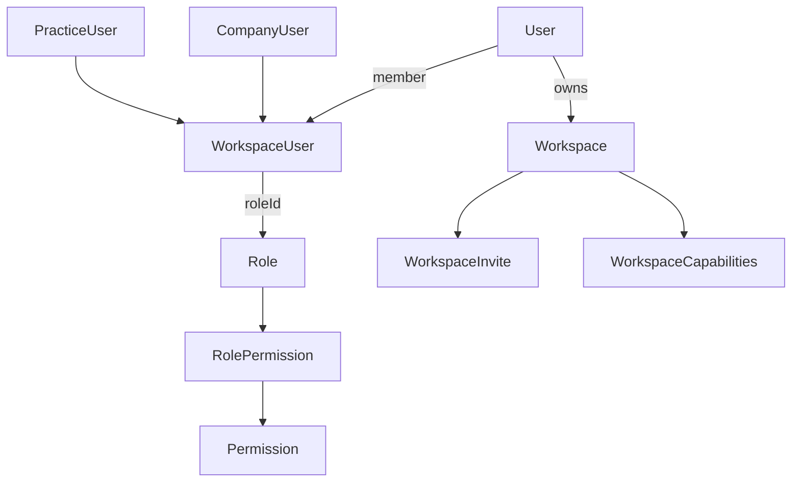

## 2) Business Owners, Plans & Billing
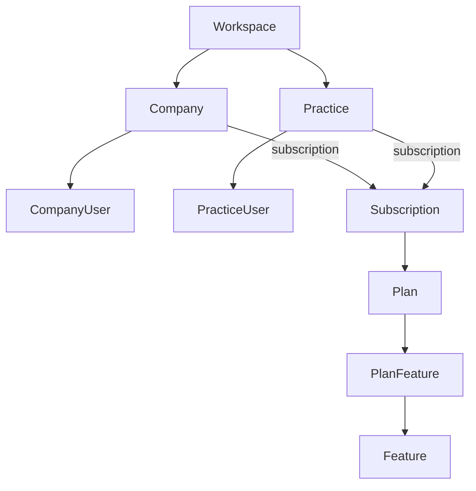

## 3) Onboarding (per Company/Practice)
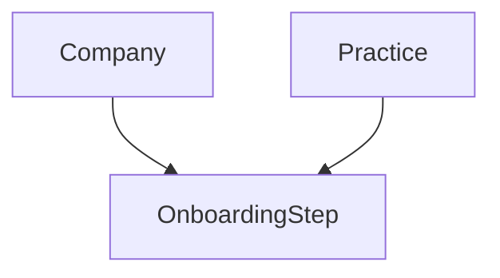

## 4) Accounting Core (Company-scoped)
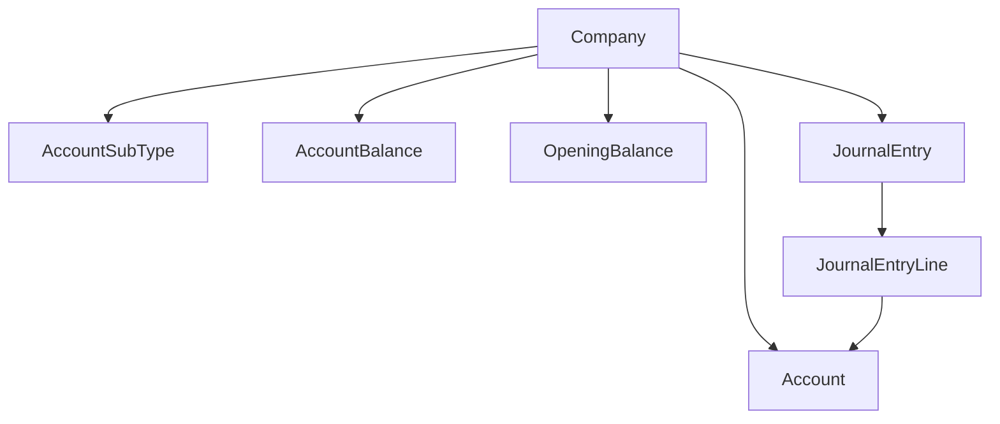

## 5) Sales (AR) + Receipts/Refunds + Collections
```mermaid
flowchart TD
  C[Company]
  Q[Quote]
  QL[QuoteLine]
  INV[Invoice<br/>status=InvoiceStatus<br/>paymentStatus=PaymentStatus]
  INVL[InvoiceLine]
  IPA[InvoicePaymentApplication]
  PR[PaymentReceived]
  BD[BankDeposit<br/>status=BankDepositStatus]
  BDL[BankDepositLine]
  CR[CustomerRefund]
  WO[WriteOff]
  RR[RefundReason]
  RA[RefundApproval]
  PT[PaymentTerm]
  PM[PaymentMethod<br/>type=PaymentMethodType]
  PL[PriceList]
  PLI[PriceListItem]
  CC[CustomerCredit]
  CCL[CustomerCreditLine]
  CCA[CustomerCreditApplication]
  DP[DunningProfile]
  DS[DunningStep]
  DR[DunningRun]
  DN[DunningNotice]
  CS[CustomerStatement]
  PRM[PaymentReminder]
  DSP[Dispute<br/>status=DisputeStatus]
  DSR[DisputeReason]
  CB[Chargeback<br/>status=ChargebackStatus]
  RI[RecurringInvoice<br/>status=RecurringInvoiceStatus]
  RS[RecurringSchedule]
  REL[RecurringExecutionLog]

  C --> Q
  Q --> QL
  Q -->|converts to| INV
  C --> INV
  INV --> INVL
  C --> IPA
  C --> PR
  PR --> IPA
  PR --> BD
  BD --> BDL
  C --> CR
  CR --> RR
  CR --> RA
  INV --> WO
  C --> PT
  C --> PM
  PM[PaymentMethod<br/>type=PaymentMethodType]
  C --> PL
  PL --> PLI
  C --> CC
  CC --> CCL
  C --> CCA
  C --> DP
  DP --> DS
  DP --> DR
  DR --> DN
  C --> CS
  C --> PRM
  C --> DSP
  DSP --> DSR
  C --> CB
  C --> RI
  RI --> RS
  RS --> REL
```

## 5.1) Document sequencing & atomic numbering
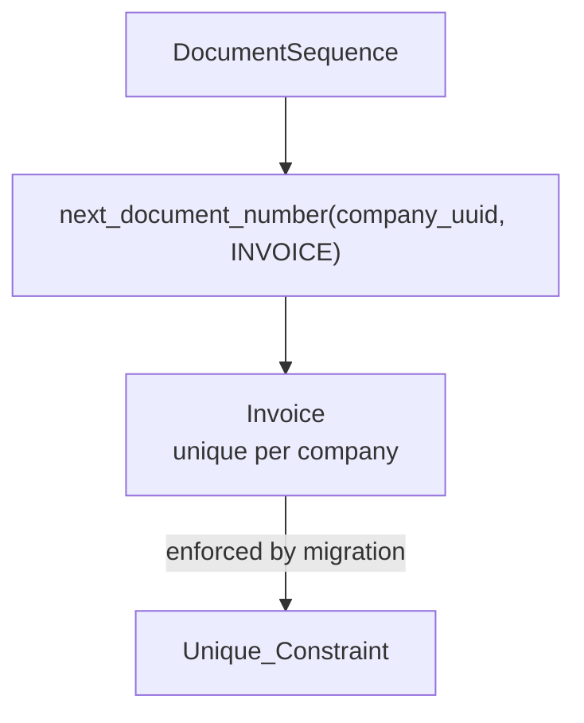

*Notes:* For production safety, the DB function `next_document_number` is used from application code inside a transaction (see `docs/migrations/001_document_sequence_and_constraints.sql`).

## 6) Purchases (AP) + Payments/Refunds
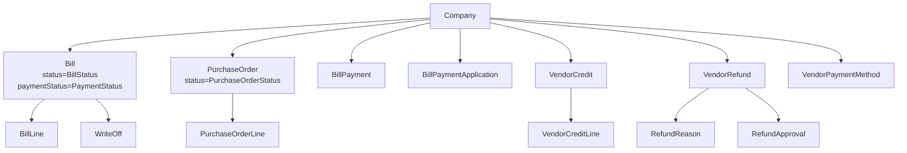

## 7) Inventory + Manufacturing + COGS
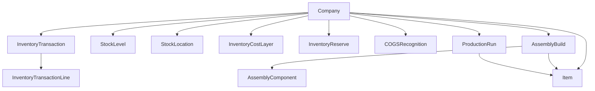

## 8) Treasury/Banking + Bank Feed Ingestion
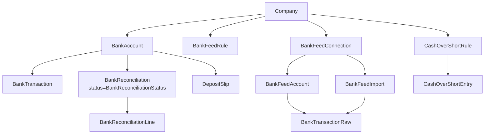

## 9) Tax, Payroll & Fixed Assets
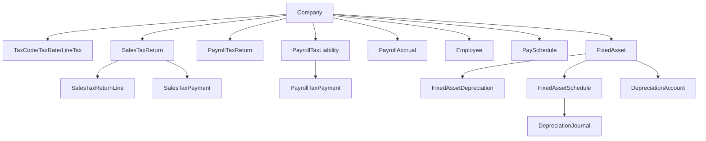

## 10) Governance, Reporting & Audit
```mermaid
flowchart TD
  W[Workspace]
  C[Company]
  PR[Practice]
  AJ[ArchiveJob]
  DRP[DataRetentionPolicy]
  DOCRET[DocumentRetention]
  FC[FinancialControl]
  CV[ControlViolation]
  AV[AccountingValidation]
  SL[SubsidiaryLedger]
  BUD[BudgetActualComparison]
  CFF[CashFlowForecast]
  CFFI[CashFlowForecastItem]
  REX[ReconciliationException]
  WF[Workflow]
  WFR[WorkflowRule]
  WRUN[WorkflowRun]
  WSTEP[WorkflowRunStep]
  AI[AI Insight]
  AP[AccountingPeriod]
  REV[Reversal]
  FSS[FinancialStatementSnapshot]
  CFS[CashFlowStatementSnapshot]
  CFC[CashFlowCategory]
  SR[SavedReport]
  FST[FinancialStatementTemplate]
  RS[ReportSection]
  CE[ClosingEntry]
  YEC[YearEndClose]
  EA[EquityAccount]
  DIV[Dividend]
  AS[AccrualSchedule]
  AE[AccrualEntry]
  IAR[InventoryAdjustmentRequest<br/>status=InventoryAdjustmentStatus]
  IAA[InventoryAdjustmentApproval<br/>status=InventoryAdjustmentStatus]
  TASK[Task]
  TC[TaskComment]
  WU[WorkspaceUser]
  AL[AuditLog]
  EL[EventLog]

  W --> TASK
  C --> TASK
  PR --> TASK
  TASK --> TC
  TASK --> WU
  W --> AJ
  W --> DRP
  C --> DRP
  C --> DOCRET
  C --> FC
  FC --> CV
  C --> AV
  C --> SL
  C --> BUD
  C --> CFF
  CFF --> CFFI
  C --> REX
  W --> WF
  C --> WF
  PR --> WF
  WF --> WFR
  WF --> WRUN
  WRUN --> WSTEP
  W --> AI
  C --> AI
  C --> AP
  C --> REV
  C --> FSS
  C --> CFS
  C --> CFC
  C --> SR
  C --> FST
  FST --> RS
  C --> CE
  C --> YEC
  C --> EA
  C --> DIV
  C --> AS
  AS --> AE
  C --> IAR
  IAR --> IAA
  W --> AL
  C --> AL
  PR --> AL
  W --> EL
```

## 11) Intercompany & Consolidation
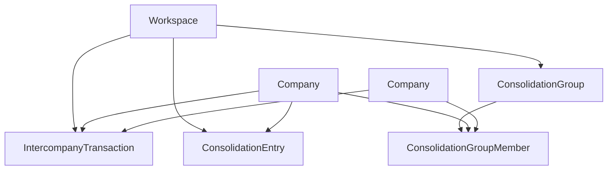

## 12) Contractors & 1099
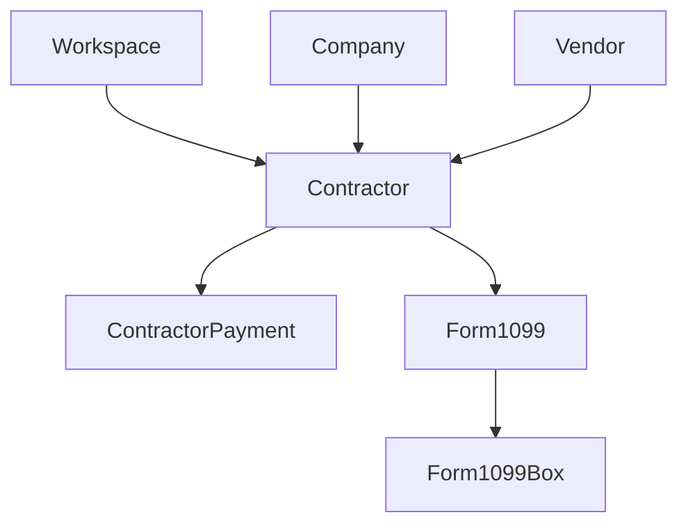

## 13) Integrations, Webhooks & Monitoring
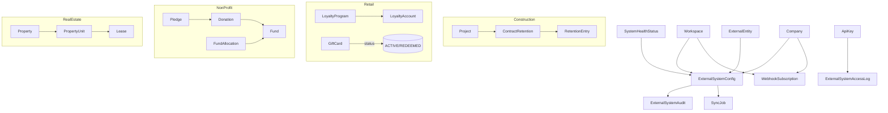

## 18) Templating & Advanced Reporting
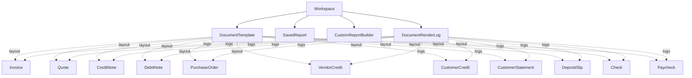

> **Notes & Ops**
>
> - **Default template uniqueness:** We enforce a single default per (companyId, type) via a Postgres partial unique index. Migration: `docs/migrations/003_unique_default_template.sql` which uses:
>   ```sql
>   CREATE UNIQUE INDEX unique_default_template_per_company_type
>   ON "DocumentTemplate" ("companyId", "type")
>   WHERE "isDefault" = true AND "deletedAt" IS NULL;
>   ```
>
> - **Render log analytics:** DESC-sorted indexes were added (see `docs/migrations/004_documentrenderlog_indexes.sql`) to accelerate recent-first queries and dashboards:
>   - `(workspaceId, companyId, renderedAt DESC)`
>   - `(workspaceId, userId, renderedAt DESC)`
>   - `(status, renderedAt DESC)`
>
> - **Template UX:** `DocumentTemplate.previewThumbnailUrl` enables quick visual selection in the UI. Use app-layer schema validation (Zod/OpenAPI) for `structure`, `design`, and `content` JSON fields.

## How to read this
- **User** owns a **Workspace** and can belong to multiple workspaces via **WorkspaceUser** (unique per workspace).
- **Workspace** is the HQ container (users, roles, invites, tasks) and *enables* Companies/Practices.
- **Company** and **Practice** each have **one Subscription** (billing is per owner).
- **Plan/Feature** models define what each subscription includes.
- **Company** is where the accounting operations live (accounts, invoices, bills, journal entries, inventory, taxes, payroll).

## Key rules (from the schema)
- One **WorkspaceUser** per (workspace, user) pair.
- One **Subscription** per Company and one per Practice.
- Onboarding is tracked **per Company/Practice** (not Workspace), via `OnboardingStep` + `onboardingMode`.

If you want a more detailed flowchart (including all accounting submodules), tell me which areas to expand.