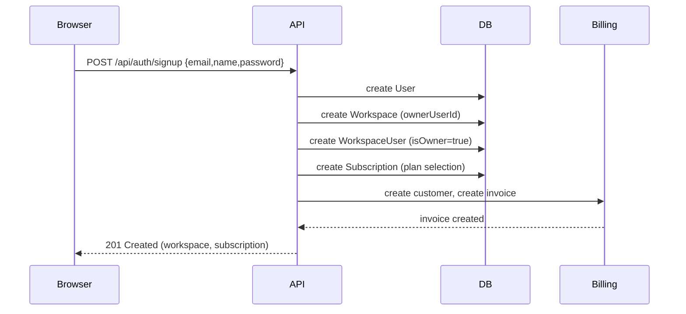
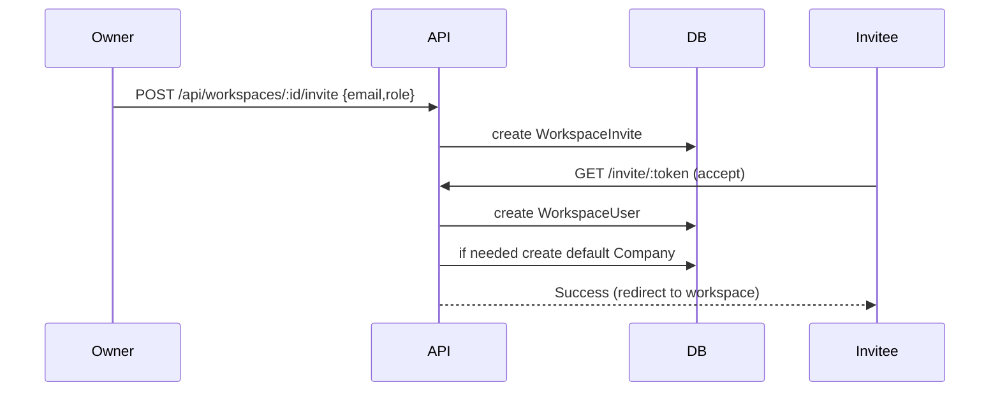
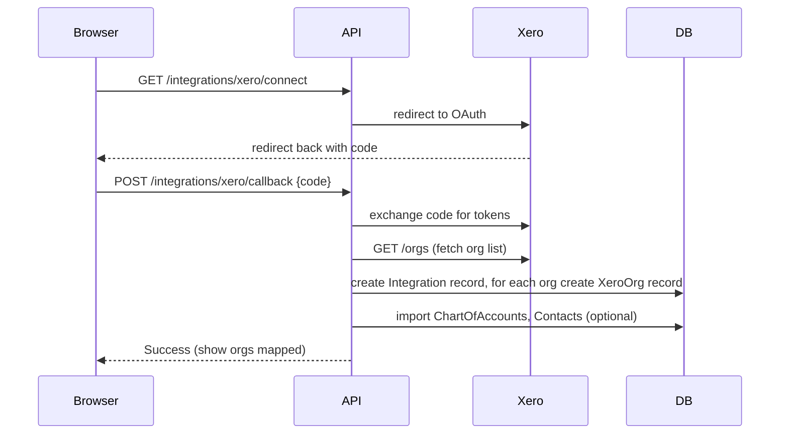

# Haypbooks — Full Site Flow (text flow-chart)

> Purpose: A concise, readable end-to-end flow of the Haypbooks product from user entry (login/signup) through key features, integrations, billing, and admin operations. This document references canonical Prisma models from `prisma/schema.prisma` to keep the flow grounded in the actual data model.

---

## Legend
- → indicates the next step or API call
- [Model] indicates relevant Prisma model(s)
- ⚠️ indicates guardrails / important invariants

---

## 1) Entry & Authentication

Landing Page / Marketing → Sign Up / Login

- Login (UI: `/login`) → POST `/api/auth/login` → Validate credentials (User.email, User.password) → create session/JWT
  - Models: `User`, `WorkspaceUser` (session links user → workspace membership)
- Signup flow (UI: `/signup`) → create `User` and create `Workspace` (owner) or accept invite
  - Owner signup: create `Workspace` row (ownerUserId → User.id) and `WorkspaceUser` with isOwner=true
  - Staging note: seed helpers and `prisma/seed.ts` upsert workspace for demo
- Invite flow: owner sends invite → create `WorkspaceInvite` → accept → create `WorkspaceUser`
  - Models: `Workspace`, `WorkspaceInvite`, `WorkspaceUser`
- Password reset / email verification: endpoints under `/api/auth/*`
  - Model hooks: `User`, `UserSecurityEvent`

Quick flow diagram (authentication):

Landing → [Login] → Auth → (success) → Hub/Dashboard (Workspace)
                  ↳ (failure) → Error / audit log (UserActionAudit)

---

## 2) Workspace & Role Management

Owner Hub (Workspace Owner) → Create / Manage Workspaces → Invite team members
- Create Workspace: `Workspace` created with ownerUserId
- Invite user: create `WorkspaceInvite` with roleId (or create `WorkspaceUser`) → accept invite → `WorkspaceUser` with role and isOwner boolean
- Roles & permissions implemented at application layer and enforced via RLS policies where needed
  - Models: `Workspace`, `WorkspaceUser`, `Role` (application-level mapping)

Important invariant: A User’s workspace membership is the source of truth for company access. Company-level access is implemented with `CompanyUser` and uses `workspaceId` and `companyId` to scope permissions.

---

## 3) Company Onboarding & Setup

Create Company (UI: Add Company / Import) → Company record inserted
- Company creation steps: basic details (name, country, base currency, fiscal year), optionally import chart of accounts or choose template
- Model: `Company` (+ `CompanyChartOfAccounts`)

Onboarding flow:
- `FirmOnboardingProgress` (for firms) and per-company onboarding state indicate required tasks (tax settings, bank connections, chart of accounts, user invites)
- Move workspace-level onboarding fields to `Company` where applicable (scripts: `migrate_workspace_onboarding_to_company.js`).

---

## 4) Plans, Subscriptions & Capacities (Billing)

Plan selection during workspace creation or later → Subscription created
- Models: `Plan`, `Subscription`, `PlanCapacity`, `WorkspaceCapacity`, `WorkspaceBillingInvoice`, `WorkspaceBillingUsage`

Capacity enforcement (Xero capacities example):
- PlanCapacity defines per-plan numeric limits (e.g., `max_xero_orgs`, `max_bank_connections`, `max_contacts`)
- WorkspaceCapacity stores per-workspace limits and usage counters (`limit_value`, `used_value`) to enforce soft/hard limits
- Backfill script: `scripts/set_default_plan_capacities.ts` (dry-run + `--apply`) inserts defaults

Billing flow:
- Subscription created (company-owned or practice-owned) → invoice generation (`WorkspaceBillingInvoice`) → payment processing → billing usage recorded (`WorkspaceBillingUsage`)

---

## 5) Accounting Firm / Accountant Hub

Accountant or Practice Signup (separate flow)
- Model: `AccountingFirm`, `AccountingFirmSubscription`, `FirmPlan`, `FirmFeatureFlag`, `CompanyFirmAccess`
- Accountant invites and grants `CompanyFirmAccess` to a company; firm-level subscription is recorded in `AccountingFirmSubscription`
- Firms see dashboards for their client companies and feature flags control available features per workspace (FirmFeatureFlag)

Firm onboarding progress stored in `FirmOnboardingProgress` (one per workspace for firm-specific onboarding state)

---

## 6) Integrations: Xero, Bank Feeds, Webhooks

Connect Xero (UI: `/integrations/xero/connect`) → OAuth handshake → store credentials/connection
- Limit Xero org connect using `max_xero_orgs` capacity
- On successful connect: create integration row and fetch org info, chart of accounts mapping, Contact sync

Bank feed flow:
- Connect bank (plaid/aggregator) → create a bank connection record → import transactions → create bank statement entries
- Important: **Haypbooks handles bank feed ingestion directly; do NOT rely on Xero for bank feeds.** Xero integrations are used only for accounting data (orgs, chart of accounts, invoices, contacts), not for bank feed ingestion.
- Business logic: match imported transactions to existing records (payments, receipts) or create new transactions to reconcile

Webhooks: registration and handler endpoints process remote events. Distinctions:
- Bank feed provider webhooks (Plaid/aggregator) deliver new transactions or connection updates; handled by Haypbooks' bank feed handlers.
- Xero webhooks are used for accounting events (invoice status changes, payments) if the workspace has a Xero integration; note that Xero is not used for bank feeds.

---

## 7) Core Transactions & Registers

Invoice lifecycle (create → send → receive payment → apply credits)
- Models: `Invoice`, `InvoiceLine`, `Payment`, `CreditNote`, `Application` (apply credit/payment)
- API endpoints: `POST /api/companies/:id/invoices`, `POST /api/invoices/:id/payments` etc.

Bills / Purchases
- Manage vendor bills, credits, bill payments
- Reconciliation uses `Reconciliation` models; bank statements are matched to payments/receipts

Journals & Adjusting entries
- Journal entries recorded to the ledger (`JournalEntry`, `JournalEntryLine`) with validation before posting
- Approvals/review workflows stored in audit tables / event logs

---

## 8) Reconciliation & Financial Reports

Reconciliation flow:
- Bank transactions (from feed) → match suggestions using algorithm → user confirms match → create reconciliation entry
- Periodic checks and invariants ensure sums match ledger (reconciliation math invariants tests exist)

Reporting
- Exports (CSV/CSV-Version) and standard financial statements (Balance Sheet, Profit & Loss, Cash Flow)
- Reports use `Company` + `CompanyChartOfAccounts` + transactional tables to compute outputs

---

## 9) UX & UI Routes (high-level)
- /login, /signup
- /hub (owner/accountant hub)
- /workspace/:id/dashboard
- /workspace/:id/settings (billing, plan, users)
- /companies/:companyId (company dashboard, transactions, settings)
- /integrations/xero, /integrations/bank-feeds
- /reports, /exports

APIs mirror these routes under `/api/*` with well-defined controllers in the backend.

---

## 10) Background Jobs, Webhooks & Scheduling
- Jobs for billing (generate invoices, reminders): `SubscriptionReminder`, `WorkspaceBillingUsage` aggregation
- Cron jobs for API quota resets, monthly usage cleanup, and backup tasks
- Webhooks for external integration event handling (Xero, bank feed providers)

---

## 11) Observability, RLS, & Security
- Audit events: `UserActionAudit`, `EventLog`
- Row-Level Security verification scripts exist (`LOgic.documentation/... verify-rls.psql` and CI scripts)
- Migrations follow strict guarded, idempotent patterns and include pre-check scripts and dry-run recommendations

---

## 12) Data Invariants & Migration Notes (key operational rules)
- Company is always scoped by a Workspace (`Company.workspaceId`) — all company data must include the workspace context
- Subscription should reference exactly one owner (`companyId` or `practiceId`) at application level
- Capacity enforcement is checked at the time of creating integrations or resources that consume counts (e.g., connecting a Xero org increments `used_value` in `WorkspaceCapacity`)
- Migrations must be safe: back up staging/production and run dry-run scripts (e.g., `scripts/migrate_firm_models.ts`) before applying destructive changes

---

## 13) Quick Model-to-Feature Map (handy reference)
- Auth: `User`, `WorkspaceUser`
- Workspace & Ownership: `Workspace`, `WorkspaceInvite`, `WorkspaceUser`
- Company: `Company`, `CompanyChartOfAccounts`, `CompanyUser`
- Plans & Billing: `Plan`, `Subscription`, `WorkspaceBillingInvoice`, `WorkspaceBillingUsage`, `PlanCapacity`, `WorkspaceCapacity`
- Firms & Accountant Flow: `AccountingFirm`, `AccountingFirmSubscription`, `FirmPlan`, `FirmFeatureFlag`, `FirmOnboardingProgress`, `CompanyFirmAccess`
- Integrations: external connection stores and usage counters (Xero usage tied to capacities)
- Audit & Jobs: `UserActionAudit`, `SubscriptionReminder`, job-run tables

---

## 14) Recommended Next Steps (docs & improvements)
- Add sequence diagrams for the top 3 flows: (1) Signup → Workspace creation → Plan selection, (2) Invite → Accept → Company access, (3) Xero connect → fetch org → import chart of accounts
- Add capacity enforcement tests and e2e tests for Xero connect + bank feed limit edge cases
- Update onboarding pages to link directly into `FirmOnboardingProgress` and `FirmFeatureFlag` state checks

---

Notes
- This document was generated with close reference to `prisma/schema.prisma` and the new firm/billing/capacity models added in recent migrations.

---

## End-to-end sequences & operational runbook (detailed)

Below are **sequence diagrams (Mermaid)** for the primary end-to-end flows and a concise runbook covering staging, tests, monitoring, and rollback procedures. These diagrams are text-first and can be rendered by tooling that supports Mermaid (e.g., MkDocs with Mermaid plugin, or GitHub Markdown preview).

### Signup → Workspace → Plan (Mermaid)

### Invite → Accept → Company Access (Mermaid)

### Xero Connect → Fetch Org → Import (Mermaid)

---

## Operational Runbook (E2E checklist)

1. Pre-deploy (local & branch)
   - Run `npx prisma migrate dev` locally and confirm `prisma validate` passes.
   - Run `npx prisma generate` and ensure tests compile.
   - Run `npm run test:unit` and `npm run test:serial` (focus on impacted tests).

2. Staging deploy
   - Take DB backup (pg_dump or DB snapshot). ⚠️
   - Run migrations on staging: `npx prisma migrate deploy --schema=prisma/schema.prisma`.
   - Dry-run backfill scripts: `node ./scripts/migrate_firm_models.js` and `node ./scripts/set_default_plan_capacities.js` (dry-run)
   - Apply backfill with `--apply` after review.
   - Run full test-suite and RLS verification (`verify:rls`) in staging CI.
   - Smoke test critical flows: signup, invite, Xero connect, create invoice, payment, run reporting exports.

3. Production deploy
   - Ensure a full backup and maintenance window if needed.
   - Apply migrations and backfills as in staging.
   - Run post-migration smoke tests (automated or manual).
   - Monitor application metrics, error logs, and billing events for 24-48 hours.

4. Monitoring & Alerting
   - Watch for increased error rates, failed background jobs, or billing webhook failures.
   - Add alerts for: migration failures, webhooks failing repeatedly, billing re-attempts, spike in DB locks.

5. Rollback plan
   - If a migration is destructive (not the case here), restore from backup. For additive changes, rollback application, and then consider reversing migrations only after careful data handling.
   - For backfill errors, have a compensating script to unroll changes (e.g., delete created `FirmOnboardingProgress` rows where `migrationNote` equals X).

---

## Capacity Enforcement (end-to-end)

Flow: User requests Xero connect or creates resource → Check `WorkspaceCapacity` used vs `limitValue` → If allowed, increment `used_value` (transactionally) → On delete/disconnect, decrement `used_value`.

Implementation notes:
- Use DB transactions to increment `used_value` with a WHERE clause ensuring `used_value < limit_value` and fail gracefully if limit reached.
- Record events in `WorkspaceBillingUsage` or a `CapacityEvent` audit table for chargeback and analytics.

---

## Tests to add (minimum)
- E2E: Signup + Plan subscription + default capacities assigned
- E2E: Invite acceptance → Company access
- Integration: Xero connect flow with mocked OAuth provider
- Unit: Capacity enforcement logic (increment/decrement under concurrent requests)
- Migration: Run backfill dry-run & apply in CI against a test snapshot

---

## Deliverables I can provide next
- Rendered Mermaid diagrams inserted (already added above) or separate SVG/PDF exports
- A short PR description & checklist ready to copy into a GitHub PR body
- Compensating scripts for any backfill that needs to be reversed

---

If you want, I can now:
- A) Generate **Mermaid images** and place them into the docs site, or
- B) Create the PR body + CI checklist for you to push and open the PR.

Which do you want next? (A or B) If you prefer A, tell me the format you prefer (SVG/PNG or inline Mermaid).
