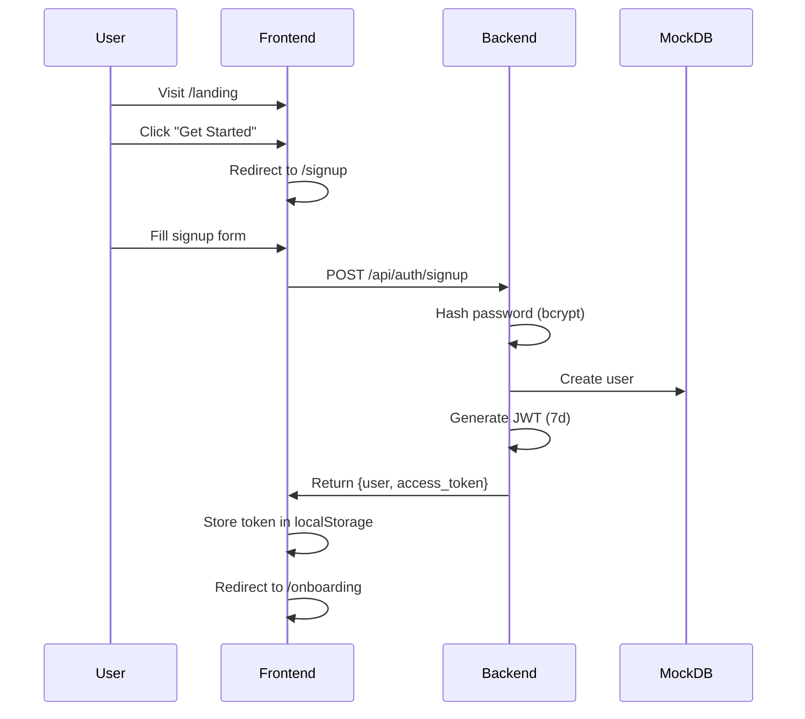

# Haypbooks v9 - Landing Page & Authentication Setup

## ✅ Completed Implementation

This implementation follows the **Roadmap v2** guidelines and sets up:
- ✅ Landing page with Hero, Features, Pricing Preview, Footer
- ✅ Login & Signup pages with real password authentication
- ✅ NestJS backend with JWT authentication
- ✅ Mock database (ready for Prisma migration)
- ✅ API integration layer (frontend → backend)
- ✅ Best practices architecture

## 🏗️ Architecture Overview

### Frontend (Next.js 14)
```
src/
├── app/
│   ├── (public)/           # Unauthenticated routes
│   │   ├── landing/        # Marketing landing page
│   │   ├── login/          # Login page
│   │   └── signup/         # Signup page
│   └── (authenticated)/    # Protected routes (existing)
├── components/
│   └── landing/            # Landing page components
├── services/
│   ├── auth.service.ts     # Authentication API calls
│   └── onboarding.service.ts
└── lib/
    └── api-client.ts       # Axios instance with interceptors
```

### Backend (NestJS)
```
Backend/src/
├── main.ts                 # Bootstrap (port 4000)
├── app.module.ts           # Root module
├── auth/                   # JWT + bcrypt authentication
├── users/                  # User management
├── onboarding/             # Onboarding flow
└── repositories/
    ├── interfaces/         # Repository contracts
    └── mock/              # In-memory implementations
```

## 🚀 Getting Started

### Option 1: Quick Start (Recommended)
```powershell
# Run the startup script (opens 2 terminal windows)
./start-dev.ps1
```

### Option 2: Manual Start
```powershell
# Terminal 1 - Backend
cd Haypbooks/Backend
npm install
npm run dev

# Terminal 2 - Frontend
cd Haypbooks/Frontend
npm install
npm run dev
```

## 🌐 Access Points

| Service | URL | Description |
|---------|-----|-------------|
| Landing Page | http://localhost:3000/landing | Marketing page with CTA |
| Login | http://localhost:3000/login | Authentication |
| Signup | http://localhost:3000/signup | User registration |
| Dashboard | http://localhost:3000/dashboard | Main app (after login) |
| Backend API | http://localhost:4000 | NestJS REST API |

## 🔐 Demo Credentials

```
Email:    demo@haypbooks.test
Password: password
```

## 📋 API Endpoints

### Authentication
- `POST /api/auth/signup` - Create new user
- `POST /api/auth/login` - Authenticate user
- `POST /api/auth/logout` - End session

### Users (Protected 🔒)
- `GET /api/users/me` - Get current user profile

### Onboarding (Protected 🔒)
- `POST /api/onboarding/save` - Save step data
- `GET /api/onboarding/save` - Get progress
- `POST /api/onboarding/complete` - Mark complete

### Quick business onboarding

Onboarding pages are protected and require authentication. There is also a dedicated single-step onboarding route for business details:

```
GET /onboarding/business
```

This is intended for quick setup/testing of company details and saves directly against `POST /api/onboarding/save`.

## 🔄 Authentication Flow



## 🛠️ Technical Details

### Frontend Service Layer

**API Client** (`src/lib/api-client.ts`)
- Axios instance configured for http://localhost:4000
- Automatic JWT token attachment from localStorage
- 401 error handling → auto-redirect to /login
- CORS with credentials enabled

**Auth Service** (`src/services/auth.service.ts`)
```typescript
// Login
const response = await authService.login({ email, password });
// Returns: { user, access_token }

// Signup
const response = await authService.signup({
  firstName, lastName, companyName, email, password
});

// Get current user
const user = await authService.getCurrentUser();

// Logout
await authService.logout();
```

### Backend Architecture

**Repository Pattern**
- Interface-based design
- Mock implementations (in-memory)
- Ready for Prisma/PostgreSQL migration
- Zero service layer changes needed

**JWT Strategy**
- 7-day token expiration
- Bearer token authentication
- Passport.js integration
- Password hashing with bcrypt (10 rounds)

**Validation**
- DTO classes with class-validator
- Automatic validation via ValidationPipe
- Type-safe request/response

## 🎨 Landing Page Components

### Hero Section
- Gradient background
- Primary CTA: "Get Started Free"
- Secondary CTA: "Watch Demo"
- Value proposition messaging

### Features Grid (8 features)
1. Accurate Financial Reporting
2. Philippine Tax Compliance
3. Multi-Currency Support
4. Real-time Collaboration
5. Bank Reconciliation
6. Expense Management
7. Inventory Tracking
8. Custom Reports

### Pricing Preview
| Tier | Price | Description |
|------|-------|-------------|
| Free | ₱0/mo | Perfect for testing |
| Basic | ₱29/mo | Small businesses |
| Pro | ₱59/mo | Growing companies |
| Enterprise | Custom | Large organizations |

### Footer
- Quick links (Features, Pricing, About, Contact)
- Resources (Documentation, API Docs, Support)
- Legal (Privacy, Terms, Security)
- Social media links

## 🔧 Environment Variables

**Frontend** (`.env.local`)
```env
NEXT_PUBLIC_API_URL=http://localhost:4000
```

**Backend** (`.env` - create if needed)
```env
JWT_SECRET=your-secret-key-here
JWT_EXPIRATION=7d
PORT=4000
```

## 📊 Mock Database

**Current State** (Backend mock repository)
- In-memory storage
- Demo user pre-seeded
- Users array structure
- Onboarding progress tracking

**Migration Path** (when ready for core features)
1. Install Prisma: `npm install @prisma/client prisma`
2. Create Prisma schema
3. Generate Prisma client
4. Implement Prisma repositories
5. Swap DI tokens in `app.module.ts`
6. No service layer changes needed ✅

## 🧪 Testing the Setup

### 1. Verify Backend
```powershell
# Backend should be running
curl http://localhost:4000

# Test signup endpoint
curl -X POST http://localhost:4000/api/auth/signup `
  -H "Content-Type: application/json" `
  -d '{"email":"test@test.com","password":"password","firstName":"Test","lastName":"User","companyName":"Test Co"}'
```

### 2. Verify Frontend
1. Open http://localhost:3000 → should redirect to `/landing`
2. Click "Get Started" → should go to `/signup`
3. Fill signup form → should create user and redirect to `/onboarding`
4. Logout and login → should work with credentials

### 3. Check Authentication
1. Login with demo credentials
2. Open DevTools → Application → Local Storage
3. Should see `authToken` and `user` entries
4. Navigate to `/dashboard` → should be authenticated

## 🚧 Current Limitations

### ✅ Implemented (Working)
- Landing page UI
- Signup flow
- Login flow
- JWT authentication
- Password hashing
- Repository pattern
- Mock database

### ⏳ Not Yet Implemented (Per Roadmap)
- Subscription plan functionality (intentionally disabled - you'll finish core first)
- Payment processing
- Real database (Prisma/PostgreSQL)
- Email verification
- Password reset flow
- Forgot password functionality
- Social login (Google, etc.)

## 📝 Roadmap Compliance

This implementation strictly follows **Roadmap v2**:
- ✅ Uses **real backend** (NestJS) not mock
- ✅ Uses **mock database** (in-memory) not real DB yet
- ✅ Implements **landing page** per `Landing&Login.md`
- ✅ Follows **tech stack** from `Tech.stack.md`
- ✅ Matches **project structure** from `Project.structure.md`
- ✅ Subscription plan **non-functional** as requested
- ✅ Best practices architecture

## 🐛 Troubleshooting

### Build Error: "Duplicate pages"
Fixed. Removed old `/login/page.tsx` to prevent route conflicts.

### Port Already in Use
```powershell
# Kill process on port 4000 (backend)
Get-Process -Id (Get-NetTCPConnection -LocalPort 4000).OwningProcess | Stop-Process

# Kill process on port 3000 (frontend)
Get-Process -Id (Get-NetTCPConnection -LocalPort 3000).OwningProcess | Stop-Process
```

### CORS Errors
Backend already configured with:
```typescript
app.enableCors({ origin: true, credentials: true });
```

### Authentication Not Working
1. Check backend is running on port 4000
2. Check `.env.local` has correct API URL
3. Check browser localStorage for `authToken`
4. Check Network tab for API calls to `localhost:4000`

## 📚 Next Steps

After testing the landing page + auth setup:
1. ✅ Finish core accounting features (as you planned)
2. Implement Prisma + PostgreSQL
3. Add email verification
4. Implement password reset
5. Enable subscription plans
6. Add payment processing
7. Deploy to production

## 🔗 Related Documentation

- `all.about.haypbooks/README.md` - Full system documentation
- `Roadmap.v2/Tech.stack.md` - Technology choices
- `Roadmap.v2/Landing&Login.md` - UI/UX specifications
- `Roadmap.v2/Project.structure.md` - Architecture guide
- `Backend/README.md` - Backend API documentation

---

**Status**: ✅ Landing page and authentication fully functional with real NestJS backend and mock database.
