# Haypbooks Online Interface Structure & Workflow Guide

*Comprehensive Level 3 Manual - Complete Reference Guide to Haypbooks Online Interface Organization, Navigation, and Integration Capabilities*

---

## Document Information

**Version**: 3.0  
**Last Updated**: September 1, 2025  
**Target Audience**: Business Owners, Accountants, Bookkeepers, IT Administrators, and Power Users  
**Skill Level**: Advanced - Comprehensive technical and operational guidance  
**Document Purpose**: Complete reference manual for Haypbooks Online interface, workflows, and advanced features

---

## Executive Summary

This comprehensive Level 3 Manual provides an exhaustive reference guide to Haypbooks Online, covering every aspect of the platform's interface structure, workflow optimization, integration capabilities, and advanced features. Designed for advanced users, accountants, and IT administrators who require deep technical knowledge and operational mastery of Haypbooks Online.

### Key Objectives
- **Complete Interface Coverage**: Detailed documentation of every menu, section, and feature
- **Workflow Optimization**: Advanced techniques for maximizing productivity and efficiency
- **Integration Mastery**: Comprehensive guide to third-party integrations and API usage
- **Security & Compliance**: Enterprise-grade security practices and regulatory compliance
- **Troubleshooting & Support**: Advanced problem-solving and technical support resources
- **Best Practices**: Industry-leading practices for accounting operations and financial management

### Document Structure
This manual is organized into logical sections that mirror Haypbooks Online's interface architecture, providing both conceptual understanding and practical implementation guidance.

---

## Table of Contents

### Getting Started
1. [Haypbooks at a Glance](#Haypbooks-at-a-glance)
2. [Haypbooks Workflow Overview](#Haypbooks-workflow-overview)

### Core Features & Architecture
3. [Haypbooks Interface Architecture](#Haypbooks-interface-architecture)
4. [Haypbooks HTML Interface Structure](#Haypbooks-html-interface-structure)
5. [Effective Navigation Guide](#effective-navigation-guide)

### Advanced Features
6. [Haypbooks Integration Capabilities](#Haypbooks-integration-capabilities)
7. [Haypbooks Automation & Workflow Optimization](#Haypbooks-automation--workflow-optimization)
8. [Haypbooks Mobile Capabilities](#Haypbooks-mobile-capabilities)

### Management & Analytics
9. [Haypbooks Best Practices](#Haypbooks-best-practices)
10. [Haypbooks Security & Data Protection](#Haypbooks-security--data-protection)
11. [Haypbooks Reporting & Analytics](#Haypbooks-reporting--analytics)

### Implementation & Support
12. [Haypbooks Migration & Onboarding Guide](#Haypbooks-migration--onboarding-guide)
13. [Haypbooks Troubleshooting Guide](#Haypbooks-troubleshooting-guide)
14. [Haypbooks Pricing & Subscription Management](#Haypbooks-pricing--subscription-management)

### Advanced Topics
15. [Haypbooks API & Developer Resources](#Haypbooks-api--developer-resources)
16. [Haypbooks Enterprise Features](#Haypbooks-enterprise-features)
17. [Haypbooks Compliance & Regulatory Guide](#Haypbooks-compliance--regulatory-guide)
18. [Haypbooks Performance Optimization](#Haypbooks-performance-optimization)
19. [Haypbooks Training & Certification](#Haypbooks-training--certification)

### Reference Materials
20. [Glossary of Key Terms](#glossary-of-key-terms)
21. [Detailed Interface Structure Reference](#detailed-interface-structure-reference)
22. [Complete End-to-End Workflows](#complete-end-to-end-workflows)

### Advanced Implementation
23. [Accounting Principles Integration](#accounting-principles-integration)
24. [End-to-End Navigation Guide](#end-to-end-navigation-guide)
25. [Advanced Configuration & Customization](#advanced-configuration--customization)
26. [Real-World Integration Examples](#real-world-integration-examples)
27. [Best Practices & Practical Tips](#best-practices--practical-tips)

### Technical Deep Dives
28. [Advanced Transaction Conversion Flows](#advanced-transaction-conversion-flows)
29. [Complete Accounting Cycle Workflow](#complete-accounting-cycle-workflow)
30. [Integration Diagrams & Architecture](#integration-diagrams--architecture)
31. [Industry-Specific Process Flows](#industry-specific-process-flows)

### Specialized Operations
32. [Compliance Workflows & Controls](#compliance-workflows--controls)
33. [Mobile Workflow Processes](#mobile-workflow-processes)
34. [Performance Optimization Flows](#performance-optimization-flows)

---

## Related Documentation

### Core Guides
- **[Haypbooks User Guide](Haypbooks_User_Guide.md)** - Essential workflows and daily operations
- **[Haypbooks Admin Guide](Haypbooks_Admin_Guide.md)** - Advanced configuration and management
- **[Haypbooks Developer Guide](Haypbooks_Developer_Guide.md)** - API development and technical integration
- **[Haypbooks Reference Guide](Haypbooks_Reference_Guide.md)** - Quick reference and troubleshooting

### Specialized Guides
- **[Haypbooks Complete Accounting Cycle Guide](Haypbooks_Complete_Accounting_Cycle_Guide.md)** - End-to-end accounting processes
- **[Haypbooks Financial Reporting Guide](Haypbooks_Financial_Reporting_Analysis_Guide.md)** - Advanced reporting and analysis
- **[Haypbooks Advanced Features Guide](Haypbooks_Advanced_Features_Conversions_Guide.md)** - Complex transactions and automation
- **[Haypbooks Implementation Roadmap](Haypbooks_Implementation_Roadmap.md)** - Project planning and deployment

### Industry-Specific Guides
- **[Retail & E-commerce Guide](Haypbooks_Retail_Ecommerce_Guide.md)** - Retail-specific configurations
- **[Professional Services Guide](Haypbooks_Professional_Services_Guide.md)** - Service industry workflows
- **[Construction Guide](Haypbooks_Construction_Contracting_Guide.md)** - Construction-specific processes
- **[Healthcare Guide](Haypbooks_Healthcare_Guide.md)** - Healthcare compliance and billing

### Support & Training
- **[Training & Certification Guide](Haypbooks_Training_Certification_Guide.md)** - User training programs
- **[Troubleshooting Guide](Haypbooks_Troubleshooting_Support_Guide.md)** - Problem-solving and support
- **[Video Tutorial Scripts](Haypbooks_Video_Tutorial_Scripts.md)** - Professional training content

---

---

## Table of Contents

### Getting Started
1. [Haypbooks at a Glance](#Haypbooks-at-a-glance)
2. [Haypbooks Workflow Overview](#Haypbooks-workflow-overview)

### Core Features & Architecture
3. [Haypbooks Interface Architecture](#Haypbooks-interface-architecture)
4. [Haypbooks HTML Interface Structure](#Haypbooks-html-interface-structure)
5. [Effective Navigation Guide](#effective-navigation-guide)

### Advanced Features
6. [Haypbooks Integration Capabilities](#Haypbooks-integration-capabilities)
7. [Haypbooks Automation & Workflow Optimization](#Haypbooks-automation--workflow-optimization)
8. [Haypbooks Mobile Capabilities](#Haypbooks-mobile-capabilities)

### Management & Analytics
9. [Haypbooks Best Practices](#Haypbooks-best-practices)
10. [Haypbooks Security & Data Protection](#Haypbooks-security--data-protection)
11. [Haypbooks Reporting & Analytics](#Haypbooks-reporting--analytics)

### Implementation & Support
12. [Haypbooks Migration & Onboarding Guide](#Haypbooks-migration--onboarding-guide)
13. [Haypbooks Troubleshooting Guide](#Haypbooks-troubleshooting-guide)
14. [Haypbooks Pricing & Subscription Management](#Haypbooks-pricing--subscription-management)

### Advanced Topics
15. [Haypbooks API & Developer Resources](#Haypbooks-api--developer-resources)
16. [Haypbooks Enterprise Features](#Haypbooks-enterprise-features)
17. [Haypbooks Compliance & Regulatory Guide](#Haypbooks-compliance--regulatory-guide)
18. [Haypbooks Performance Optimization](#Haypbooks-performance-optimization)
19. [Haypbooks Training & Certification](#Haypbooks-training--certification)

### Reference Materials
20. [Glossary of Key Terms](#glossary-of-key-terms)
21. [Detailed Interface Structure Reference](#detailed-interface-structure-reference)
22. [Complete End-to-End Workflows](#complete-end-to-end-workflows)

### Advanced Implementation
23. [Accounting Principles Integration](#accounting-principles-integration)
24. [End-to-End Navigation Guide](#end-to-end-navigation-guide)
25. [Advanced Configuration & Customization](#advanced-configuration--customization)
26. [Real-World Integration Examples](#real-world-integration-examples)
27. [Best Practices & Practical Tips](#best-practices--practical-tips)

### Technical Deep Dives
28. [Advanced Transaction Conversion Flows](#advanced-transaction-conversion-flows)
29. [Complete Accounting Cycle Workflow](#complete-accounting-cycle-workflow)
30. [Integration Diagrams & Architecture](#integration-diagrams--architecture)
31. [Industry-Specific Process Flows](#industry-specific-process-flows)

### Specialized Operations
32. [Compliance Workflows & Controls](#compliance-workflows--controls)
33. [Mobile Workflow Processes](#mobile-workflow-processes)
34. [Performance Optimization Flows](#performance-optimization-flows)

---

## Haypbooks at a Glance

### Platform Overview

Haypbooks Online represents the pinnacle of cloud-based accounting software, designed specifically for small and medium-sized businesses (SMBs) ranging from startups to enterprises with up to 25 users. As a Software-as-a-Service (SaaS) solution, it provides comprehensive financial management capabilities with enterprise-grade security and scalability.

### Core Capabilities

#### 1. **Transaction Processing Engine**
- **Multi-Entity Support**: Handle complex transactions involving multiple accounts, customers, vendors, and inventory items
- **Real-Time Processing**: Instant transaction recording with immediate financial impact calculation
- **Audit Trail**: Complete transaction history with user tracking and timestamp logging
- **Reversal Capabilities**: Support for transaction reversals, voids, and adjustments
- **Batch Processing**: Efficient handling of bulk transaction imports and exports

#### 2. **Advanced Financial Reporting**
- **Dynamic Report Generation**: Real-time report creation with customizable parameters
- **Multi-Company Consolidation**: Combined reporting across multiple business entities
- **Comparative Analysis**: Year-over-year, period-over-period, and custom date range comparisons
- **Export Capabilities**: Multiple format support (PDF, Excel, CSV, XML)
- **Scheduled Reporting**: Automated report generation and distribution

#### 3. **Comprehensive Payroll Management**
- **Multi-State Tax Compliance**: Automatic calculation of federal, state, and local tax obligations
- **Direct Deposit**: Secure electronic payment distribution to employees
- **Benefits Administration**: Integration with health insurance, retirement plans, and other benefits
- **Time Tracking Integration**: Seamless connection with time tracking systems
- **Worker Classification**: Proper handling of employees, contractors, and gig workers

#### 4. **Intelligent Inventory Management**
- **Multi-Location Support**: Track inventory across multiple warehouses and sales locations
- **Costing Methods**: FIFO, LIFO, Average Cost, and Specific Identification methods
- **Barcode Integration**: Support for barcode scanning and inventory tracking
- **Reorder Point Management**: Automated alerts for low stock conditions
- **Serial Number Tracking**: Individual item tracking for high-value assets

#### 5. **Customer Relationship Management (CRM)**
- **360-Degree Customer View**: Complete customer profile with transaction history and preferences
- **Automated Communication**: Email integration for invoices, statements, and reminders
- **Payment Processing**: Integrated payment gateways and recurring billing
- **Customer Segmentation**: Advanced filtering and customer categorization
- **Loyalty Program Integration**: Support for customer rewards and retention programs

#### 6. **Vendor Management System**
- **Vendor Performance Tracking**: Quality, delivery time, and cost analysis
- **Automated Purchase Orders**: Streamlined procurement workflow
- **Vendor Payment Terms**: Flexible payment scheduling and discount management
- **1099 Processing**: Automated contractor tax form generation and filing
- **Vendor Portal**: Self-service portal for vendors to manage their information

#### 7. **Tax Compliance Automation**
- **Multi-Jurisdiction Support**: Federal, state, and local tax calculation
- **Tax Planning Tools**: Year-round tax optimization and planning
- **Automated Filing**: Direct integration with tax authorities for electronic filing
- **Tax Document Management**: Secure storage and retrieval of tax-related documents
- **Audit Support**: Comprehensive documentation for tax authority reviews

### Technical Architecture

#### Cloud Infrastructure
- **Global Data Centers**: Redundant data centers across multiple geographic regions
- **99.9% Uptime SLA**: Enterprise-grade availability and reliability
- **Auto-Scaling**: Dynamic resource allocation based on usage patterns
- **Disaster Recovery**: Comprehensive backup and recovery systems
- **Data Encryption**: End-to-end encryption for data in transit and at rest

#### Security Framework
- **Multi-Factor Authentication (MFA)**: Advanced user authentication protocols
- **Role-Based Access Control (RBAC)**: Granular permission management
- **Audit Logging**: Complete activity tracking and monitoring
- **Compliance Certifications**: SOC 2, PCI DSS, and other industry standards
- **Data Privacy**: GDPR, CCPA, and other privacy regulation compliance

#### Integration Capabilities
- **RESTful API**: Comprehensive application programming interface
- **Webhook Support**: Real-time event notifications and data synchronization
- **OAuth 2.0**: Secure third-party application authorization
- **Open Banking**: Direct connection to financial institutions
- **E-commerce Platforms**: Native integration with major online marketplaces

### User Experience Design

#### Interface Philosophy
- **Progressive Disclosure**: Information presented based on user needs and expertise level
- **Contextual Actions**: Relevant actions displayed based on current workflow
- **Responsive Design**: Optimized experience across desktop, tablet, and mobile devices
- **Accessibility Compliance**: WCAG 2.1 AA compliance for users with disabilities
- **Internationalization**: Support for multiple languages and regional formats

#### Workflow Optimization
- **Keyboard Shortcuts**: Comprehensive keyboard navigation support
- **Customizable Dashboards**: Personalized interface based on user preferences
- **Quick Actions**: One-click access to frequently used functions
- **Search Functionality**: Global search across all data types and transactions
- **Batch Operations**: Efficient processing of multiple items simultaneously

### Performance Characteristics

#### System Performance
- **Sub-Second Response Times**: Fast loading and processing of data
- **Concurrent User Support**: Multi-user collaboration capabilities
- **Large Dataset Handling**: Efficient processing of millions of transactions
- **Real-Time Synchronization**: Instant data updates across all connected devices
- **Offline Capability**: Limited functionality for offline operations

#### Scalability Features
- **User Scaling**: Support from 1 to 25 users per company
- **Transaction Volume**: Handling up to millions of transactions annually
- **Storage Capacity**: Unlimited document storage and attachment support
- **Integration Limits**: Support for hundreds of third-party connections
- **API Rate Limits**: Optimized for high-volume data processing

### Industry-Specific Adaptations

#### Retail & E-commerce
- **Point of Sale Integration**: Direct connection to POS systems
- **Inventory Synchronization**: Real-time stock level updates
- **Customer Loyalty**: Integrated rewards and loyalty program management
- **Multi-Channel Sales**: Unified view of online and offline sales
- **Returns Management**: Streamlined product return and refund processing

#### Professional Services
- **Time & Expense Tracking**: Detailed project time and cost allocation
- **Project Profitability**: Real-time project financial performance monitoring
- **Client Billing**: Flexible billing options including retainers and progress billing
- **Resource Management**: Staff utilization and capacity planning
- **Compliance Reporting**: Industry-specific regulatory reporting requirements

#### Construction & Contracting
- **Job Costing**: Detailed project cost tracking and analysis
- **Change Orders**: Management of contract modifications and amendments
- **Progress Billing**: Percentage-of-completion billing and revenue recognition
- **Subcontractor Management**: Specialized vendor management for subcontractors
- **Construction-Specific Reports**: Industry-tailored financial reporting

#### Manufacturing
- **Bill of Materials**: Complex product structure and component tracking
- **Work Order Management**: Production order processing and tracking
- **Quality Control**: Integration with quality management systems
- **Cost Accounting**: Detailed manufacturing cost analysis
- **Supply Chain Integration**: Connection with suppliers and distributors

### Advanced Features Overview

#### Automation & AI
- **Machine Learning**: Intelligent categorization and anomaly detection
- **Predictive Analytics**: Forecasting and trend analysis capabilities
- **Automated Workflows**: Custom approval processes and notifications
- **Smart Suggestions**: AI-powered recommendations for optimization
- **Natural Language Processing**: Voice commands and conversational interfaces

#### Collaboration Tools
- **Real-Time Collaboration**: Multi-user editing and commenting
- **Document Sharing**: Secure file sharing with external stakeholders
- **Audit Trail**: Complete history of all changes and interactions
- **Approval Workflows**: Configurable review and approval processes
- **Communication Integration**: Connection with email, chat, and collaboration platforms

#### Analytics & Insights
- **Business Intelligence**: Advanced data analysis and visualization
- **Key Performance Indicators**: Custom KPI creation and monitoring
- **Benchmarking**: Industry comparison and performance benchmarking
- **Trend Analysis**: Historical data analysis and forecasting
- **Custom Dashboards**: Personalized analytics and reporting interfaces

This comprehensive overview establishes the foundation for understanding Haypbooks Online as a complete business management platform, not just accounting software.


## Haypbooks Interface Architecture

### Accounting workflow notes: reversals, reclass, and write-offs

- Reversals: When reversing a journal entry, the default reversal date is the next open day if no date is specified. Explicit dates in a closed period are rejected with a clear message.
- Reclassification: Creating an adjusting journal that moves an amount between accounts is blocked for closed periods. Provide a date in an open period; no silent date shifting is performed.
- A/R write-offs: Writing off an invoice reduces the balance by posting an adjusting journal (DR expense — default 6000; CR A/R — 1100) and applying a synthetic payment to reflect the reduction. If a date is provided and falls in a closed period, the API rejects the request.

API quick reference

- POST /api/journal/reclass — { fromAccountNumber, toAccountNumber, amount, date?, memo? }
- POST /api/journal/{id}/reverse — { date?, memo? }
- POST /api/invoices/{id}/writeoff — { amount?, date?, memo?, expenseAccountNumber? }

Refund receipts (customer refunds)

- Use /api/customer-refunds (POST) to issue a cash refund to a customer against available credit.
- Rules:
   - Refund date must be in an open period (enforced at posting time).
   - When a specific credit is referenced, the refund amount cannot exceed its remaining balance; the remaining is reduced.
   - Posting: credits cash and debits accounts receivable to offset the customer credit, keeping A/R balanced while reflecting cash outflow.
- Listing: /api/customer-refunds (GET) with optional ?customerId filter.

Vendor refunds (cash received from vendors)

- Use /api/vendor-refunds (POST) to record cash received from a vendor against an A/P vendor credit.
- Rules:
   - Refund date must be in an open period (enforced at posting time).
   - When a specific vendor credit is referenced, the refund amount cannot exceed its remaining balance; the remaining is reduced.
   - Posting: debits cash and credits accounts payable to reflect cash inflow and reduction of A/P.
- Listing: /api/vendor-refunds (GET) with optional ?vendorId filter.

Print and export policy

- Single Print button per page triggers the browser print dialog; no separate print-only routes.
- Exports follow a JSON-first policy; CSV captions and filenames are standardized by shared helpers.

### Main Functional Areas

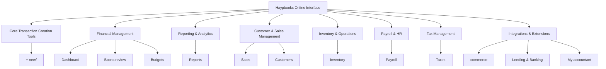

### Data Flow Between Systems

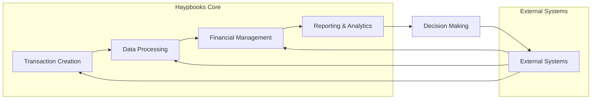

### User Access Levels

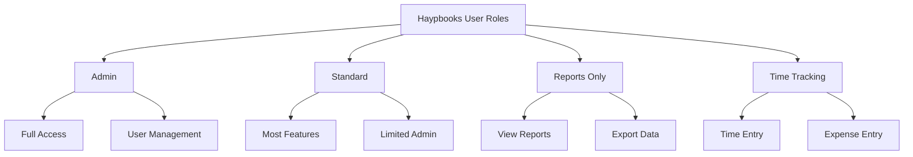

## Haypbooks Security & Data Protection

### Executive Summary
Haypbooks Online employs enterprise-grade security measures including encryption, two-factor authentication, and regular backups. However, robust data protection requires implementing user access controls, network security, and compliance measures. Key focus areas include preventing unauthorized access, protecting against data breaches, and ensuring regulatory compliance.

**Key Takeaways:**
- Implement role-based access control and regular access reviews
- Use two-factor authentication and strong password policies
- Maintain regular backups and secure data storage
- Monitor for security threats and maintain incident response plans
- Ensure compliance with data privacy regulations

Protecting your financial data is critical for business continuity and regulatory compliance. Haypbooks Online provides robust security features, but users must implement proper security practices to ensure data protection.

### Security Features in Haypbooks Online

- **Two-Factor Authentication (2FA)**: Adds an extra layer of security beyond passwords
- **Secure Data Centers**: Enterprise-grade security with 24/7 monitoring and regular security audits
- **Encryption**: Data is encrypted both in transit and at rest using industry-standard encryption
- **Regular Backups**: Automatic backups with point-in-time recovery options
- **Activity Logs**: Detailed tracking of all user actions and system changes
- **Role-Based Access Control**: Granular permission settings for different user roles
- **Session Management**: Automatic timeout and secure session handling
- **Fraud Detection**: Automated monitoring for suspicious activities and transactions

### Security Best Practices

#### User Access Management

- **Principle of Least Privilege**: Grant users only the access necessary for their roles
- **Regular Access Reviews**: Periodically review user permissions and remove access when needed
- **Strong Password Policies**: Implement complex password requirements and regular password changes
- **Separation of Duties**: Ensure critical functions require multiple approvals
- **Account Deactivation**: Immediately deactivate accounts when employees leave the company

#### Data Protection Measures

- **Regular Backups**: Perform regular backups of company data
- **Data Archiving**: Archive historical data to reduce exposure while maintaining accessibility
- **Secure Document Storage**: Use encrypted storage for sensitive financial documents
- **Secure File Transfer**: Use secure methods when transferring financial data externally
- **Data Retention Policies**: Establish and follow proper data retention and disposal policies

#### Network Security

- **Secure Network Connections**: Use VPNs for remote access to Haypbooks
- **Firewall Configuration**: Properly configure firewalls to protect network access
- **Secure Wi-Fi**: Use encrypted Wi-Fi networks with strong passwords
- **Public Wi-Fi Caution**: Avoid accessing Haypbooks on public or unsecured networks
- **Network Monitoring**: Monitor network activity for unusual access patterns

### Threat Prevention

#### Common Security Threats

- **Phishing Attacks**: Deceptive emails attempting to steal login credentials
- **Malware**: Malicious software that can compromise system security
- **Ransomware**: Malicious software that encrypts data and demands payment for decryption
- **Insider Threats**: Risks from current or former employees with access to systems
- **Third-Party Risks**: Security vulnerabilities in connected applications and services

#### Prevention Strategies

- **Security Training**: Regular training for all users on security awareness
- **Email Filtering**: Implement robust email filtering to detect phishing attempts
- **Antivirus Protection**: Use updated antivirus and anti-malware software
- **Application Whitelisting**: Only approve trusted applications for integration
- **Regular Security Audits**: Conduct periodic security assessments and penetration testing
- **Incident Response Plan**: Establish and regularly test an incident response plan

### Compliance Considerations

- **Data Privacy Regulations**: Ensure compliance with relevant data privacy laws (GDPR, CCPA, etc.)
- **Industry Standards**: Follow industry-specific security requirements and standards
- **Audit Trails**: Maintain comprehensive audit logs for compliance verification
- **Data Retention**: Adhere to legal requirements for data retention and disposal
- **Regular Compliance Reviews**: Conduct regular compliance assessments

## Haypbooks Automation & Workflow Optimization

### Executive Summary
Haypbooks Online offers comprehensive automation capabilities that can transform business operations by reducing manual tasks, minimizing errors, and improving efficiency. Key automation areas include transaction processing, reporting, integration workflows, and approval processes. Successful automation requires careful planning, stakeholder engagement, and ongoing optimization to maximize ROI and ensure business processes remain effective.

**Key Takeaways:**
- Start with high-impact automation opportunities like bank rules and recurring transactions
- Implement automation in phases to manage change and ensure success
- Regularly review and optimize automated processes for continued effectiveness
- Combine multiple automation features for comprehensive workflow optimization
- Monitor automation performance and user adoption for continuous improvement

Automating repetitive tasks and optimizing workflows in Haypbooks Online can significantly improve efficiency, reduce errors, and free up time for more strategic activities. This section explores the various automation features and workflow optimization techniques available in Haypbooks.

### Transaction Automation

#### Bank Rules

- **Rule Creation**: Set up rules to automatically categorize transactions based on various criteria
- **Matching Criteria**: Define rules based on description, amount, payee, account, or custom fields
- **Action Assignment**: Specify actions like categorize, split, or add to existing transaction
- **Rule Prioritization**: Order rules by priority to ensure proper categorization
- **Rule Testing**: Test rules against sample transactions before applying broadly
- **Rule Maintenance**: Regular review and update of rules as business needs change

#### Transaction Rules

- **Expense Rules**: Automate expense categorization and vendor assignment
- **Sales Rules**: Streamline sales transaction processing and customer assignment
- **Recurring Transactions**: Set up recurring transactions for regular payments and income
- **Template Application**: Apply templates to similar transactions for consistency
- **Approval Workflows**: Configure multi-level approval processes for transactions
- **Notification Triggers**: Set up notifications for specific transaction types or amounts

#### Data Entry Automation

- **Copy Transaction**: Duplicate similar transactions with minimal changes
- **Batch Entry**: Process multiple transactions of the same type simultaneously
- **Import/Export**: Bulk import and export of transaction data
- **API Integration**: Connect with other systems via API for automated data exchange
- **Mobile Capture**: Use mobile app for quick data capture with minimal manual entry
- **Voice Input**: Utilize voice-to-text for hands-free data entry

### Advanced Automation Features

#### Smart Categorization

- **Machine Learning**: Haypbooks learns from your categorization patterns to suggest categories
- **Pattern Recognition**: Automatically identifies recurring transaction patterns
- **Confidence Scoring**: Provides confidence levels for automated categorizations
- **Learning Feedback**: Improves accuracy based on user corrections and confirmations
- **Bulk Categorization**: Apply categorization rules to multiple transactions at once
- **Exception Handling**: Flags transactions that don't match established patterns

#### Workflow Automation

- **Custom Workflows**: Create multi-step approval and processing workflows
- **Conditional Logic**: Set up rules that trigger different actions based on conditions
- **Escalation Rules**: Automatically escalate overdue items or exceptions
- **Delegation**: Set up automatic delegation when approvers are unavailable
- **SLA Tracking**: Monitor and enforce service level agreements for processes
- **Audit Trails**: Complete tracking of all automated workflow actions

### Integration Automation

#### Third-party App Integration

- **App Marketplace**: Connect with pre-built integrations from the Haypbooks App Store
- **Custom Integration**: Develop custom integrations for unique business needs
- **Data Mapping**: Configure proper data mapping between systems
- **Error Handling**: Set up error handling and resolution procedures
- **Sync Management**: Manage synchronization frequency and conflict resolution
- **Performance Monitoring**: Monitor integration performance and reliability

#### API Automation

- **REST API**: Utilize Haypbooks Online REST API for custom automation
- **Webhooks**: Configure webhooks for real-time data synchronization
- **OAuth Authentication**: Implement secure authentication for API access
- **Rate Limiting**: Manage API call frequency to avoid throttling
- **Data Validation**: Implement validation for API data exchange
- **Error Handling**: Create robust error handling for API failures

### Process Optimization Strategies

#### Streamlining Data Entry

- **Form Customization**: Customize forms to match business workflows
- **Template Creation**: Develop templates for common transaction types
- **Default Settings**: Configure default settings to reduce repetitive data entry
- **Integration Points**: Identify and leverage integration points for automated data flow
- **Mobile Optimization**: Utilize mobile capabilities for on-the-go data entry
- **Batch Processing**: Implement batch processing for similar transactions

#### Enhancing Reporting

- **Report Customization**: Tailor reports to specific business needs
- **KPI Development**: Define and track key performance indicators
- **Data Visualization**: Implement effective charts and graphs for data presentation
- **Report Distribution**: Establish efficient report distribution processes
- **Report Archiving**: Implement report archiving and retrieval systems
- **Comparative Analysis**: Set up regular comparative analysis processes

#### Improving Collaboration

- **Shared Access**: Configure appropriate shared access for team members
- **Document Management**: Implement centralized document management
- **Communication Tools**: Leverage built-in communication features
- **Meeting Integration**: Connect financial data with meeting schedules
- **Feedback Loops**: Establish feedback mechanisms for process improvement
- **Version Control**: Implement document and data version control

### Automation Best Practices

#### Planning & Design

- **Process Mapping**: Map current processes before automation
- **Automation Opportunities**: Identify high-impact automation opportunities
- **Phased Implementation**: Implement automation in phases to manage change
- **Stakeholder Engagement**: Engage stakeholders in automation planning
- **Success Metrics**: Define metrics to measure automation success
- **ROI Analysis**: Conduct regular ROI analysis for automation investments

#### Implementation & Testing

- **Pilot Programs**: Test automation with pilot programs before full rollout
- **Change Management**: Implement effective change management processes
- **Training Programs**: Develop comprehensive training for automated processes
- **Documentation**: Maintain thorough documentation of automated workflows
- **Performance Monitoring**: Monitor automation performance and reliability
- **Continuous Improvement**: Implement regular review and improvement cycles

#### Maintenance & Optimization

- **Regular Review**: Schedule regular reviews of automated processes
- **Rule Updates**: Keep automation rules current with business changes
- **Performance Tuning**: Regularly optimize automation performance
- **Error Handling**: Implement robust error handling and resolution
- **User Feedback**: Collect and incorporate user feedback for improvement
- **Technology Updates**: Stay current with Haypbooks features and updates

### Reporting Automation

#### Scheduled Reports

- **Report Scheduling**: Set up automatic generation and delivery of reports
- **Distribution Lists**: Configure report distribution to stakeholders
- **Format Selection**: Choose preferred formats for report delivery (PDF, Excel, CSV)
- **Frequency Settings**: Define report generation frequency (daily, weekly, monthly)
- **Custom Parameters**: Set specific parameters for each scheduled report
- **Notification Management**: Configure notifications for report availability

#### Dashboard Automation

- **Auto-refresh**: Configure dashboards to automatically refresh data
- **Alert Setup**: Set up alerts for key metric changes or threshold breaches
- **Data Pipeline**: Establish automated data flows to dashboards
- **Custom Metrics**: Create and track custom business metrics
- **Visual Updates**: Automate chart and graph updates based on new data
- **Widget Management**: Configure widget display and organization

### Integration Automation

#### Third-party App Integration

- **App Marketplace**: Connect with pre-built integrations from the Haypbooks App Store
- **Custom Integration**: Develop custom integrations for unique business needs
- **Data Mapping**: Configure proper data mapping between systems
- **Error Handling**: Set up error handling and resolution procedures
- **Sync Management**: Manage synchronization frequency and conflict resolution
- **Performance Monitoring**: Monitor integration performance and reliability

#### API Automation

- **REST API**: Utilize Haypbooks Online REST API for custom automation
- **Webhooks**: Configure webhooks for real-time data synchronization
- **OAuth Authentication**: Implement secure authentication for API access
- **Rate Limiting**: Manage API call frequency to avoid throttling
- **Data Validation**: Implement validation for API data exchange
- **Error Handling**: Create robust error handling for API failures

### Workflow Automation

#### Approval Workflows

- **Multi-level Approval**: Configure approval chains based on transaction types or amounts
- **Delegate Authority**: Set up delegation for approvers who are unavailable
- **Approval Templates**: Create approval templates for common scenarios
- **Automated Routing**: Route transactions to appropriate approvers automatically
- **SLA Management**: Set service level agreements for approval timeframes
- **Audit Trail**: Maintain complete audit trail of approval processes

#### Notification Workflows

- **Event-based Notifications**: Configure notifications for specific events or triggers
- **Recipient Management**: Define notification recipients based on roles or criteria
- **Notification Channels**: Choose delivery channels (email, in-app, SMS)
- **Notification Templates**: Create custom notification templates
- **Frequency Control**: Manage notification frequency to avoid alert fatigue
- **Acknowledge System**: Implement acknowledgment requirements for critical notifications

#### Task Automation

- **Task Assignment**: Automatically assign tasks based on triggers or rules
- **Deadline Management**: Set and manage task deadlines with reminders
- **Progress Tracking**: Monitor task completion and identify bottlenecks
- **Dependency Management**: Configure task dependencies and workflows
- **Resource Allocation**: Automatically assign tasks to appropriate resources
- **Performance Analytics**: Track task completion times and resource utilization

### Process Optimization

#### Streamlining Data Entry

- **Form Customization**: Customize forms to match business workflows
- **Template Creation**: Develop templates for common transaction types
- **Default Settings**: Configure default settings to reduce repetitive data entry
- **Integration Points**: Identify and leverage integration points for automated data flow
- **Mobile Optimization**: Utilize mobile capabilities for on-the-go data entry
- **Batch Processing**: Implement batch processing for similar transactions

#### Enhancing Reporting

- **Report Customization**: Tailor reports to specific business needs
- **KPI Development**: Define and track key performance indicators
- **Data Visualization**: Implement effective charts and graphs for data presentation
- **Report Distribution**: Establish efficient report distribution processes
- **Report Archiving**: Implement report archiving and retrieval systems
- **Comparative Analysis**: Set up regular comparative analysis processes

#### Improving Collaboration

- **Shared Access**: Configure appropriate shared access for team members
- **Document Management**: Implement centralized document management
- **Communication Tools**: Leverage built-in communication features
- **Meeting Integration**: Connect financial data with meeting schedules
- **Feedback Loops**: Establish feedback mechanisms for process improvement
- **Version Control**: Implement document and data version control

### Automation Best Practices

#### Planning & Design

- **Process Mapping**: Map current processes before automation
- **Automation Opportunities**: Identify high-impact automation opportunities
- **Phased Implementation**: Implement automation in phases to manage change
- **Stakeholder Engagement**: Engage stakeholders in automation planning
- **Success Metrics**: Define metrics to measure automation success
- **ROI Analysis**: Conduct regular ROI analysis for automation investments

#### Implementation & Testing

- **Pilot Programs**: Test automation with pilot programs before full rollout
- **Change Management**: Implement effective change management processes
- **Training Programs**: Develop comprehensive training for automated processes
- **Documentation**: Maintain thorough documentation of automated workflows
- **Performance Monitoring**: Monitor automation performance and reliability
- **Continuous Improvement**: Implement regular review and improvement cycles

#### Maintenance & Optimization

- **Regular Review**: Schedule regular reviews of automated processes
- **Rule Updates**: Keep automation rules current with business changes
- **Performance Tuning**: Regularly optimize automation performance
- **Error Handling**: Implement robust error handling and resolution
- **User Feedback**: Collect and incorporate user feedback for improvement
- **Technology Updates**: Stay current with Haypbooks features and updates

## Haypbooks Workflow Overview

Haypbooks Online follows a logical workflow designed to streamline business financial operations. Understanding these workflows helps users navigate the platform more efficiently and leverage its full potential.

### Primary Data Flow

1. **Transaction Creation** - All financial activities begin in the `+ new/` section where users create invoices, bills, expenses, and other transactions. This is the entry point for all financial data into the system.

2. **Data Processing & Categorization** - Transactions flow through the `Transactions/` section for categorization, reconciliation, and validation. Here, transactions are properly classified, matched to accounts, and prepared for financial reporting.

3. **Financial Management & Analysis** - Processed data appears in the `Dashboard/` and various reports for analysis and decision-making. Users can track performance, identify trends, and make informed business decisions based on accurate financial data.

4. **Periodic Activities & Compliance** - Regular tasks like payroll (`Payroll/`), tax management (`Taxes/`), and budgeting (`Budgets/`) are performed on scheduled intervals. These ensure compliance with regulations and maintain financial health.

5. **Integration & Collaboration** - External systems and professional services are accessed through `commerce/`, `My accountant/`, and other integration points. This extends Haypbooks' capabilities and facilitates collaboration with other stakeholders.

### Secondary Workflows

- **Customer Lifecycle**: From initial contact (`Sales/`) through invoicing (`Invoices/`) to payment collection (`Receive Payment/`) and follow-up (`Statements/`)
- **Vendor Management**: From purchase orders (`Purchase Order/`) to receiving goods (`Inventory/`) to payment processing (`Pay bills/`)
- **Project Management**: From estimation (`Estimates/`) through execution (`Time entry/`) to final invoicing and profitability analysis

### Invoice-to-Cash Workflow

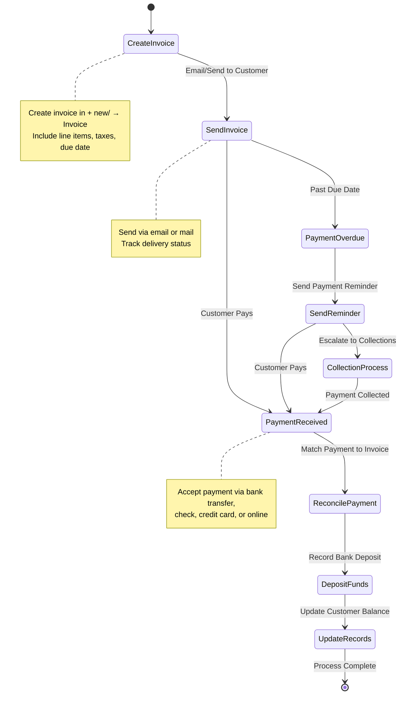

> **💡 Related Sections**: See [+ new/](#new) for invoice creation details, [Sales/](#sales) for customer management, and [Transactions/](#transactions) for payment reconciliation.

### Expense Management Workflow

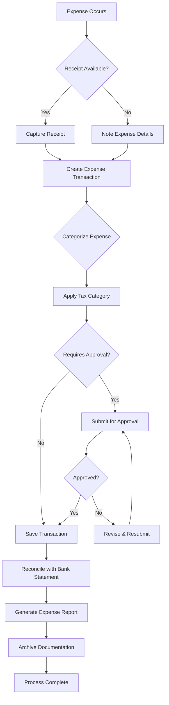

### Month-End Close Process

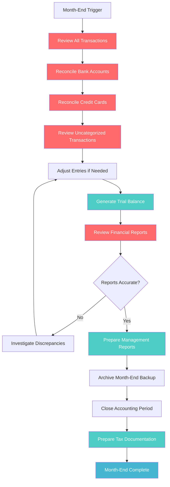

## Haypbooks Best Practices

Implementing best practices when using Haypbooks Online ensures data accuracy, operational efficiency, and maximizes the value derived from the platform.

### Setup & Configuration

- **Chart of Accounts**: Customize the chart of accounts to match your specific business needs and industry requirements
  - *Example*: A restaurant should add accounts for "Food Cost" and "Beverage Cost" under Cost of Goods Sold
- **Classes and Locations**: Use classes for department tracking and locations for multi-site businesses
  - *Example*: Track revenue by class (Online Sales, In-Store Sales) and location (Downtown Store, Mall Location)
- **Products and Services**: Set up detailed product and service information with proper categorization
  - *Example*: For a consulting firm, create service items for "Strategy Consulting" and "Implementation Services" with different billing rates
- **Customer and Vendor Templates**: Create templates for common customer types and vendor relationships
  - *Example*: Set up a "Wholesale Customer" template with specific payment terms and pricing
- **Bank Rules**: Configure bank rules to automate transaction categorization and reduce manual data entry
  - *Example*: Create a rule that automatically categorizes transactions containing "Office Depot" as Office Supplies expense
- **Security Settings**: Implement appropriate user permissions and security protocols
  - *Example*: Give sales staff access to create invoices but restrict them from editing historical transactions

### Practical Use Cases

#### Small Business Setup Scenario
**Business**: Local landscaping company with 5 employees
- **Setup Actions**:
  1. Create service items for "Lawn Mowing," "Tree Trimming," and "Seasonal Cleanup"
  2. Set up classes for different service areas (Residential, Commercial)
  3. Configure bank rules for common vendors (equipment suppliers, fuel stations)
  4. Create customer templates for different customer types (Monthly Service, One-time Project)
  5. Set up recurring invoices for monthly maintenance customers

#### E-commerce Business Integration
**Business**: Online retail store using Shopify
- **Integration Setup**:
  1. Connect Shopify to Haypbooks via commerce section
  2. Map product categories to Haypbooks inventory items
  3. Set up automated order fulfillment workflows
  4. Configure bank rules for payment processor fees
  5. Create custom reports for sales channel performance analysis

### Data Management

- **Regular Backups**: Enable automatic backups and perform manual exports regularly
- **Data Entry Standards**: Establish consistent procedures for data entry across all users
- **Period Reconciliation**: Reconcile all accounts monthly to ensure accuracy
- **Document Management**: Attach receipts and supporting documents to all relevant transactions
- **Period Cleanup**: Perform regular cleanup of duplicate transactions and unused accounts
- **Data Validation**: Implement checks to ensure data integrity and consistency

### Workflow Optimization

- **Automation Setup**: Automate repetitive tasks using rules, templates, and batch processing
- **Integration Utilization**: Leverage integrations to reduce manual data entry between systems
- **Custom Reporting**: Create and save custom reports for regular business analysis
- **Dashboard Customization**: Tailor dashboard widgets to display critical business metrics
- **Mobile Accessibility**: Utilize the mobile app for on-the-go transaction entry and approval
- **Team Training**: Ensure all team members are properly trained on Haypbooks features and procedures

### Financial Management

- **Budget Planning**: Implement and regularly review business budgets against actual performance
- **Cash Flow Monitoring**: Use cash flow tools to track and forecast business liquidity
- **Expense Tracking**: Implement robust expense tracking and categorization systems
- **Revenue Recognition**: Ensure proper revenue recognition according to accounting principles
- **Tax Planning**: Use tax planning tools throughout the year to optimize tax positions
- **Financial Review**: Schedule regular financial reviews to identify trends and opportunities

## Haypbooks Integration Capabilities

### Executive Summary
Haypbooks Online offers extensive integration capabilities that connect your accounting system with essential business tools, creating a unified operational ecosystem. Key integration areas include e-commerce platforms, accounting services, business applications, and productivity tools. Successful integration requires careful planning, data mapping, and ongoing management to maximize efficiency and minimize data silos.

**Key Takeaways:**
- Start with core integrations like bank feeds and accounting services
- Implement integrations in phases to manage complexity and ensure success
- Regularly review integration performance and data accuracy
- Choose integrations that directly support your business workflows
- Maintain clear documentation of integration points and data flows

Haypbooks Online is designed to seamlessly integrate with various business systems and services, creating a comprehensive ecosystem that extends beyond basic accounting functions. These integrations enable businesses to streamline operations, reduce data entry, and maintain consistency across all platforms.

### E-commerce Integration

The `commerce/` section provides direct connections to online sales channels, creating a unified e-commerce and accounting experience:

- **Platform Connections**: Native integrations with major platforms like Shopify, BigCommerce, WooCommerce, and Amazon
- **Order Management**: Synchronizes e-commerce orders with Haypbooks, updating inventory and creating sales transactions automatically
- **Inventory Sync**: Automatically updates stock levels across platforms, preventing overselling and stockouts
- **Payment Processing**: Integrates with multiple payment gateways including Stripe, PayPal, Square, and Authorize.net
- **Customer Data Sync**: Transfers customer information between e-commerce platforms and Haypbooks for consistent customer profiles

### Accounting & Financial Services

Haypbooks provides robust connections to accounting and financial services:

- **`My accountant/` Portal**: Secure collaboration with accounting professionals, with real-time access to company data, document sharing, and direct messaging
- **Data Import/Export**: Seamless transfer of financial data with CSV, Excel, and accounting software like TurboTax and TaxAct
- **API Access**: Comprehensive RESTful API for custom integrations and automation, with detailed documentation and SDKs
- **Bank Feeds**: Direct connection to financial institutions for transaction synchronization, with bank-level security and encryption
- **Tax Services**: Integration with tax preparation software for automated tax calculations and filings

### Business Applications

Haypbooks connects with a wide range of business applications to create a complete business management solution:

- **CRM Integration**: Connect with customer relationship management systems like Salesforce, HubSpot, and Zoho CRM for unified customer data
- **Project Management**: Link with tools like Asana, Trello, and Monday.com for tracking project costs and profitability
- **Inventory Management**: Integration with specialized inventory and warehouse systems like Fishbowl and TradeGecko
- **Payment Processing**: Connection to various payment processors and gateways with automatic reconciliation
- **HR Systems**: Integration with human resources platforms for employee management and payroll coordination

### Productivity Tools

Haypbooks enhances productivity through various integrations with popular productivity tools:

- **Email Integration**: Send invoices and receipts directly from Haypbooks with tracking and read receipts
- **Calendar Sync**: Connect with scheduling systems like Google Calendar and Outlook for appointment-based businesses
- **Document Management**: Integration with cloud storage services like Google Drive, Dropbox, and OneDrive for receipt and document storage
- **Communication Tools**: Integration with Slack and Microsoft Teams for notifications and updates
- **Automation Platforms**: Connect with Zapier and Integromat for custom workflow automation

## Haypbooks Mobile Capabilities

Haypbooks Online offers robust mobile functionality that enables users to manage their finances from anywhere, at any time. This section explores the mobile features and best practices for using Haypbooks on mobile devices.

### Haypbooks Mobile Apps

#### Haypbooks Online Mobile App

- **Platform Availability**: iOS and Android devices
- **Core Features**: Invoicing, expense tracking, receipt capture, dashboard access
- **User Experience**: Intuitive interface optimized for mobile screens
- **Offline Functionality**: Limited functionality when offline with automatic sync when connected
- **Security**: Biometric login, device encryption, remote wipe capabilities
- **Notifications**: Real-time alerts for invoices, payments, and important activities

#### Haypbooks Accounting App

- **Specialized Features**: Enhanced accounting tools for accounting professionals
- **Advanced Reporting**: More sophisticated reporting and analysis tools
- **Multi-company Support**: Switch between multiple company accounts
- **Collaboration Features**: Enhanced sharing and commenting capabilities
- **Custom Views**: Tailored views for accounting professionals
- **Integration**: Deeper integration with accounting workflows

#### Haypbooks Self-Employed App

- **Target Audience**: Freelancers, contractors, and gig economy workers
- **Mileage Tracking**: Automatic mileage tracking with GPS integration
- **Expense Management**: Simplified expense categorization and tracking
- **Tax Estimation**: Quarterly tax estimates and deductions optimization
- **Receipt Capture**: Smart receipt scanning and categorization
- **Income Tracking**: Separate business and personal income tracking
- **Tax Deductions**: Identification of potential tax deductions

### Mobile Features & Functionality

#### Transaction Management

- **Invoicing**: Create and send invoices directly from mobile devices
- **Expense Tracking**: Capture and categorize expenses on the go
- **Receipt Management**: Take photos of receipts and extract data automatically
- **Payment Processing**: Accept payments via mobile device with integrated payment processing
- **Bank Transactions**: View and categorize bank transactions from mobile
- **Time Tracking**: Record billable and non-billable hours with timer functionality

#### Data Access & Management

- **Dashboard Access**: View key financial metrics and business performance
- **Report Viewing**: Access and review important financial reports
- **Customer Management**: View customer details and payment status
- **Vendor Management**: Track vendor information and payment status
- **Inventory Access**: Check stock levels and product information
- **Document Access**: View and manage important business documents

#### Collaboration & Communication

- **Message Center**: Communicate with accountant and team members
- **File Sharing**: Share documents and receipts with stakeholders
- **Approval Workflows**: Approve expenses and invoices on the go
- **Meeting Integration**: Connect calendar events with financial data
- **Team Coordination**: Coordinate with team members on financial tasks
- **Client Communication**: Communicate with clients regarding invoices and payments

### Mobile Security Best Practices

#### Device Security

- **Device Lock**: Use device passcodes, fingerprints, or facial recognition
- **App Updates**: Keep mobile apps updated with the latest security patches
- **Remote Wipe**: Enable remote wipe capabilities for lost or stolen devices
- **Screen Time-Out**: Set appropriate screen timeout periods
- **Public Wi-Fi Caution**: Avoid accessing sensitive data on public networks
- **Bluetooth Security**: Disable Bluetooth when not in use

#### Data Protection

- **Auto Logout**: Configure automatic logout after periods of inactivity
- **Data Encryption**: Ensure data is encrypted both in transit and at rest
- **Secure Storage**: Use secure storage for sensitive financial information
- **Backup Strategy**: Implement regular mobile data backup procedures
- **App Permissions**: Review and restrict unnecessary app permissions
- **Data Minimization**: Only store necessary data on mobile devices

#### Network Security

- **VPN Usage**: Use VPNs when accessing Haypbooks on public networks
- **Network Verification**: Verify network security before connecting
- **Data Compression**: Enable data compression for more secure transmissions
- **Session Management**: Properly manage mobile sessions and logouts
- **Network Monitoring**: Monitor network activity for unusual patterns
- **Firewall Configuration**: Configure device firewalls appropriately

### Mobile Workflow Optimization

#### Field Service & Mobile Workflows

- **Job Site Management**: Track expenses and time at job sites
- **Customer Invoicing**: Create invoices on-site after completing work
- **Receipt Capture**: Capture job-related expenses immediately
- **Time Tracking**: Record time spent at different client locations
- **Progress Updates**: Update project progress from the field
- **Photo Documentation**: Document work with photos attached to transactions

#### Sales & Customer Management

- **On-site Sales**: Process sales and payments at customer locations
- **Customer Presentations**: Show customer account balances and history
- **Order Entry**: Create sales orders directly with customers
- **Product Catalog**: Access product information and pricing
- **Payment Processing**: Accept various payment methods on the go
- **Customer Follow-up**: Schedule follow-up activities while with customers

#### Executive & Managerial Access

- **Real-time Monitoring**: Monitor key business metrics in real-time
- **Decision Support**: Make informed decisions with up-to-date financial data
- **Approval Processes**: Approve expenses and transactions while traveling
- **Performance Review**: Review department and location performance
- **Crisis Management**: Address urgent financial issues remotely
- **Strategic Planning**: Access data for strategic planning sessions

### Mobile Integration Capabilities

#### Third-party App Integration

- **Payment Processors**: Integrate with mobile payment solutions
- **Expense Management**: Connect with expense management apps
- **CRM Systems**: Integration with customer relationship management
- **Project Management**: Connect with project tracking applications
- **Communication Tools**: Integration with messaging and collaboration apps
- **Document Management**: Connection with cloud storage services

#### Device Integration

- **Calendar Sync**: Sync with device calendar for scheduling
- **Contact Sync**: Integrate with device contact lists
- **Camera Integration**: Use device camera for receipt capture
- **GPS Integration**: Track location for mileage and field service
- **Voice Commands**: Use voice commands for hands-free operation
- **Widget Support**: Quick access via device home screen widgets

### Mobile Productivity Tips

#### Efficiency Strategies

- **Batch Processing**: Group similar tasks for efficient completion
- **Template Usage**: Use templates for common transactions and activities
- **Keyboard Shortcuts**: Learn mobile-specific shortcuts and gestures
- **Offline Preparation**: Prepare work while offline for later synchronization
- **Notification Management**: Configure notifications for important alerts
- **Custom Views**: Create mobile-optimized views for frequent tasks

#### Data Entry Optimization

- **Photo Receipts**: Use camera for quick receipt capture and data extraction
- **Voice Input**: Use voice-to-text for faster data entry
- **Copy Function**: Use copy functionality for similar transactions
- **Auto-fill**: Leverage auto-fill for repetitive data entry
- **Barcode Scanning**: Use barcode scanning for product information
- **QR Codes**: Generate and scan QR codes for quick access

## Haypbooks Migration & Onboarding Guide

Whether transitioning from another accounting system or onboarding new team members, a structured approach ensures a smooth implementation and maximizes the benefits of Haypbooks Online.

### Data Migration from Other Systems

#### Pre-Migration Preparation

- **Data Assessment**: Evaluate current data quality, completeness, and structure
- **Mapping Requirements**: Create a detailed mapping of existing accounts and transactions to Haypbooks structure
- **Cleanup Activities**: Remove duplicate entries, inactive accounts, and outdated data
- **Migration Timeline**: Establish a realistic timeline with milestones and checkpoints
- **Stakeholder Communication**: Inform all stakeholders about the migration process and timeline
- **Backup Strategy**: Ensure comprehensive backups of existing data before migration

#### Migration Methods

- **Direct Import**: Use Haypbooks import tools for CSV, Excel, or IIF files
- **Data Conversion Services**: Utilize Intuit's data conversion services for complex migrations
- **Third-Party Migration Tools**: Specialized tools for specific accounting software migrations
- **Custom Development**: Custom scripts for unique or highly complex data requirements
- **Professional Services**: Engage Haypbooks ProAdvisors for professional migration assistance

#### Post-Migration Activities

- **Data Verification**: Confirm all data migrated accurately and completely
- **Reconciliation**: Reconcile migrated data with source systems
- **Process Testing**: Verify all accounting processes function correctly
- **User Training**: Train all users on the new system and processes
- **Go-Live Preparation**: Prepare for the transition to live operations
- **Contingency Planning**: Establish fallback procedures in case of issues

### Team Onboarding

#### Role-Based Onboarding

- **Administrators**: Focus on system configuration, user management, and security settings
- **Accountants**: Emphasize transaction processing, reconciliation, and reporting
- **Managers**: Highlight dashboard usage, financial analysis, and decision-making tools
- **Data Entry Staff**: Train on transaction entry, categorization, and document handling
- **End Users**: Cover basic navigation, task completion, and reporting access

#### Training Resources

- **Haypbooks Training Library**: Official tutorials and guides for different user levels
- **Custom Training Materials**: Create role-specific documentation and job aids
- **Video Tutorials**: Short videos demonstrating common tasks and workflows
- **Hands-on Practice**: Provide sandbox environments for practice without affecting live data
- **Documentation**: Create comprehensive user guides and quick reference materials
- **Support Channels**: Establish clear support channels for ongoing assistance

#### Change Management

- **Communication Plan**: Regular updates about the transition process and benefits
- **Feedback Mechanisms**: Create channels for user feedback and concerns
- **Success Metrics**: Define and measure success metrics for the implementation
- **Recognition Program**: Acknowledge and reward successful adoption and proficiency
- **Continuous Improvement**: Regular review and refinement of processes based on feedback
- **Phased Rollout**: Consider a phased rollout to manage change more effectively

### Implementation Timeline

#### Phase 1: Planning (2-4 weeks)
- Requirements gathering
- System configuration planning
- Data migration strategy
- Training plan development

#### Phase 2: Setup (1-2 weeks)
- Company configuration
- Account setup and customization
- User creation and permissions
- Integration setup

#### Phase 3: Data Migration (1-3 weeks)
- Data extraction and cleanup
- Data import and verification
- Reconciliation and validation
- Migration adjustments

#### Phase 4: Training (1-2 weeks)
- Administrator training
- User group training
- Documentation development
- Support setup

#### Phase 5: Go-Live (Ongoing)
- Parallel operations (if applicable)
- Full system transition
- Monitoring and support
- Process refinement

### Success Metrics

- **Data Accuracy**: Zero material errors in migrated and new data
- **User Adoption**: Percentage of active users and frequency of use
- **Process Efficiency**: Time savings and error reduction compared to previous system
- **Reporting Timeliness**: Ability to generate reports on schedule
- **User Satisfaction**: Feedback from users on system usability and support
- **Business Impact**: Improvements in decision-making and financial management

## Haypbooks Troubleshooting Guide

Even with the most careful setup, users may encounter issues when working with Haypbooks Online. This guide provides solutions to common problems and tips for resolving issues efficiently.

### Common Issues and Solutions

#### Login and Access Problems

- **Issue**: Unable to login to Haypbooks Online
  - **Solution**: Clear browser cache and cookies, try a different browser, reset password if needed
  - **Prevention**: Enable two-factor authentication and keep contact information updated

- **Issue**: "Something went wrong" error messages
  - **Solution**: Use a supported browser, disable browser extensions, check internet connection
  - **Prevention**: Keep browser updated, use Haypbooks in incognito mode to test for extension conflicts

#### Data Entry and Accuracy Issues

- **Issue**: Duplicate transactions appearing
  - **Solution**: Use the "Find duplicates" tool, manually remove duplicates, implement better data entry procedures
  - **Prevention**: Set up bank rules, use the "Add to existing transaction" feature, train staff on data entry protocols

- **Issue**: Incorrect categorization of transactions
  - **Solution**: Review and correct transaction categories, update bank rules, use batch editing
  - **Prevention**: Create comprehensive bank rules, conduct regular category reviews

#### Reporting and Analysis Problems

- **Issue**: Reports not matching expectations
  - **Solution**: Verify date ranges, check transaction categorization, ensure account mapping is correct
  - **Prevention**: Regular report reviews, establish consistent reporting procedures

- **Issue**: Slow report generation
  - **Solution**: Reduce date ranges, simplify report filters, generate reports during off-peak hours
  - **Prevention**: Schedule report generation, use report templates, limit historical data in reports

#### Integration and Data Sync Issues

- **Issue**: Third-party app not syncing data
  - **Solution**: Reconnect the app, check API settings, verify data mapping, contact app support
  - **Prevention**: Regularly review integration settings, monitor sync logs

- **Issue**: Bank feed not updating
  - **Solution**: Refresh bank connection, reauthenticate with financial institution, check for service issues
  - **Prevention**: Regularly monitor bank feeds, enable transaction notifications

### Performance Optimization

- **Browser Performance**: Use supported browsers, clear cache regularly, disable unnecessary extensions
- **Internet Connection**: Ensure stable internet connectivity, consider wired connections for critical operations
- **Data Management**: Regular cleanup of old data, archive historical data when possible
- **Session Management**: Log out properly, avoid multiple simultaneous sessions
- **Mobile App Performance**: Keep app updated, clear app cache, restart device when needed

### When to Seek Professional Help

- **Complex Accounting Issues**: When accounting principles are unclear or transactions are complex
- **Data Corruption**: When data appears damaged or inconsistent
- **Integration Challenges**: When multiple system integrations require specialized knowledge
- **Security Concerns**: When potential security breaches or data access issues arise
- **Major System Changes**: When implementing significant business process changes

### Support Resources

- **Haypbooks Help Center**: Comprehensive documentation and tutorials
- **Community Forums**: Peer support and shared solutions
- **Live Expert Support**: Direct access to Haypbooks experts
- **Accountant Collaboration**: Professional accounting guidance
- **Training Resources**: Video tutorials and webinars

## Haypbooks Pricing & Subscription Management

Understanding Haypbooks Online pricing options and effectively managing subscriptions can help businesses optimize their investment in the platform while ensuring they have the right features for their needs.

### Haypbooks Online Pricing Plans

#### Simple Start

- **Target Audience**: Very small businesses with basic accounting needs
- **Core Features**: Invoicing, expense tracking, cash flow dashboard, receipt capture
- **User Limit**: Up to 3 users
- **Mobile Access**: Full mobile app access
- **Support**: Included support with 24/7 access to support knowledge base
- **Ideal For**: Freelancers, sole proprietors, and very small businesses

#### Essentials

- **Target Audience**: Small businesses needing more advanced features
- **Core Features**: All Simple Start features plus bill tracking, time tracking, and up to 40 integrations
- **User Limit**: Up to 5 users
- **Mobile Access**: Full mobile app access
- **Support**: Included support with priority access to support team
- **Ideal For**: Service-based businesses with employees

#### Plus

- **Target Audience**: Growing businesses with more complex needs
- **Core Features**: All Essentials features plus inventory tracking, project profitability tracking, and up to 50 integrations
- **User Limit**: Up to 5 users
- **Mobile Access**: Full mobile app access
- **Support**: Priority customer support
- **Ideal For**: Businesses with inventory or project-based work

#### Advanced

- **Target Audience**: Established businesses with complex accounting needs
- **Core Features**: All Plus features plus advanced inventory, batch invoicing, and custom user permissions
- **User Limit**: Up to 25 users
- **Mobile Access**: Full mobile app access
- **Support**: Dedicated customer success manager
- **Ideal For**: Businesses with complex inventory or multi-location operations

### Add-on Services & Features

#### Payroll Services

- **Basic Payroll**: Core payroll processing with tax forms
- **Enhanced Payroll**: Additional features like direct deposit and tax filing
- **Full Service Payroll**: Complete payroll solution with tax compliance and filings
- **Self-Service Payroll**: DIY payroll with calculation assistance
- **Contractor Payroll**: Specialized solution for 1099 contractors
- **Multi-state Payroll**: Support for employees in multiple states

#### Payment Processing

- **Haypbooks Payments**: Integrated payment processing solution
- **In-Person Payments**: Hardware for in-person payment acceptance
- **Online Payments**: E-commerce and online payment acceptance
- **Mobile Payments**: Mobile payment processing with card readers
- **International Payments**: Multi-currency payment acceptance
- **Payment Gateway Integration**: Connection to third-party payment processors

#### Time Tracking

- **Time Tracking Tools**: Built-in time tracking functionality
- **Time Tracking Integration**: Integration with dedicated time tracking apps
- **Employee Time Tracking**: Time tracking for employee hours and wages
- **Project Time Tracking**: Time tracking by project or client
- **Billable Time Tracking**: Integration with invoicing for billable hours
- **Time Tracking Reports**: Detailed reporting on time and attendance

#### Advanced Inventory

- **Inventory Tracking**: Basic inventory level tracking
- **Advanced Inventory**: Detailed inventory management with locations
- **Barcode Scanning**: Integration with barcode scanning systems
- **Inventory Reporting**: Advanced inventory valuation and reporting
- **Purchase Order Management**: Integration with purchase order workflows
- **Inventory Reordering**: Automated reordering based on stock levels

### Subscription Management

#### Plan Selection

- **Needs Assessment**: Evaluate business needs against available features
- **User Requirements**: Determine necessary user access and permissions
- **Feature Prioritization**: Identify must-have vs. nice-to-have features
- **Future Planning**: Consider business growth plans when selecting plans
- **Cost Analysis**: Compare total cost of ownership across plans
- **ROI Evaluation**: Assess potential return on investment for each plan

#### User Management

- **User Roles**: Define appropriate roles and permissions
- **User Assignment**: Assign users to appropriate access levels
- **User Training**: Develop training based on user roles and responsibilities
- **Access Reviews**: Regular review of user access and permissions
- **Offboarding Process**: Streamlined process for removing departing employees
- **Guest Access**: Configure appropriate guest access for external collaborators

#### Subscription Changes

- **Plan Upgrades**: Process for upgrading to higher-tier plans
- **Plan Downgrades**: Process for downgrading to lower-tier plans
- **Add-on Management**: Adding and removing optional services
- **Proration Handling**: Understanding of proration for mid-cycle changes
- **Change Timing**: Optimal timing for subscription changes
- **Data Backup**: Ensure proper data backup before significant changes

### Cost Optimization

#### Subscription Cost Management

- **Plan Optimization**: Regular review of plan fit to avoid overpayment
- **User Optimization**: Remove unnecessary user licenses
- **Add-on Review**: Regular evaluation of add-on services and usage
- **Promotion Utilization**: Take advantage of promotions and discounts
- **Annual Planning**: Plan for subscription costs in annual budgets
- **Cost Analysis**: Regular analysis of subscription costs vs. benefits

#### Efficiency Gains

- **Automation Benefits**: Calculate time and cost savings from automation
- **Error Reduction**: Quantify cost savings from reduced errors
- **Productivity Improvements**: Measure productivity gains from streamlined workflows
- **Integration Benefits**: Evaluate cost savings from system integrations
- **Resource Allocation**: Optimize staff time and resources
- **Scalability Benefits**: Assess value of scalable infrastructure

#### Financial Management

- **Subscription Tracking**: Centralized tracking of all software subscriptions
- **Cost Allocation**: Allocate subscription costs to appropriate departments
- **Budget Planning**: Include subscription costs in financial planning
- **Expense Analysis**: Regular analysis of software and technology expenses
- **ROI Measurement**: Track return on investment for Haypbooks subscription
- **Cost Forecasting**: Project future subscription costs based on growth plans

### Value Realization

#### Strategic Benefits

- **Financial Visibility**: Enhanced financial visibility and decision-making
- **Operational Efficiency**: Streamlined accounting and financial operations
- **Business Growth**: Scalability to support business growth
- **Risk Management**: Improved financial controls and risk management
- **Compliance**: Enhanced regulatory compliance and reporting
- **Competitive Advantage**: Technology-enabled competitive advantages

#### Operational Improvements

- **Time Savings**: Reduced time spent on manual accounting tasks
- **Error Reduction**: Fewer accounting errors and reconciliation issues
- **Process Improvement**: Streamlined financial workflows
- **Resource Optimization**: Better allocation of financial resources
- **Decision Support**: Improved data for business decisions
- **Customer Service**: Enhanced customer service through better financial data

#### Long-term Value

- **Business Continuity**: Systems and processes that support long-term operations
- **Knowledge Management**: Preservation of business financial knowledge
- **Scalability**: Infrastructure that grows with the business
- **Integration Ecosystem**: Connected business systems and data flow
- **Financial Foundation**: Solid foundation for financial operations
- **Strategic Asset**: Haypbooks as a strategic business asset

## Haypbooks Interface Architecture

### Main Functional Areas


### Data Flow Between Systems


### User Access Levels


## Haypbooks HTML Interface Structure

### Core Transaction Creation Tools

The Core Transaction Creation Tools section forms the foundation of Haypbooks Online, serving as the central hub for all financial data entry. These tools are designed with specific accounting workflows in mind, ensuring data integrity and consistency across the platform.

### + new/
**Primary Transaction Creation Hub**

This central section contains all forms and tools for creating various transactions and records in Haypbooks. It serves as the primary entry point for initiating financial activities, including customer invoicing, vendor payments, expense tracking, and more. Each tool is designed to streamline specific accounting workflows while maintaining data integrity across the system.

#### Key Features:
- **Comprehensive Transaction Types**: Supports all major business transactions from sales to expenses
- **Data Validation**: Built-in checks ensure accurate data entry and compliance with accounting standards
- **Template Support**: Save time with pre-configured templates for common transaction types
- **Integration**: Seamless connection with other Haypbooks modules for unified data management
- **Mobile Accessibility**: Most transaction types can be created on the go using the mobile app

### Books review/
**Financial Record Analysis Tools**

Comprehensive tools for reviewing and analyzing financial books and records, allowing for in-depth examination of account activities, reconciliation verification, and financial health assessment. This section provides critical insights into the financial status of the business and helps identify discrepancies, errors, and areas for improvement.

#### Key Features:
- **Account Reconciliation**: Tools for matching transactions between accounts and identifying discrepancies
- **Transaction Verification**: Detailed views of all transactions with filtering and search capabilities
- **Error Identification**: Flags unusual transactions, potential duplicates, and categorization issues
- **Audit Trail**: Complete history of changes to financial records for compliance and review
- **Custom Views**: Create customized views of account data based on specific analysis needs
- **Export Capabilities**: Export financial data for external analysis or reporting

### Budgets/
**Financial Planning and Management**

Tools for creating, managing, and monitoring financial budgets. Compare projected financial plans against actual performance to identify trends, variances, and opportunities for optimization. Effective budget management is crucial for financial control, resource allocation, and strategic decision-making.

#### Key Features:
- **Budget Creation**: Build detailed budgets by account, class, or customer with customizable time periods
- **Variance Analysis**: Automatically compare budgeted amounts to actual results with visual indicators
- **Forecasting Tools**: Project future financial performance based on historical data and trends
- **Scenario Planning**: Create multiple budget scenarios to evaluate different business strategies
- **Progress Tracking**: Monitor budget performance in real-time with customizable alerts
- **Reporting**: Generate comprehensive budget reports with drill-down capabilities to transaction level

### Choose company/
**Company Management Hub**

Centralized location for selecting and managing company settings, profiles, and configurations. Enables seamless switching between different company accounts and organizational structures. This section is essential for users managing multiple businesses or subsidiaries, providing a unified interface for company administration.

#### Key Features:
- **Multi-Company Management**: Switch between different company files without logging out
- **Company Profiles**: Access and edit company information, tax IDs, and business details
- **User Management**: Control access levels and permissions for different company files
- **Data Separation**: Maintain strict separation of financial data between companies
- **Consolidated Reporting**: View combined reports across multiple companies when needed
- **Template Settings**: Apply consistent settings across multiple company files

### Dashboard/
**Business Performance Command Center**

Centralized hub for monitoring overall business performance through customizable widgets, key performance indicators (KPIs), and real-time data visualization. Provides immediate access to critical financial metrics, operational insights, and strategic decision-making tools. The dashboard serves as the central nervous system of Haypbooks, offering a comprehensive overview of business health at a glance.

#### Key Features:
- **Customizable Widgets**: Drag and drop widgets to create a personalized dashboard layout
- **Real-time Data**: Live updates of financial metrics and business performance indicators
- **KPI Tracking**: Monitor key performance indicators tailored to your industry and business needs
- **Visual Analytics**: Interactive charts and graphs for data visualization and trend analysis
- **Drill-down Capability**: Navigate from high-level metrics to detailed transaction data
- **Alert System**: Set up notifications for critical business events and threshold breaches
- **Mobile Optimization**: Access dashboard insights on the go with the mobile app

### Inventory/
**Inventory Management System**

Comprehensive suite of tools for managing inventory levels, stock tracking, product lifecycle, and fulfillment operations. Enables efficient control over physical goods, from procurement through to final delivery. Effective inventory management is critical for optimizing cash flow, reducing carrying costs, and ensuring product availability for customers.

#### Key Features:
- **Stock Tracking**: Real-time visibility into inventory levels across multiple locations
- **Order Management**: Track purchase orders, returns, and transfers with detailed status updates
- **Product Management**: Maintain detailed product information, pricing, and categorization
- **Fulfillment Operations**: Coordinate shipping, receiving, and warehouse activities
- **Inventory Valuation**: Track inventory value using various costing methods (FIFO, LIFO, Average Cost)
- **Low Stock Alerts**: Automated notifications when inventory levels fall below predefined thresholds
- **Batch/Lot Tracking**: Manage products with expiration dates or serial numbers

### LIve experts/
**Expert Support & Guidance**

Direct access to certified Haypbooks experts and accounting professionals for personalized assistance, troubleshooting, and strategic guidance. Provides real-time support for complex accounting challenges and optimization opportunities. This feature bridges the gap between standard software support and professional accounting services, offering expert-level advice without requiring a separate accounting retainer.

#### Key Features:
- **Real-time Chat**: Instant messaging with certified Haypbooks ProAdvisors and accounting experts
- **Screen Sharing**: Visual guidance through complex procedures and setup processes
- **Video Consultations**: Scheduled sessions for in-depth business strategy and optimization
- **Priority Support**: Expedited issue resolution for premium subscribers
- **Specialized Expertise**: Access to experts in specific industries or accounting specialties
- **Learning Resources**: Tutorials and best practices from industry professionals
- **Workflow Optimization**: Personalized recommendations for streamlining accounting processes

### Lending & Banking/
**Financial Institution Integration**

Tools for managing relationships with financial institutions, including bank accounts, credit facilities, and lending products. Streamlines banking operations and cash flow management through integrated financial connections. This section provides a centralized hub for all financial institution relationships, simplifying account management and transaction processing.

#### Key Features:
- **Bank Account Management**: Connect and manage multiple bank accounts in one place
- **Transaction Synchronization**: Automatically import and categorize bank transactions
- **Credit Facility Management**: Track lines of credit, loans, and other credit products
- **Cash Flow Analysis**: Monitor cash position and forecast future cash needs
- **Reconciliation Tools**: Streamlined account reconciliation with bank statements
- **Transfer Management**: Initiate and track transfers between accounts
- **Financial Institution Directory**: Discover and connect with compatible banks and credit providers

### My accountant/
**Accountant Collaboration Portal**

Secure platform for seamless collaboration with accounting professionals, facilitating data sharing, workflow coordination, and professional oversight. Enables efficient accounting review and strategic financial planning. This portal transforms the relationship between business owners and their accounting professionals, providing a secure environment for real-time collaboration and document exchange.

#### Key Features:
- **Secure Data Sharing**: Controlled access to company financial data with customizable permissions
- **Document Exchange**: Secure sharing of financial statements, tax documents, and other sensitive files
- **Real-time Communication**: Built-in messaging and commenting system for efficient collaboration
- **Task Management**: Assign and track accounting tasks and review items
- **Workflow Coordination**: Streamlined processes for month-end closes, tax preparation, and audits
- **Professional Oversight**: Accountant can review transactions, make adjustments, and provide guidance
- **Year-round Support**: Continuous access to professional accounting advice beyond tax season

### Payroll/
**Employee Compensation Management**

Comprehensive payroll processing system for managing employee compensation, tax withholdings, benefits, and compliance. Streamlines payroll operations while ensuring adherence to labor laws and tax regulations. Effective payroll management is critical for employee satisfaction, regulatory compliance, and accurate financial reporting.

#### Key Features:
- **Employee Management**: Maintain detailed employee information, compensation, and benefits
- **Payroll Processing**: Calculate wages, deductions, and taxes with automated calculations
- **Tax Compliance**: Automatic calculation and filing of payroll taxes with regulatory agencies
- **Time Tracking**: Integration with time tracking systems for accurate hours and overtime calculation
- **Direct Deposit**: Automated payment distribution to employee bank accounts
- **Reporting**: Generate payroll reports for financial accounting and compliance purposes
- **Benefits Administration**: Manage health insurance, retirement plans, and other employee benefits
- **Payroll Integration**: Seamless integration with accounting for accurate expense tracking

### Project/
**Project Management & Tracking**

Project lifecycle management tools for tracking project costs, timelines, resources, and profitability. Enables detailed project analysis, budget monitoring, and performance evaluation. For service-based businesses and project-oriented organizations, effective project management is essential for controlling costs, meeting deadlines, and ensuring profitability.

#### Key Features:
- **Project Creation**: Set up detailed projects with budgets, timelines, and team assignments
- **Time Tracking**: Record time spent on project tasks with billable and non-billable hours
- **Expense Tracking**: Allocate project expenses to specific projects and cost categories
- **Progress Monitoring**: Track project milestones, completion status, and resource utilization
- **Profitability Analysis**: Compare project costs to revenue and calculate profit margins
- **Resource Management**: Assign team members and track their availability across projects
- **Reporting**: Generate project reports for management and client billing
- **Integration**: Connect with other Haypbooks modules for comprehensive project accounting

### Reports/
**Financial Intelligence & Analytics**

Comprehensive reporting system for generating, customizing, and analyzing financial data. Provides actionable insights through customizable reports, performance tracking, and business intelligence tools. Effective reporting transforms raw financial data into strategic insights, enabling data-driven decision-making across all levels of the organization.

#### Key Features:
- **Report Library**: Extensive collection of pre-built reports for common business needs
- **Custom Report Builder**: Create tailored reports with specific data fields and filters
- **Financial Analysis**: Tools for trend analysis, ratio calculations, and performance benchmarking
- **Data Visualization**: Interactive charts and graphs for enhanced data understanding
- **Scheduling & Distribution**: Automate report generation and delivery to stakeholders
- **Export Options**: Export reports in multiple formats for further analysis or presentation
- **Drill-down Capability**: Navigate from summary reports to detailed transaction data
- **Report Sharing**: Secure sharing of reports with team members and external stakeholders

#### CSV export filename conventions

To keep downloads consistent and testable across the app, all CSV exports use a shared naming pattern and sanitized tokens.

- Structure: CSV files include a caption line, a blank spacer line, a header row, data rows, and a trailing Totals row when applicable.
- Date formatting: All dates in filenames use ISO `YYYY-MM-DD`.
- General naming:
   - Range: `<slug>-<start>_to_<end>.csv`
   - As-of: `<slug>-asof-<date>.csv`
- Tokens: Optional context tokens (e.g., product, customer) may be appended as `_token`, where each token is lowercased, spaces -> `-`, and non-alphanumeric characters removed. See `CSV_Filename_Tokens.md` for the full token catalog.
- As-of-only filename exceptions: The following reports must use the as-of style in the filename even when a date range appears in the report caption/UI. This preserves downstream expectations and avoids regressions:
   - `purchase-list`
   - `purchases-by-product-detail`
   - `check-detail`
- Examples:
   - `sales-by-customer-summary-2025-09-01_to_2025-09-30.csv`
   - `retained-earnings-asof-2025-09-30.csv`
   - `sales-by-product-summary-2025-09-01_to_2025-09-30_widgets.csv` (with a `widgets` token)

    #### Caption rows and exceptions

    Most exports use a shared caption builder for the first CSV row:
    - If both `start` and `end` are provided, the caption is a formatted human range (e.g., "September 1-7, 2025").
    - Otherwise, the caption is "As of <Month D, YYYY>" using the end date when provided, else today.

    Notable exceptions (kept to preserve expected shapes in detail-style reports and tests):
    - Detail aging and detail open invoices use ISO forms for caption when only an end date is supplied:
       - Open Invoices: first row equals the raw end ISO (e.g., `2025-09-04`).
       - A/R and A/P Aging Detail: same behavior (raw end ISO). If both dates are provided, the caption uses an ISO range `YYYY-MM-DD - YYYY-MM-DD`.
    - Check Detail and Purchases by Product/Service Detail/Summary: when both dates are provided, the caption uses a deterministic ISO range `YYYY-MM-DD - YYYY-MM-DD` to keep outputs stable.

    These exceptions ensure parity with established behaviors and avoid regressions in automated tests while the general case benefits from centralized formatting.

      #### Aging summaries — configurable buckets (AR/AP)

      The A/R and A/P Aging Summary exports support optional query parameters to adjust bucket granularity without breaking defaults:

      - Endpoint examples:
         - `/api/reports/ar-aging/export?period=YTD&end=2025-09-30&days=30&periods=4`
         - `/api/reports/ap-aging/export?period=QTD&end=2025-09-30&days=15&periods=6`
      - Parameters:
         - `days` (optional): Days per period bucket. Default 30. Minimum 1. When omitted or invalid, defaults are used.
         - `periods` (optional): Number of pre-120 buckets. Default 4. Minimum 1. The last bucket aggregates `periods * days` and higher (shown as `N+`).
      - Behavior:
         - Headers render as `Customer/Vendor, Current, <days>, <2*days>, ..., <(periods*days)+>, Total`.
         - The first caption row remains `As of,<Month D, YYYY>` and filenames remain `*-aging-<PERIOD>-asof-<YYYY-MM-DD>.csv` as before.
         - When parameters are omitted, behavior is identical to the existing 30/60/90/120+ buckets to preserve tests.

    #### Management Pack (Reports Hub) — CSV/PDF naming and CSV shape

   To keep the combined export consistent and prevent drift across CSV and PDF, the pack export uses the shared filename helper in period mode and mirrors the same base name for PDF.

   - Endpoints: `/api/reports/pack/export` (CSV by default) and `/api/reports/pack/export?format=pdf`.
   - Filename pattern (period mode via buildCsvFilename):
      - Preset period: `management-pack-<PERIOD>[_tokens].csv`
      - Custom period: `management-pack-Custom_<YYYY-MM-DD>_to_<YYYY-MM-DD>[_tokens].csv`
      - Optional name token: when a saved preset name is supplied (`name=`), it’s sanitized and appended as a token (default token position, after the period/range segment).
      - PDF: identical base as CSV with `.pdf` extension.
   - Caption and metadata (CSV):
      - First row caption uses the shared caption builder (range when start/end; otherwise “As of <YYYY-MM-DD>”).
      - Followed by a blank spacer line.
      - Then filter metadata rows: `Pack,<name>` (when present), `Preset,<preset>`, `Range,<start> to <end>` when preset is Custom, `As of,<date>`, `Period Start,<YYYY-MM-DD>`, `Period End,<YYYY-MM-DD>`, `Reports,<comma-separated list>`; then a blank spacer.
      - KPI section header: `KPI,Value`, followed by rows for DSO, DPO, AR/AP open balances, GL balanced, and Net margin (%); then a blank spacer.
      - Section list: `Section,Note` with a line per selected report.
   - Permissions: `reports:read` required.
   - Print: Keep the Print button in report headers per standard; no print-only routes.

Print behavior for reports:
- Keep a persistent Print button in the report header that triggers the browser’s print dialog.
- Do not create separate print-only routes or pages; legacy print URLs should redirect to the canonical route.

#### Closed-period safeguards and posting rules

To keep financials protected and predictable, posting operations enforce closed-period rules consistently across the app and APIs.

- Normalized posting dates: All posting operations normalize dates to ISO `YYYY-MM-DD` before validation to avoid time-of-day drift.
- Enforcement points:
   - Customer payments, deposits, vendor credits, and bill payments assert the target posting date is in an open period before applying allocations.
   - Journal posting asserts the period is open; reversing entries default to the next open date when the requested date is closed.
- UI behavior: When users attempt to post into a closed period, the action is blocked with a clear error banner/message. No silent adjustments are made, except for explicit reversal flows that choose the next open day.
- API behavior: Business rule violations such as closed-period posting or invalid allocations return HTTP 400 with a descriptive message; missing entities continue to return 404.
- Accessibility: Errors surface via standard alert semantics and are included in the export/log context when relevant. No print-only variants are used; the single Print button behavior is preserved.

   Journal Entry rules (UI + API)
   - Single-sided lines: Each row must have only one of Debit or Credit entered. In the UI, when a user types a Debit amount, the Credit field auto-clears (and vice versa). The API rejects any line where both amounts are non-zero with HTTP 400 and a descriptive message (e.g., "Line N: only one of debit or credit may be non-zero").
   - Balanced totals required: The entry cannot be saved unless total Debits equal total Credits. The Save button remains disabled until the variance is zero. The API returns HTTP 400 on imbalance.
   - Visible variance indicator: The UI displays Debits, Credits, and Variance (Debits − Credits) with an ARIA-live region to announce changes for assistive technologies. This makes the reason for a blocked save obvious and accessible.
   - Closed-period guard: Journal dates in a closed period are blocked in the UI with clear messaging. The server enforces the same guard and returns HTTP 400; no silent date shifting occurs (except explicit reversal flows described below).
   - Tests: Automated tests cover dual-sided line rejection and total imbalance, ensuring parity and preventing regressions.

   Reversal workflow (journals):
   - A posted journal can be reversed via the UI action on its detail page or programmatically using `POST /api/journal/{id}/reverse` with an optional `{ date, memo }` body.
   - When a date is not provided, the system defaults to the next calendar day after the original entry. If that date falls in a closed period, the reversal is automatically scheduled for the first open day after the closed-through date.
   - The reversing entry swaps debits and credits, links back to the original via `reversesEntryId`, and sets `reversing: true`. Period locks are enforced consistently across UI, API, and posting helpers.
   - Brand policy and print behavior remain unchanged: the single Print button triggers the browser print dialog with no dedicated print-only routes.

      Reclassification (adjustments):
      - Use `POST /api/journal/reclass` to move an amount from one account to another by posting an adjusting journal (DR to-account, CR from-account).
      - Required fields: `fromAccountNumber`, `toAccountNumber`, and positive `amount`; optional `date` and `memo`.
      - The specified date must be in an open period; reclass does not auto-shift dates when closed. A clear 400 error is returned if the period is closed through the provided date.

         Accounts Receivable write-offs:
         - Use `POST /api/invoices/{id}/writeoff` to reduce an invoice’s remaining balance by posting an adjusting journal (DR expense, CR accounts receivable) and applying the write-off amount to the invoice.
         - Fields: optional `amount` (defaults to remaining), optional `date` and `memo`, optional `expenseAccountNumber` (defaults to 6000).
         - The write-off date must be in an open period; if the date is closed, the API returns 400 with guidance. No auto-shift occurs for write-offs.

#### A/R report parity: Open Invoices and Unpaid Bills

To align with the accounting reference and keep tests stable, ensure these reports share consistent structure and naming behavior.

- Caption: Use "As of <Month D, YYYY>" style for both reports when generated for a single date context. For ranges in the UI, keep the CSV filename using as-of pattern to preserve downstream expectations.
- Columns (typical default set):
   - Customer/Vendor
   - Transaction type
   - Num
   - Term
   - Due date
   - Aging buckets or Aging date (where applicable)
   - Open balance
- Grouping: Top-level grouped by Customer (Open Invoices) or Vendor (Unpaid Bills), with transaction rows beneath; include a TOTAL footer row.
- Totals: Provide a trailing Totals row with the grand open balance.
- Scope note (Unpaid Bills): Include all unpaid vendor bills within the selected bill-date range, not only those past due, to match expected allocation and visibility rules.
- CSV filenames: Use buildCsvFilename with as-of form and no tokens by default.
   - open-invoices-asof-YYYY-MM-DD.csv
   - unpaid-bills-asof-YYYY-MM-DD.csv
- Print: Keep the Print button; no dedicated print pages.

Note: These rules standardize export behavior and avoid regressions in tests that assert caption, header, and filename shapes.

#### A/R report parity: Invoices & Received Payments

- Caption: First line shows an explicit date range when both start/end are provided; otherwise shows an as-of date. The filename uses the as-of convention.
- Header: `Customer, Invoice Number, Invoice Date, Due Date, Payment Date, Payment Amount, Open Balance`.
- Rows: Include invoices and any received payments attribution where applicable; append a trailing Totals row summing the Open Balance.
- Filename: `invoices-and-received-payments-asof-<YYYY-MM-DD>.csv` generated via the centralized helper.
- Implementation: Uses shared `deriveRange` and `buildCsvFilename` to keep behavior consistent with other A/R exports.

#### A/R report parity: Customer Balance Detail and Summary

To extend parity across A/R reports, Customer Balance Detail and Summary follow the same CSV structure and naming policies:

- Caption: First line shows either a date range when both start and end are present, or “As of <YYYY-MM-DD>” using the end date when provided, otherwise today.
- Columns:
   - Detail: Date, Type, Number, Customer, Memo, Amount; includes a trailing Totals row summing Amount.
   - Summary: Customer, Open Balance; includes a trailing Totals row summing Open Balance.
- Filenames: customer-balance-detail-asof-<date>.csv and customer-balance-summary-asof-<date>.csv generated via the centralized helper; tokens default to append after the range/as-of.
- Implementation: Both routes use shared deriveRange and buildCsvFilename to ensure consistent behavior with other reports.

#### A/P report parity: Vendor Balance Detail and Summary

To mirror A/R parity on the payables side, Vendor Balance Detail and Summary follow identical CSV structure and naming policies adapted for vendors:

- Caption: First line shows either a date range when both start and end are present, or the raw ISO as-of date `YYYY-MM-DD` when only an end date is provided (detail-style stability). If neither is provided, the caption resolves to today.
- Columns:
   - Detail: Date, Type, Number, Vendor, Memo, Amount; includes a trailing Totals row summing Amount.
   - Summary: Vendor, Open Balance; includes a trailing Totals row summing Open Balance.
- Filenames: vendor-balance-detail-asof-<date>.csv and vendor-balance-summary-asof-<date>.csv generated via the centralized helper; tokens default to append after the range/as-of.
- Implementation: JSON routes use the shared deriveRange helper for period/range normalization; CSV exports delegate to JSON and use buildCsvRangeOrDate and buildCsvFilename. Permission `reports:read` is enforced.
- Print: Keep the single Print button; no print-only variants.

#### A/P: Scheduled Bills

- UI: Page at `/bills/scheduled` lists bills with a `scheduledDate`; includes Export CSV and a Print button.
- Export API: `/api/bills/scheduled/export`.
   - Caption-first CSV, then blank spacer, then header: `Bill #,Vendor,Due Date,Scheduled Date,Total,Balance`.
   - Filtering: Uses `deriveRange(period?, start?, end?)`; filters by Due Date. Includes any bill with a scheduled date set.
   - Filename: `buildCsvFilename('scheduled-bills', { start, end, asOfIso })` with `asOfIso = end || today`.
- Permissions: `reports:read` required for export; `bills:write` for schedule/unschedule at `/api/bills/:id/schedule`.

#### A/P Payments: Pay Bills → Checks (print later)

To mirror expected A/P workflows, paying a bill by check with “Print later” queues a check in the internal checks store and records an audit event. Printing leverages a single Print button; no print-only routes.

- Endpoint: `POST /api/bills/:id/payments` (RBAC: `bills:write`)
- Request body (minimum fields shown):
   - `amount` number (required, > 0)
   - `date` ISO `YYYY-MM-DD` (optional; must be in an open period)
   - `method` = `"check"` (string)
   - `printLater` = `true`
   - `checkAccount` = string (bank account label/identifier, required when printLater)
   - Optional: `reference` (string), `accountNumber` (string)
- Behavior:
   - Applies the payment to the bill. Closed-period enforcement blocks posting when `date` is on/before the close-through date (HTTP 400), consistent with other posting operations.
   - When `method === "check" && printLater === true && checkAccount` present, a check is created in status `to_print` with fields: `id`, `date` (payment date or today), `payee` (vendor name), `amount`, `account` (the provided `checkAccount`), `number` (auto-assigned per-account), `status: "to_print"`, `memo` (reference, when provided).
   - Per-account numbering: `nextCheckNumber(checkAccount)` assigns the next available check number scoped to that account.
   - Audit trail: An event `check:create` is added with `meta` including `{ source: "billPayment", billId, account, number, amount }` for traceability.
   - Response includes the updated bill and the created payment object.
- Printing queued checks:
   - Use the existing checks print endpoint `POST /api/checks/print` (RBAC: `bills:write`) to generate a PDF of checks currently in `to_print` status. The UI includes a single Print button that triggers this flow and then uses the browser print dialog.
- Tests: Automated API tests cover queued check creation, per-account numbering, and closed-period enforcement for payment date. UI tests exercise the Print checks action.

#### Ledger reports parity: Trial Balance and Account Ledger

To keep period-close outputs consistent and testable, ledger reports follow the shared CSV conventions and filename policies:

- Trial Balance
   - Caption: Uses the shared caption builder: range when both start/end are present; otherwise “As of <Month D, YYYY>”.
   - Header: `Account,Name,Debit,Credit` with a trailing Totals row aggregating debits and credits.
   - Filename: `trial-balance-asof-<YYYY-MM-DD>.csv` via `buildCsvFilename` using `asOfIso = end || today`.
   - Implementation: CSV delegates to JSON; JSON uses shared `deriveRange`.

- Account Ledger
   - Caption: Shared caption builder; range when both dates; otherwise as-of date. Rows show `Date, Memo, Debit, Credit, Balance`.
   - Filename: `account-ledger-asof-<YYYY-MM-DD>_<account>.csv` using the account number as a token.
   - Implementation: CSV delegates to JSON; JSON uses shared `deriveRange` for period normalization.

- Print: Single Print button remains; avoid print-only variants.

##### CSV-Version prelude support (metadata row)

To standardize CSV parsing for downstream tooling, a number of exports accept an optional `csvVersion=1` flag. When present, the CSV includes a first row `CSV-Version,1` before the caption. This behavior is opt-in and does not change the structure otherwise. Newly confirmed/added support includes:

- Financial statements: Balance Sheet, Profit & Loss, Cash Flow, Profit & Loss by Month, Profit & Loss by Quarter
- Ledger: Trial Balance, Adjusted Trial Balance, Account Ledger, General Ledger List
- Tax: Tax Summary, Tax Liability, Tax Detail
- A/R & A/P and transactions: Open Invoices, Unpaid Bills, Statements, Collections Overview, Collections Report, Transaction List (by date, with splits), Journal and Journal Detail, Transaction Detail by Account, Invoices & Received Payments, Deposit Detail, Transactions by Customer/Vendor, Refunds (customer/vendor, consolidated), Performance metrics, Ratio analysis
- Lists and reference: Accounts, Customers, Vendors, Terms, Payment Methods, Product/Service list, Contact and Phone lists, Periods
- Specialized: Retained Earnings, Budget vs Actual, Invalid Journal Transactions, Management Pack (CSV)

Notes:
- The caption remains the second row when the version prelude is included.
- Filenames and token placement rules are unchanged by this flag.
- PDF exports (e.g., Management Pack with `format=pdf`) do not include CSV-Version.

#### Adjusted Trial Balance — deriveRange and aliasing

To fully align ledger reports, the Adjusted Trial Balance JSON route now uses the centralized `deriveRange` helper and adopts the same preset alias semantics as core statements:

- Preset aliasing: `ThisMonth` → `MTD`, `ThisQuarter` → `QTD` prior to range derivation.
- As-of behavior: `asOf` resolves to `end` when provided; otherwise today, formatted as ISO `YYYY-MM-DD` for CSV filename generation and UI display.
- JSON-first: CSV export delegates to the JSON route and uses the shared caption/filename builders, preserving the existing caption-first CSV shape and standardized filenames.
- CSV-Version: The export supports an opt-in CSV metadata line `CSV-Version,1` as the first row when `?csvVersion=1` is present. The standard CSV structure remains: version (optional), caption, blank spacer, header, data rows, Totals.
- Permissions and Print: `reports:read` enforced for export; the single Print button remains in the header; no print-only routes are introduced.

This change reduces drift, keeps period handling consistent across Trial Balance, Adjusted Trial Balance, Account Ledger, and core financial statements, and prevents regressions via focused tests.

#### General Ledger List — deriveRange and aliasing

To maintain parity with ledger reports, the General Ledger List JSON and CSV export routes apply centralized range handling with preset aliasing before derivation:

- Preset aliasing: `ThisMonth` → `MTD`, `ThisQuarter` → `QTD`.
- Caption: Uses the shared caption builder, which renders a human-readable range (e.g., “September 1-4, 2025”) when both dates are known; otherwise an As of caption.
- Filename: `general-ledger-list-asof-<YYYY-MM-DD>.csv` using `asOfIso = end || today`.
- JSON-first: CSV delegates to the JSON route for data generation; no duplicate logic.
- Permissions and Print: `reports:read` enforced; single Print button remains; no print-only routes.

#### Management Pack — inclusion of Adjusted Trial Balance

Including “Adjusted Trial Balance” in the pack does not change caption/filename policies:

- Custom with only end date uses the As of naming: `management-pack-asof-<YYYY-MM-DD>[_tokens].csv`.
- Preset periods use the period naming: `management-pack-<PERIOD>[_tokens].csv`.
- PDF mirrors the CSV base name with `.pdf` extension.
- Caption and metadata lines remain unchanged, preserving tests and integrations.

#### Unbilled and Vendor Purchases — range standardization

To complete the sweep toward centralized date handling and CSV parity, the following JSON routes now import the shared deriveRange helper from `frontend/src/lib/report-helpers.ts` instead of maintaining local copies:

- `/api/reports/unbilled-charges`
- `/api/reports/unbilled-time`
- `/api/reports/expenses-by-vendor-summary`
- `/api/reports/purchases-by-vendor-detail`

Behavioral notes:
- Query parameters `period`, `start`, and `end` are normalized consistently with all other reports.
- When only `end` is provided, `asOf` remains `end`; when both `start` and `end` are provided, the range is honored as passed through by deriveRange.
- CSV exports for these reports already delegate to JSON and use the shared caption/filename helpers; no changes to export shapes were required.

#### Additional reports — deriveRange standardization

To complete parity across high-traffic accounting routes, the following JSON endpoints now import the shared `deriveRange` helper and no longer maintain local copies. This reduces drift and keeps range normalization consistent with the rest of the suite. CSV export behavior and Print policy are unchanged.

- Purchases by Product/Service Detail: `/api/reports/purchases-by-product-detail`
- Purchases by Product/Service Summary: `/api/reports/purchases-by-product-summary`
- Purchase List: `/api/reports/purchase-list`
- Open PO Detail: `/api/reports/open-po-detail`
- Open PO List by Vendor: `/api/reports/open-po-list-by-vendor`
- Invoice List by Date: `/api/reports/invoice-list-by-date`
- Customer Balance Detail: `/api/reports/customer-balance-detail`
- Customer Balance Summary: `/api/reports/customer-balance-summary`
- Account List: `/api/reports/account-list`
- Invalid Journal Transactions: `/api/reports/invalid-journal-transactions`
- Check Detail: `/api/reports/check-detail`
- 1099 Contractor Balance Detail (US): `/api/reports/1099-contractor-balance-detail-us`
- 1099 Contractor Balance Summary (US): `/api/reports/1099-contractor-balance-summary-us`
- 1099 Transaction Detail (US): `/api/reports/1099-transaction-detail-us`

Notes:
- Query parameters `period`, `start`, and `end` are normalized via `deriveRange`.
- When only `end` is provided, `asOf` remains `end`; when both `start` and `end` are supplied, the range is honored.
- CSV captions/filenames continue to use the shared helpers and observe the documented exceptions (e.g., as-of filenames for purchase-list and check-detail; ISO range captions for certain detail reports).
- The single Print button remains in headers; no print-only routes were added.

Additional note — Profit & Loss routes:
- Profit & Loss by Month (`/api/reports/profit-loss-by-month`) and Profit & Loss by Quarter (`/api/reports/profit-loss-by-quarter`) now import the centralized `deriveRange` helper. To preserve existing semantics, these routes treat presets as follows: `ThisMonth` behaves like `MTD` and `ThisQuarter` behaves like `QTD`. Custom `start`/`end` query parameters continue to take precedence. No changes to CSV filename/caption policies or UI (Print/Export buttons) were required.

Additional note — Cash Flow route:
- Statement of Cash Flows (`/api/reports/cash-flow`) now imports the centralized `deriveRange` helper. To retain prior semantics, presets `ThisMonth` and `ThisQuarter` are treated as `MTD` and `QTD` respectively. The day-count scaling for Operations/Investing/Financing sections is unchanged. CSV export naming/captions and the presence of the Print button were not modified.

Additional note — Balance Sheet route:
- Balance Sheet (`/api/reports/balance-sheet`) now uses the centralized `deriveRange` helper for query normalization. This preserves the route’s as-of semantics: when `end` is provided, the JSON simulates a small date-based drift while keeping Assets = Liabilities + Equity, and `asOf` is set from `end` (else today). Presets `ThisMonth` and `ThisQuarter` are internally treated as `MTD` and `QTD`. CSV export continues to use “As of” captions and as-of filenames; UI keeps a single Print button.

### Sales/
**Customer Relationship & Revenue Management**

Comprehensive suite of tools for managing the complete sales lifecycle, from lead generation through to payment collection. Streamlines customer interactions, order processing, and revenue tracking to maximize sales effectiveness. Effective sales management is critical for revenue growth, customer retention, and overall business success.

#### Key Features:
- **Customer Management**: Maintain detailed customer profiles, contact information, and interaction history
- **Sales Order Processing**: Create and track sales orders from quote to fulfillment
- **Invoicing & Billing**: Generate professional invoices with multiple payment options
- **Payment Processing**: Track receivables, apply payments, and manage collections
- **Sales Analytics**: Monitor sales performance, identify trends, and forecast revenue
- **Communication Tools**: Integrated email and messaging for customer engagement
- **Product Catalog**: Manage product information, pricing, and availability
- **Sales Pipeline**: Track opportunities through the sales cycle with visual pipeline management

### Screenshots/
**Interface Documentation & Visual Guide**

Visual documentation of Haypbooks interface elements, navigation paths, and feature locations. Serves as a visual reference for understanding the platform's layout and functionality. This visual documentation aids in user onboarding, training, and troubleshooting by providing clear visual examples of the interface.

#### Key Features:
- **Interface Elements**: Visual catalog of all interface components with detailed descriptions
- **Navigation Paths**: Step-by-step visual guides for common workflows and procedures
- **Feature Locations**: Clear indicators of where to find specific functions and tools
- **Process Documentation**: Visual guides for complex multi-step procedures
- **Training Materials**: Visual aids for employee training and onboarding
- **Reference Library**: Organized collection of interface screenshots for quick reference
- **Search Functionality**: Quick location of specific interface elements or procedures
- **Update Notifications**: Alerts for interface changes and new feature locations

### Tasks/
**Business Operations Management**

Task management system for organizing, prioritizing, and tracking business activities and to-dos. Enhances productivity by providing visibility into pending actions and deadlines. Effective task management is critical for ensuring operational efficiency, meeting deadlines, and maintaining accountability across the organization.

#### Key Features:
- **Task Creation**: Create detailed tasks with descriptions, due dates, and priority levels
- **Assignment & Delegation**: Assign tasks to team members with clear ownership and expectations
- **Progress Tracking**: Monitor task completion status and identify bottlenecks
- **Calendar Integration**: Sync tasks with calendar applications for better time management
- **Reminders & Notifications**: Automated alerts for upcoming deadlines and overdue tasks
- **Categorization**: Organize tasks by project, department, or business function
- **Reporting**: Generate task completion reports for productivity analysis
- **Template Library**: Pre-configured task templates for common business activities

### Taxes/
**Tax Compliance & Management**

Comprehensive tax management system for handling various tax obligations, including income tax, sales tax, contractor payments, and year-end filings. Ensures compliance with tax regulations while optimizing tax strategies. Effective tax management is critical for regulatory compliance, minimizing tax liabilities, and avoiding penalties.

#### Key Features:
- **Tax Calculation**: Automated calculation of various taxes based on transaction data
- **Compliance Monitoring**: Tracking of tax deadlines, filing requirements, and regulatory changes
- **1099 Management**: Processing and filing of contractor payments and tax forms
- **Sales Tax Handling**: Calculation and collection of sales tax by jurisdiction
- **Document Management**: Organization of tax-related documents and receipts
- **Audit Support**: Tools for tax audit preparation and documentation
- **Tax Planning**: Features for tax optimization and strategy development
- **Professional Integration**: Collaboration with tax professionals for complex tax matters

### Time/
**Time Tracking & Resource Management**

Tools for tracking time spent on projects, tasks, and activities. Enables accurate billing, project costing, and resource allocation through comprehensive time entry and scheduling capabilities. Effective time tracking is essential for service-based businesses, project management, and resource optimization.

#### Key Features:
- **Time Entry**: Multiple methods for recording hours worked (manual entry, timer, integration with calendar)
- **Project Allocation**: Assign time to specific projects, tasks, and cost codes
- **Billable vs. Non-billable**: Separate tracking of billable hours for client invoicing
- **Timesheet Management**: Approval workflow for timesheet submission and review
- **Scheduling Integration**: Connection with calendar systems for automatic time capture
- **Resource Analysis**: Reports on time utilization, productivity, and resource allocation
- **Mobile Access**: Track time on the go with mobile applications
- **Integration**: Seamless connection with project management and billing systems

### Transactions/
**Financial Transaction Processing**

Core transaction management system for recording, categorizing, and processing all financial activities. Includes bank feeds, account reconciliation, and automation tools to streamline bookkeeping operations. Effective transaction management is the foundation of accurate financial record-keeping and essential for maintaining the integrity of financial data.

#### Key Features:
- **Transaction Entry**: Multiple methods for recording financial transactions (manual entry, imports, bank feeds)
- **Categorization**: Automatic and manual categorization of transactions to accounts and classes
- **Bank Reconciliation**: Tools for matching transactions to bank statements and identifying discrepancies
- **Rule Automation**: Custom rules to automatically categorize and process common transactions
- **Import/Export**: Seamless transfer of transaction data with CSV, Excel, and accounting software
- **Search & Filter**: Powerful tools for finding and analyzing specific transactions
- **Audit Trail**: Complete history of changes to transactions for compliance and review
- **Batch Processing**: Efficient handling of multiple transactions with common characteristics

## Effective Navigation Guide

Mastering Haypbooks navigation is essential for maximizing productivity and minimizing time spent on routine tasks. This comprehensive guide provides structured navigation paths, advanced techniques, and role-based workflows to help users become proficient with the platform.

### Quick Start Navigation

#### Getting Started in 5 Minutes
1. **Log in** → Navigate to `Dashboard/` for business overview
2. **Create first transaction** → Click `+ New` → Select `Invoice` or `Expense`
3. **Set up bank connection** → Go to `Transactions/` → `Banking` → Connect account
4. **Review reports** → Visit `Reports/` → Select `Profit & Loss` or `Balance Sheet`
5. **Customize dashboard** → Add widgets for key metrics and shortcuts

### Primary Navigation Paths

Understanding the most common workflows helps streamline daily operations:

#### Core Business Workflows
- **🏠 Daily Operations**: Start with `Dashboard/` for overview, then use `+ new/` for transaction creation
- **👥 Customer Management**: Access through `Sales/` → `Customers/` for client information and `Invoices/` for billing
- **📊 Financial Review**: Use `Reports/` for analysis and `Books review/` for detailed transaction examination
- **⏰ Periodic Tasks**: Navigate to `Payroll/`, `Taxes/`, and `Budgets/` for scheduled activities
- **📦 Inventory Management**: Use `Inventory/` section for stock tracking and `Purchase Orders/` for procurement
- **🏢 Vendor Management**: Access through `Expenses/` → `Vendors/` for supplier relationships and bill payments

#### Specialized Workflows
- **💼 Accounting Close**: `Books review/` → `Reconcile` → `Reports/` → Month-end reports
- **💰 Cash Management**: `Dashboard/` → `Transactions/` → `Banking` → Cash flow analysis
- **📈 Business Planning**: `Budgets/` → `Reports/` → Custom dashboards for forecasting
- **🔄 Integration Management**: `Commerce/` → `My accountant/` → Third-party app connections

### Advanced Navigation Techniques

#### Keyboard Shortcuts & Power User Tips
- **Essential Shortcuts**:
  - `Ctrl/Cmd + K`: Open global search (most powerful navigation tool)
  - `Ctrl/Cmd + N`: Create new transaction (quick access to + New)
  - `Ctrl/Cmd + F`: Find/search within current view
  - `Ctrl/Cmd + B`: Go to Banking section
  - `Ctrl/Cmd + S`: Go to Sales section
  - `Ctrl/Cmd + E`: Go to Expenses section
  - `Ctrl/Cmd + P`: Go to Payroll section
  - `Ctrl/Cmd + R`: Go to Reports section

#### Smart Navigation Features
- **Custom Navigation**: Customize the left navigation bar to prioritize frequently used sections
- **Quick Create Bar**: Use the "+ New" button for rapid transaction creation without navigating through menus
- **Global Search**: Utilize the powerful search function across all data types, transactions, and reports
- **Recent Items**: Access recently used transactions, customers, and reports from the dashboard
- **Favorites**: Mark frequently used reports and forms as favorites for quick access
- **Breadcrumb Navigation**: Use breadcrumb trails to understand your current location and navigate back easily

### Time-Saving Productivity Tips

#### Efficiency Strategies
1. **Master Search Functionality**: Haypbooks provides search across all sections for quick access to specific items, transactions, customers, and vendors
2. **Customize Your Dashboard**: Add frequently accessed widgets to your dashboard for one-click access to critical information
3. **Create Transaction Templates**: Use recurring transactions and transaction rules to automate common entries and reduce data entry
4. **Batch Processing**: Group similar transactions for efficient processing, such as multiple invoices or expense entries
5. **Automation Setup**: Configure bank rules and transaction rules to automatically categorize common transactions
6. **Keyboard Shortcuts**: Learn keyboard shortcuts for frequently performed actions to navigate without mouse interaction
7. **Bookmark Common Pages**: Save direct links to frequently used sections for quicker access
8. **Custom Reports**: Create and save custom reports with specific filters for recurring analysis needs
9. **Mobile Integration**: Utilize the Haypbooks mobile app for on-the-go transaction entry and approval

#### Workflow Optimization
- **Set Up Favorites**: Create a personalized list of favorite reports, forms, and navigation shortcuts
- **Use Quick Actions**: Leverage quick action buttons on transaction forms for common next steps
- **Template Library**: Build a library of transaction templates for different scenarios
- **Scheduled Reports**: Set up automated report generation and delivery to reduce manual report creation
- **Notification Center**: Configure notifications for important events and deadlines

### Navigation by User Role

#### 👨‍💼 Business Owners & Executives
**Focus Areas**: High-level insights and strategic decision-making
- **Primary Tools**: Dashboard, Reports, Budgets, Cash Flow
- **Key Workflows**: Business performance review, financial planning, strategic analysis
- **Navigation Tips**: Start with Dashboard for daily overview, use Reports for detailed analysis
- **Mobile Usage**: Focus on approval workflows and high-level metrics

#### 👩‍💻 Accountants & Bookkeepers
**Focus Areas**: Transaction processing, reconciliation, and compliance
- **Primary Tools**: Books review, Transactions, Reports, Payroll
- **Key Workflows**: Month-end close, bank reconciliation, tax preparation
- **Navigation Tips**: Master keyboard shortcuts, use advanced search filters
- **Efficiency Focus**: Batch processing, automation rules, custom reports

#### 👨‍💼 Office Managers & Administrators
**Focus Areas**: Operational efficiency and team coordination
- **Primary Tools**: + New, Expenses, Sales, Tasks
- **Key Workflows**: Transaction creation, expense management, team task coordination
- **Navigation Tips**: Customize navigation bar, use templates extensively
- **Mobile Usage**: Field data entry, receipt capture, approval workflows

#### 👥 Sales & Customer Service Teams
**Focus Areas**: Customer relationship management and sales processing
- **Primary Tools**: Sales, Customers, Invoices, Estimates
- **Key Workflows**: Customer onboarding, quote-to-cash, payment collection
- **Navigation Tips**: Use customer search frequently, master invoice creation shortcuts
- **Mobile Usage**: Customer meetings, on-site quoting, payment processing

#### 👷 Project Managers & Consultants
**Focus Areas**: Project tracking, time management, and profitability analysis
- **Primary Tools**: Projects, Time, Reports, Expenses
- **Key Workflows**: Project setup, time tracking, project profitability analysis
- **Navigation Tips**: Use project filters, master time entry shortcuts
- **Mobile Usage**: Field time tracking, project updates, expense capture

### Troubleshooting Navigation Issues

#### Common Navigation Problems
- **Can't Find a Feature**: Use global search (Ctrl/Cmd + K) or check the navigation menu customization
- **Slow Loading**: Clear browser cache, use supported browsers, or try incognito mode
- **Mobile Navigation**: Ensure app is updated, check network connection, restart if needed
- **Lost in Deep Menus**: Use breadcrumb navigation or press Escape to go back levels
- **Missing Sections**: Check user permissions or contact administrator for access

#### Navigation Best Practices
- **Consistent Routine**: Establish daily navigation patterns for efficiency
- **Regular Cleanup**: Remove unused favorites and customize navigation quarterly
- **Team Alignment**: Standardize navigation approaches across team members
- **Training Investment**: Spend time learning shortcuts and advanced features
- **Mobile-Desktop Sync**: Understand differences between mobile and desktop navigation

## Haypbooks HTML Interface Structure

### Core Transaction Creation Tools

The Core Transaction Creation Tools section forms the foundation of Haypbooks Online, serving as the central hub for all financial data entry. These tools are designed with specific accounting workflows in mind, ensuring data integrity and consistency across the platform.

### + new/
**Primary Transaction Creation Hub**

This central section contains all forms and tools for creating various transactions and records in Haypbooks. It serves as the primary entry point for initiating financial activities, including customer invoicing, vendor payments, expense tracking, and more. Each tool is designed to streamline specific accounting workflows while maintaining data integrity across the system.

#### Key Features:
- **Comprehensive Transaction Types**: Supports all major business transactions from sales to expenses
- **Data Validation**: Built-in checks ensure accurate data entry and compliance with accounting standards
- **Template Support**: Save time with pre-configured templates for common transaction types
- **Integration**: Seamless connection with other Haypbooks modules for unified data management
- **Mobile Accessibility**: Most transaction types can be created on the go using the mobile app
│   ├── Bank Deposit - Record deposits made to bank accounts, including undeposited funds and customer payments
│   ├── Bill - Track and manage bills from vendors, record expenses, and set up payment schedules
│   ├── Capital - Manage capital investments, owner contributions, and equity transactions
│   ├── Check - Record and print checks for payments, manage check numbers, and track payment status
│   ├── Contractors - Manage contractor information, track 1099 eligibility, and process contractor payments
│   ├── Credit Card Credit - Record credits to credit card accounts, process refunds, and manage credit adjustments
│   ├── Credit Memo - Issue credit memos to customers, apply credits to invoices, and manage returns
│   ├── Customers - Manage customer information, contacts, payment terms, and customer settings
│   ├── Delayed Charge - Track charges to be billed later, create delayed charges for future invoicing
│   ├── Delayed Credit - Track credits to be applied later, set up delayed credits for future invoices
│   ├── Estimate - Create price estimates for customers, convert estimates to invoices, and track estimate status
│   ├── Expense - Record and track business expenses, categorize expenses, and attach receipts
│   ├── Inventory qty adjustment - Adjust inventory quantities, record inventory losses, and manage stock levels
│   ├── Invoice - Create and send invoices to customers, track invoice status, and manage payments
│   ├── Journal Entry - Make manual journal entries, record adjusting entries, and manage general ledger transactions
│   ├── Pay bills - Schedule and process bill payments, manage payment methods, and track payment history
│   ├── Pay down credit card - Record credit card payments, manage credit card balances, and track payment history
│   ├── Print Checks - Print physical checks, manage check printing settings, and track check numbers
│   ├── Products and services - Manage product/service catalog, set up inventory items, and configure pricing
│   ├── Purchase Order - Create purchase orders for vendors, track PO status, and manage vendor relationships
│   ├── Receive Payment - Record customer payments, apply payments to invoices, and manage deposits
│   ├── Refund Receipt - Issue refunds to customers, process returns, and manage refund transactions
│   ├── Sales Receipt - Create sales receipts for immediate payments, record point-of-sale transactions
│   ├── Sales order - Create and manage sales orders, track order fulfillment, and convert to invoices
│   ├── Statement - Generate customer account statements, view transaction history, and manage aging reports
│   ├── Time entry - Record time spent on projects or tasks, track billable hours, and manage timesheets
│   ├── Transfer - Transfer funds between accounts, record inter-account transfers, and manage cash flow
│   ├── Vendor Credit - Manage credits from vendors, apply credits to bills, and track vendor adjustments
│   ├── Vendors - Manage vendor information, contacts, payment terms, and vendor settings
│   └── add task - Create and assign tasks, set due dates, and track task completion

### Books review/
**Financial Record Analysis Tools**

Comprehensive tools for reviewing and analyzing financial books and records, allowing for in-depth examination of account activities, reconciliation verification, and financial health assessment. This section provides critical insights into the financial status of the business and helps identify discrepancies, errors, and areas for improvement.

#### Key Features:
- **Account Reconciliation**: Tools for matching transactions between accounts and identifying discrepancies
- **Transaction Verification**: Detailed views of all transactions with filtering and search capabilities
- **Error Identification**: Flags unusual transactions, potential duplicates, and categorization issues
- **Audit Trail**: Complete history of changes to financial records for compliance and review
- **Custom Views**: Create customized views of account data based on specific analysis needs
- **Export Capabilities**: Export financial data for external analysis or reporting
│   └── Books review - Review financial books and records, analyze account balances, and identify discrepancies

### Budgets/
**Financial Planning and Management**

Tools for creating, managing, and monitoring financial budgets. Compare projected financial plans against actual performance to identify trends, variances, and opportunities for optimization. Effective budget management is crucial for financial control, resource allocation, and strategic decision-making.

#### Key Features:
- **Budget Creation**: Build detailed budgets by account, class, or customer with customizable time periods
- **Variance Analysis**: Automatically compare budgeted amounts to actual results with visual indicators
- **Forecasting Tools**: Project future financial performance based on historical data and trends
- **Scenario Planning**: Create multiple budget scenarios to evaluate different business strategies
- **Progress Tracking**: Monitor budget performance in real-time with customizable alerts
- **Reporting**: Generate comprehensive budget reports with drill-down capabilities to transaction level
│   └── Budgets - Create and manage financial budgets, track budget vs. actuals, and analyze budget variances

### Choose company/
**Company Management Hub**

Centralized location for selecting and managing company settings, profiles, and configurations. Enables seamless switching between different company accounts and organizational structures. This section is essential for users managing multiple businesses or subsidiaries, providing a unified interface for company administration.

#### Key Features:
- **Multi-Company Management**: Switch between different company files without logging out
- **Company Profiles**: Access and edit company information, tax IDs, and business details
- **User Management**: Control access levels and permissions for different company files
- **Data Separation**: Maintain strict separation of financial data between companies
- **Consolidated Reporting**: View combined reports across multiple companies when needed
- **Template Settings**: Apply consistent settings across multiple company files
│   └── Choose your company - Select and manage company settings, switch between companies, and manage company profiles

### Dashboard/
**Business Performance Command Center**

Centralized hub for monitoring overall business performance through customizable widgets, key performance indicators (KPIs), and real-time data visualization. Provides immediate access to critical financial metrics, operational insights, and strategic decision-making tools. The dashboard serves as the central nervous system of Haypbooks, offering a comprehensive overview of business health at a glance.

#### Key Features:
- **Customizable Widgets**: Drag and drop widgets to create a personalized dashboard layout
- **Real-time Data**: Live updates of financial metrics and business performance indicators
- **KPI Tracking**: Monitor key performance indicators tailored to your industry and business needs
- **Visual Analytics**: Interactive charts and graphs for data visualization and trend analysis
- **Drill-down Capability**: Navigate from high-level metrics to detailed transaction data
- **Alert System**: Set up notifications for critical business events and threshold breaches
- **Mobile Optimization**: Access dashboard insights on the go with the mobile app
│   └── Dashboard - View business performance overview, monitor key metrics, and access important reports

### Inventory/
**Inventory Management System**

Comprehensive suite of tools for managing inventory levels, stock tracking, product lifecycle, and fulfillment operations. Enables efficient control over physical goods, from procurement through to final delivery. Effective inventory management is critical for optimizing cash flow, reducing carrying costs, and ensuring product availability for customers.

#### Key Features:
- **Stock Tracking**: Real-time visibility into inventory levels across multiple locations
- **Order Management**: Track purchase orders, returns, and transfers with detailed status updates
- **Product Management**: Maintain detailed product information, pricing, and categorization
- **Fulfillment Operations**: Coordinate shipping, receiving, and warehouse activities
- **Inventory Valuation**: Track inventory value using various costing methods (FIFO, LIFO, Average Cost)
- **Low Stock Alerts**: Automated notifications when inventory levels fall below predefined thresholds
- **Batch/Lot Tracking**: Manage products with expiration dates or serial numbers
│   ├── Orders - Track and manage inventory orders, monitor order status, and manage fulfillment
│   ├── Overview - View inventory status and summary, analyze stock levels, and identify inventory trends
│   ├── Products and services(adjustments) - Adjust product/service details, manage inventory quantities, and update pricing
│   ├── Products and services - Manage product/service catalog, set up inventory items, and configure product details
│   ├── Purchase Orders - Create and manage purchase orders, track PO status, and manage vendor relationships
│   ├── Haypbooks - Haypbooks inventory features, inventory management tools, and inventory reporting
│   └── shipping - Manage shipping and delivery, track shipments, and configure shipping settings

### LIve experts/
**Expert Support & Guidance**

Direct access to certified Haypbooks experts and accounting professionals for personalized assistance, troubleshooting, and strategic guidance. Provides real-time support for complex accounting challenges and optimization opportunities. This feature bridges the gap between standard software support and professional accounting services, offering expert-level advice without requiring a separate accounting retainer.

#### Key Features:
- **Real-time Chat**: Instant messaging with certified Haypbooks ProAdvisors and accounting experts
- **Screen Sharing**: Visual guidance through complex procedures and setup processes
- **Video Consultations**: Scheduled sessions for in-depth business strategy and optimization
- **Priority Support**: Expedited issue resolution for premium subscribers
- **Specialized Expertise**: Access to experts in specific industries or accounting specialties
- **Learning Resources**: Tutorials and best practices from industry professionals
- **Workflow Optimization**: Personalized recommendations for streamlining accounting processes
│   └── Live expert - Access to Haypbooks expert help, get support for complex issues, and schedule expert consultations

### Lending & Banking/
**Financial Institution Integration**

Tools for managing relationships with financial institutions, including bank accounts, credit facilities, and lending products. Streamlines banking operations and cash flow management through integrated financial connections. This section provides a centralized hub for all financial institution relationships, simplifying account management and transaction processing.

#### Key Features:
- **Bank Account Management**: Connect and manage multiple bank accounts in one place
- **Transaction Synchronization**: Automatically import and categorize bank transactions
- **Credit Facility Management**: Track lines of credit, loans, and other credit products
- **Cash Flow Analysis**: Monitor cash position and forecast future cash needs
- **Reconciliation Tools**: Streamlined account reconciliation with bank statements
- **Transfer Management**: Initiate and track transfers between accounts
- **Financial Institution Directory**: Discover and connect with compatible banks and credit providers
│   ├── Line of credit - Manage business line of credit, track credit usage, and monitor interest payments
│   └── Haypbooks Checking - Manage Haypbooks checking account, track transactions, and monitor account balances

### My accountant/
**Accountant Collaboration Portal**

Secure platform for seamless collaboration with accounting professionals, facilitating data sharing, workflow coordination, and professional oversight. Enables efficient accounting review and strategic financial planning. This portal transforms the relationship between business owners and their accounting professionals, providing a secure environment for real-time collaboration and document exchange.

#### Key Features:
- **Secure Data Sharing**: Controlled access to company financial data with customizable permissions
- **Document Exchange**: Secure sharing of financial statements, tax documents, and other sensitive files
- **Real-time Communication**: Built-in messaging and commenting system for efficient collaboration
- **Task Management**: Assign and track accounting tasks and review items
- **Workflow Coordination**: Streamlined processes for month-end closes, tax preparation, and audits
- **Professional Oversight**: Accountant can review transactions, make adjustments, and provide guidance
- **Year-round Support**: Continuous access to professional accounting advice beyond tax season
│   └── My accountant - Collaborate with accountant, share financial data, and manage accountant access

### Payroll/
**Employee Compensation Management**

Comprehensive payroll processing system for managing employee compensation, tax withholdings, benefits, and compliance. Streamlines payroll operations while ensuring adherence to labor laws and tax regulations. Effective payroll management is critical for employee satisfaction, regulatory compliance, and accurate financial reporting.

#### Key Features:
- **Employee Management**: Maintain detailed employee information, compensation, and benefits
- **Payroll Processing**: Calculate wages, deductions, and taxes with automated calculations
- **Tax Compliance**: Automatic calculation and filing of payroll taxes with regulatory agencies
- **Time Tracking**: Integration with time tracking systems for accurate hours and overtime calculation
- **Direct Deposit**: Automated payment distribution to employee bank accounts
- **Reporting**: Generate payroll reports for financial accounting and compliance purposes
- **Benefits Administration**: Manage health insurance, retirement plans, and other employee benefits
- **Payroll Integration**: Seamless integration with accounting for accurate expense tracking
│   ├── Contractors - Manage contractor payments, track 1099 eligibility, and process contractor payroll
│   ├── Employees - Manage employee payroll, process paychecks, and handle tax withholdings
│   └── Workers' comp - Handle workers' compensation, manage insurance claims, and track compliance

### Project/
**Project Management & Tracking**

Project lifecycle management tools for tracking project costs, timelines, resources, and profitability. Enables detailed project analysis, budget monitoring, and performance evaluation. For service-based businesses and project-oriented organizations, effective project management is essential for controlling costs, meeting deadlines, and ensuring profitability.

#### Key Features:
- **Project Creation**: Set up detailed projects with budgets, timelines, and team assignments
- **Time Tracking**: Record time spent on project tasks with billable and non-billable hours
- **Expense Tracking**: Allocate project expenses to specific projects and cost categories
- **Progress Monitoring**: Track project milestones, completion status, and resource utilization
- **Profitability Analysis**: Compare project costs to revenue and calculate profit margins
- **Resource Management**: Assign team members and track their availability across projects
- **Reporting**: Generate project reports for management and client billing
- **Integration**: Connect with other Haypbooks modules for comprehensive project accounting
│   └── Projects - Manage business projects, track project profitability, and monitor project progress

### Reports/
**Financial Intelligence & Analytics**

Comprehensive reporting system for generating, customizing, and analyzing financial data. Provides actionable insights through customizable reports, performance tracking, and business intelligence tools. Effective reporting transforms raw financial data into strategic insights, enabling data-driven decision-making across all levels of the organization.

#### Key Features:
- **Report Library**: Extensive collection of pre-built reports for common business needs
- **Custom Report Builder**: Create tailored reports with specific data fields and filters
- **Financial Analysis**: Tools for trend analysis, ratio calculations, and performance benchmarking
- **Data Visualization**: Interactive charts and graphs for enhanced data understanding
- **Scheduling & Distribution**: Automate report generation and delivery to stakeholders
- **Export Options**: Export reports in multiple formats for further analysis or presentation
- **Drill-down Capability**: Navigate from summary reports to detailed transaction data
- **Report Sharing**: Secure sharing of reports with team members and external stakeholders
│   ├── Custom reports - Create customized financial reports, design report templates, and save report settings
│   ├── Management reports - Generate management-level reports, create report bundles, and schedule report delivery
│   ├── Performance center - View business performance metrics, analyze trends, and monitor KPIs
│   ├── Standard reports2 - Access standard financial reports, generate predefined reports, and customize report settings
│   └── reports per sections/
│       ├── Business overview - Reports for business overview, company performance, and financial health
│       ├── Employees - Employee-related reports, payroll summaries, and labor cost analysis
│       ├── Expenses and vendor - Expense and vendor reports, purchase analysis, and vendor payment history
│       ├── For my accountant - Reports for accountant review, tax preparation documents, and financial statements
│       ├── Payroll - Payroll-related reports, tax filings, and employee compensation summaries
│       ├── Sales and customers - Sales and customer reports, sales analysis, and customer payment history
│       ├── What you owe - Accounts payable reports, vendor balances, and payment due dates
│       └── Who owes you - Accounts receivable reports, customer balances, and collection reports

### Sales/
**Customer Relationship & Revenue Management**

Comprehensive suite of tools for managing the complete sales lifecycle, from lead generation through to payment collection. Streamlines customer interactions, order processing, and revenue tracking to maximize sales effectiveness. Effective sales management is critical for revenue growth, customer retention, and overall business success.

#### Key Features:
- **Customer Management**: Maintain detailed customer profiles, contact information, and interaction history
- **Sales Order Processing**: Create and track sales orders from quote to fulfillment
- **Invoicing & Billing**: Generate professional invoices with multiple payment options
- **Payment Processing**: Track receivables, apply payments, and manage collections
- **Sales Analytics**: Monitor sales performance, identify trends, and forecast revenue
- **Communication Tools**: Integrated email and messaging for customer engagement
- **Product Catalog**: Manage product information, pricing, and availability
- **Sales Pipeline**: Track opportunities through the sales cycle with visual pipeline management
│   ├── Customers - Manage customer information, contacts, payment terms, and customer settings
│   ├── Deposits - Track and manage customer deposits, apply deposits to invoices, and monitor deposit status
│   ├── Estimates - Create and manage price estimates, convert estimates to invoices, and track estimate status
│   ├── Invoices - Create and send invoices to customers, track invoice status, and manage payments
│   ├── Orders - Manage sales orders, track order fulfillment, and convert orders to invoices
│   ├── Payment links - Generate payment links for customers, set up online payments, and track payment status
│   ├── Products and services - Manage product/service catalog, set up inventory items, and configure pricing
│   ├── Recurring payments - Set up recurring payment plans, manage subscription billing, and track payment history
│   ├── Sales overview - View sales performance summary, analyze sales trends, and monitor sales metrics
│   └── Sales transactions - Track and manage sales transactions, record sales, and manage sales history

### Screenshots/
**Interface Documentation & Visual Guide**

Visual documentation of Haypbooks interface elements, navigation paths, and feature locations. Serves as a visual reference for understanding the platform's layout and functionality. This visual documentation aids in user onboarding, training, and troubleshooting by providing clear visual examples of the interface.

#### Key Features:
- **Interface Elements**: Visual catalog of all interface components with detailed descriptions
- **Navigation Paths**: Step-by-step visual guides for common workflows and procedures
- **Feature Locations**: Clear indicators of where to find specific functions and tools
- **Process Documentation**: Visual guides for complex multi-step procedures
- **Training Materials**: Visual aids for employee training and onboarding
- **Reference Library**: Organized collection of interface screenshots for quick reference
- **Search Functionality**: Quick location of specific interface elements or procedures
- **Update Notifications**: Alerts for interface changes and new feature locations
│   ├── +new - New item screenshots, creation tools, and new feature interfaces
│   ├── Accountant tools - Accountant tool screenshots, accounting features, and financial management tools
│   ├── Notification - Notification system screenshots, alert settings, and notification management
│   ├── Your company - Company settings screenshots, company information, and company configuration
│   ├── menu settings - Menu settings screenshots, navigation options, and interface customization
│   └── top header of Haypbooks - Haypbooks interface screenshots, header navigation, and main menu options

### Tasks/
**Business Operations Management**

Task management system for organizing, prioritizing, and tracking business activities and to-dos. Enhances productivity by providing visibility into pending actions and deadlines. Effective task management is critical for ensuring operational efficiency, meeting deadlines, and maintaining accountability across the organization.

#### Key Features:
- **Task Creation**: Create detailed tasks with descriptions, due dates, and priority levels
- **Assignment & Delegation**: Assign tasks to team members with clear ownership and expectations
- **Progress Tracking**: Monitor task completion status and identify bottlenecks
- **Calendar Integration**: Sync tasks with calendar applications for better time management
- **Reminders & Notifications**: Automated alerts for upcoming deadlines and overdue tasks
- **Categorization**: Organize tasks by project, department, or business function
- **Reporting**: Generate task completion reports for productivity analysis
- **Template Library**: Pre-configured task templates for common business activities
│   └── Tasks - Manage business tasks and to-dos, set due dates, and track task completion

### Taxes/
**Tax Compliance & Management**

Comprehensive tax management system for handling various tax obligations, including income tax, sales tax, contractor payments, and year-end filings. Ensures compliance with tax regulations while optimizing tax strategies. Effective tax management is critical for regulatory compliance, minimizing tax liabilities, and avoiding penalties.

#### Key Features:
- **Tax Calculation**: Automated calculation of various taxes based on transaction data
- **Compliance Monitoring**: Tracking of tax deadlines, filing requirements, and regulatory changes
- **1099 Management**: Processing and filing of contractor payments and tax forms
- **Sales Tax Handling**: Calculation and collection of sales tax by jurisdiction
- **Document Management**: Organization of tax-related documents and receipts
- **Audit Support**: Tools for tax audit preparation and documentation
- **Tax Planning**: Features for tax optimization and strategy development
- **Professional Integration**: Collaboration with tax professionals for complex tax matters
│   ├── 1099 filings - Manage 1099 tax filings, track contractor payments, and prepare 1099 forms
│   ├── Income Tax - Handle income tax preparation, track tax payments, and manage tax documents
│   ├── Sales tax - Manage sales tax calculations and filings, track tax rates, and handle tax exemptions
│   └── Year-end filing - Prepare year-end tax documents, manage W-2 forms, and handle year-end reporting

### Time/
**Time Tracking & Resource Management**

Tools for tracking time spent on projects, tasks, and activities. Enables accurate billing, project costing, and resource allocation through comprehensive time entry and scheduling capabilities. Effective time tracking is essential for service-based businesses, project management, and resource optimization.

#### Key Features:
- **Time Entry**: Multiple methods for recording hours worked (manual entry, timer, integration with calendar)
- **Project Allocation**: Assign time to specific projects, tasks, and cost codes
- **Billable vs. Non-billable**: Separate tracking of billable hours for client invoicing
- **Timesheet Management**: Approval workflow for timesheet submission and review
- **Scheduling Integration**: Connection with calendar systems for automatic time capture
- **Resource Analysis**: Reports on time utilization, productivity, and resource allocation
- **Mobile Access**: Track time on the go with mobile applications
- **Integration**: Seamless connection with project management and billing systems
│   ├── Schedule - Manage employee and project schedules, set up calendars, and track availability
│   └── Time entries - Track time spent on projects and tasks, record billable hours, and manage timesheets

### Transactions/
**Financial Transaction Processing**

Core transaction management system for recording, categorizing, and processing all financial activities. Includes bank feeds, account reconciliation, and automation tools to streamline bookkeeping operations. Effective transaction management is the foundation of accurate financial record-keeping and essential for maintaining the integrity of financial data.

#### Key Features:
- **Transaction Entry**: Multiple methods for recording financial transactions (manual entry, imports, bank feeds)
- **Categorization**: Automatic and manual categorization of transactions to accounts and classes
- **Bank Reconciliation**: Tools for matching transactions to bank statements and identifying discrepancies
- **Rule Automation**: Custom rules to automatically categorize and process common transactions
- **Import/Export**: Seamless transfer of transaction data with CSV, Excel, and accounting software
- **Search & Filter**: Powerful tools for finding and analyzing specific transactions
- **Audit Trail**: Complete history of changes to transactions for compliance and review
- **Batch Processing**: Efficient handling of multiple transactions with common characteristics
│   ├── App transactions - Manage transactions from connected apps, integrate third-party apps, and sync data
│   ├── Bank transactions - Track and categorize bank transactions, reconcile accounts, and manage bank feeds
│   ├── Chart of accounts/
│   │   └── Account quick reports - Generate quick account reports, view account details, and analyze account activity
│   ├── Chart of accounts - Manage chart of accounts, set up account types, and organize account structure
│   ├── Receipts - Capture and organize expense receipts, attach receipts to transactions, and manage receipt data
│   ├── Reconcile - Reconcile bank and credit card accounts, match transactions, and identify discrepancies
│   ├── Recurring transactions - Set up recurring transactions, automate transaction entry, and manage transaction templates
│   └── Rules - Create transaction categorization rules, automate transaction management, and streamline bookkeeping

### businees fees/
**Subscription & Service Management**

Tools for managing Haypbooks subscription plans, service fees, and account billing. Provides oversight of subscription costs, payment methods, and service level configurations.
│   └── Haypbooks - Manage Haypbooks subscription fees, track business expenses, and monitor subscription details

### commerce/
**E-commerce Integration & Management**

Comprehensive tools for managing online sales channels, e-commerce platforms, and digital storefronts. Synchronizes inventory, orders, and customer data between Haypbooks and online marketplaces.
│   ├── Commerce overview - View e-commerce performance, analyze online sales, and monitor e-commerce metrics
│   ├── Orders - Manage e-commerce orders, track order fulfillment, and process online sales
│   └── Haypbooks - Haypbooks commerce features, e-commerce integrations, and online selling tools

### expenses/
**Expense Management & Vendor Relations**

Complete expense tracking and vendor management system for recording, categorizing, and monitoring all business expenditures. Streamlines vendor relationships and payment processing while ensuring expense compliance.
│   ├── 1099 filings - Manage 1099 filings for contractors, track contractor payments, and prepare tax forms
│   ├── Bill payments - Track and manage bill payments, schedule payments, and monitor payment history
│   ├── Bills - Manage vendor bills, track due dates, and organize bill payments
│   ├── Contractors - Manage contractor expenses, track contractor payments, and handle 1099 reporting
│   ├── Expenses - Track and categorize business expenses, attach receipts, and manage expense reports
│   ├── Mileage - Track business mileage for reimbursement, record trips, and calculate mileage deductions
│   ├── Purchase Orders - Create and manage purchase orders, track PO status, and manage vendor relationships
│   └── Vendors - Manage vendor information, contacts, payment terms, and vendor settings

### overview/
**Platform Documentation & Feature Guide**

Comprehensive documentation and reference materials providing detailed information about Haypbooks features, capabilities, and best practices. Serves as a knowledge base for understanding the full scope of platform functionality.
│   └── Overview - Business overview documentation, feature summaries, and Haypbooks capabilities

---

## Glossary of Key Terms

### Haypbooks Core Concepts

**Chart of Accounts**: A complete listing of all accounts in the general ledger, organized by account type (Assets, Liabilities, Equity, Income, Expenses). The foundation of your accounting system.

**Double-Entry Accounting**: The standard accounting method where every transaction affects at least two accounts. Ensures the accounting equation (Assets = Liabilities + Equity) always balances.

**General Ledger**: The master record of all financial transactions, organized by account. Contains detailed transaction history and account balances.

**Sub-ledger**: Subsidiary ledgers that provide detailed information about specific account types (e.g., Accounts Receivable sub-ledger tracks customer balances).

**Fiscal Year**: A 12-month period used for accounting purposes, which may or may not align with the calendar year.

**Accounting Period**: The time period for which financial statements are prepared (monthly, quarterly, annually).

### Transaction Types

**Invoice**: A bill sent to customers requesting payment for goods or services provided.

**Bill**: A document received from vendors requesting payment for goods or services received.

**Estimate/Quote**: A preliminary proposal of costs for goods or services, not yet binding.

**Sales Receipt**: A document that combines the sales transaction and payment receipt in one step.

**Purchase Order (PO)**: A document sent to vendors authorizing the purchase of goods or services.

**Journal Entry**: A manual accounting entry that records financial transactions not captured through standard forms.

**Credit Memo**: A document issued to reduce the amount owed by a customer or to record a return.

**Debit Memo**: A document issued by a vendor to reduce the amount owed to them.

### Financial Terms

**Accounts Receivable (AR)**: Money owed to your business by customers for goods or services provided.

**Accounts Payable (AP)**: Money your business owes to vendors for goods or services received.

**Cash Flow**: The movement of money into and out of your business over a period of time.

**Profit & Loss (P&L)**: A financial statement showing revenues, expenses, and net income over a period.

**Balance Sheet**: A financial statement showing assets, liabilities, and equity at a specific point in time.

**Trial Balance**: A report listing all general ledger account balances to verify that debits equal credits.

**Reconciliation**: The process of matching transactions in Haypbooks with bank or credit card statements.

### Business Terms

**Customer Lifecycle**: The complete journey of a customer relationship from initial contact through ongoing business and potential conclusion.

**Vendor Management**: The process of managing relationships with suppliers, including ordering, payment, and performance tracking.

**Inventory Turnover**: A ratio showing how many times inventory is sold and replaced over a period.

**Gross Margin**: The difference between revenue and cost of goods sold, expressed as a percentage.

**Net Profit Margin**: The ratio of net profit to revenue, showing overall profitability.

**Return on Investment (ROI)**: A measure of the profitability of an investment, calculated as (Gain - Cost) / Cost.

### Haypbooks-Specific Terms

**Bank Feed**: Direct connection between Haypbooks and financial institutions to automatically import transactions.

**Bank Rule**: Automated rules that categorize imported bank transactions based on predefined criteria.

**Recurring Transaction**: A transaction that repeats on a regular schedule (weekly, monthly, etc.).

**Class Tracking**: A feature for tracking income and expenses by department, location, or project.

**Location Tracking**: Similar to class tracking but specifically for multi-location businesses.

**Tag**: Custom labels used to categorize transactions for reporting and analysis.

**Automation Rule**: Custom rules that automatically perform actions based on transaction criteria.

**Workflow**: A sequence of steps or processes for completing a business task.

**Dashboard Widget**: Customizable visual elements on the dashboard displaying key metrics and information.

**Custom Field**: User-defined fields added to forms and records for additional data capture.

### Integration Terms

**API (Application Programming Interface)**: A set of protocols for building software applications, allowing different systems to communicate.

**Webhook**: A way for applications to send real-time notifications to other applications when specific events occur.

**OAuth**: A standard for access delegation, commonly used for API authentication.

**SDK (Software Development Kit)**: A collection of tools and resources for developing applications for a specific platform.

**Third-Party App**: Applications developed by companies other than Intuit that integrate with Haypbooks.

**App Store**: Haypbooks' marketplace for third-party applications and integrations.

### Security Terms

**Two-Factor Authentication (2FA)**: A security process requiring two forms of identification before granting access.

**Role-Based Access Control**: A security approach that restricts system access based on user roles and permissions.

**Audit Trail**: A chronological record of all changes made to financial data for compliance and review.

**Data Encryption**: The process of converting data into a coded format to prevent unauthorized access.

**Session Timeout**: Automatic logout after a period of inactivity to protect against unauthorized access.

**Biometric Authentication**: Security verification using biological characteristics (fingerprint, facial recognition).

### Mobile & Remote Terms

**Offline Mode**: Ability to work without internet connection, with automatic synchronization when reconnected.

**Mobile App**: Dedicated applications for smartphones and tablets providing access to Haypbooks features.

**Receipt Capture**: Using mobile device camera to scan and digitize paper receipts.

**GPS Tracking**: Using location services for mileage tracking and field service management.

**Push Notification**: Real-time alerts sent to mobile devices for important events and updates.

### Reporting Terms

**Drill-Down**: The ability to click on summary data to see more detailed information.

**Custom Report**: A report created with specific filters, columns, and criteria tailored to user needs.

**Scheduled Report**: Reports set up to generate and deliver automatically on a regular basis.

**Report Bundle**: A collection of related reports saved together for easy access.

**KPI (Key Performance Indicator)**: Measurable values that demonstrate how effectively a company is achieving key objectives.

**Benchmarking**: Comparing business performance against industry standards or competitors.

**Trend Analysis**: Examining data over time to identify patterns and predict future performance.

### Tax Terms

**1099 Form**: A tax form used to report payments made to non-employee workers (contractors, freelancers).

**W-2 Form**: A tax form used to report wages paid to employees and taxes withheld.

**Sales Tax**: A consumption tax charged on retail sales of goods and services.

**Tax Liability**: The total amount of tax owed to tax authorities.

**Tax Deduction**: An expense that can be subtracted from taxable income to reduce tax liability.

**Quarterly Estimated Taxes**: Tax payments made throughout the year based on estimated annual tax liability.

**Tax Year**: The period for which taxes are calculated and reported (typically January 1 - December 31).

### Automation Terms

**Workflow Automation**: Using software to automatically perform routine business processes.

**Conditional Logic**: Rules that trigger different actions based on specific conditions or criteria.

**Batch Processing**: Performing the same operation on multiple items simultaneously.

**Template**: A pre-formatted document or form that can be reused with modifications.

**Approval Workflow**: A process requiring authorization before certain actions can be completed.

**Escalation**: Automatically forwarding tasks or issues to higher-level personnel when deadlines are missed.

**SLA (Service Level Agreement)**: Defined standards for task completion times and quality.

### Advanced Features

**Multi-Company**: The ability to manage multiple business entities within Haypbooks.

**Custom User Permissions**: Granular control over what features and data different users can access.

**API Rate Limiting**: Restrictions on the number of API calls allowed per time period.

**Data Validation**: Automatic checks to ensure data accuracy and compliance with business rules.

**Exception Handling**: Processes for managing unusual or error conditions in automated workflows.

**Performance Monitoring**: Tracking system performance and identifying bottlenecks.

**Scalability**: The ability of the system to handle growth in users, transactions, and complexity.

This glossary provides definitions for the most commonly used terms in Haypbooks and accounting. For more detailed explanations or industry-specific terms, consult the relevant sections of this guide or Haypbooks' official documentation.

---

## Detailed Interface Structure Reference

Based on the comprehensive Haypbooks HTML folder structure analysis, here is a detailed breakdown of each major section and its components:

### + new/ - Transaction Creation Hub
**Location**: Primary navigation → + New
**Purpose**: Central hub for creating all types of financial transactions and records

#### Available Transaction Types:
- **Bank Deposit** - Record deposits made to bank accounts, including undeposited funds and customer payments
- **Bill** - Track and manage bills from vendors, record expenses, and set up payment schedules
- **Capital** - Manage capital investments, owner contributions, and equity transactions
- **Check** - Record and print checks for payments, manage check numbers, and track payment status
- **Contractors** - Manage contractor information, track 1099 eligibility, and process contractor payments
- **Credit Card Credit** - Record credits to credit card accounts, process refunds, and manage credit adjustments
- **Credit Memo** - Issue credit memos to customers, apply credits to invoices, and manage returns
- **Customers** - Manage customer information, contacts, payment terms, and customer settings
- **Delayed Charge** - Track charges to be billed later, create delayed charges for future invoicing
- **Delayed Credit** - Track credits to be applied later, set up delayed credits for future invoices
- **Estimate** - Create price estimates for customers, convert estimates to invoices, and track estimate status
- **Expense** - Record and track business expenses, categorize expenses, and attach receipts
- **Inventory qty adjustment** - Adjust inventory quantities, record inventory losses, and manage stock levels
- **Invoice** - Create and send invoices to customers, track invoice status, and manage payments
- **Journal Entry** - Make manual journal entries, record adjusting entries, and manage general ledger transactions
- **Pay bills** - Schedule and process bill payments, manage payment methods, and track payment history
- **Pay down credit card** - Record credit card payments, manage credit card balances, and track payment history
- **Print Checks** - Print physical checks, manage check printing settings, and track check numbers
- **Products and services** - Manage product/service catalog, set up inventory items, and configure pricing
- **Purchase Order** - Create purchase orders for vendors, track PO status, and manage vendor relationships
- **Receive Payment** - Record customer payments, apply payments to invoices, and manage deposits
- **Refund Receipt** - Issue refunds to customers, process returns, and manage refund transactions
- **Sales Receipt** - Create sales receipts for immediate payments, record point-of-sale transactions
- **Sales order** - Create and manage sales orders, track order fulfillment, and convert to invoices
- **Statement** - Generate customer account statements, view transaction history, and manage aging reports
- **Time entry** - Record time spent on projects or tasks, track billable hours, and manage timesheets
- **Transfer** - Transfer funds between accounts, record inter-account transfers, and manage cash flow
- **Vendor Credit** - Manage credits from vendors, apply credits to bills, and track vendor adjustments
- **Vendors** - Manage vendor information, contacts, payment terms, and vendor settings
- **add task** - Create and assign tasks, set due dates, and track task completion

### Sales/ - Customer Relationship & Revenue Management
**Location**: Left Navigation → Sales
**Purpose**: Complete sales lifecycle management from customer management to payment collection

#### Sub-sections:
- **Customers** - Manage customer information, contacts, payment terms, and customer settings
- **Deposits** - Track and manage customer deposits, apply deposits to invoices, and monitor deposit status
- **Estimates** - Create and manage price estimates, convert estimates to invoices, and track estimate status
- **Invoices** - Create and send invoices to customers, track invoice status, and manage payments
- **Orders** - Manage sales orders, track order fulfillment, and convert orders to invoices
- **Payment links** - Generate payment links for customers, set up online payments, and track payment status
- **Products and services** - Manage product/service catalog, set up inventory items, and configure pricing
- **Recurring payments** - Set up recurring payment plans, manage subscription billing, and track payment history
- **Sales overview** - View sales performance summary, analyze sales trends, and monitor sales metrics
- **Sales transactions** - Track and manage sales transactions, record sales, and manage sales history

### Transactions/ - Financial Transaction Processing
**Location**: Left Navigation → Transactions
**Purpose**: Core transaction management, categorization, and reconciliation

#### Sub-sections:
- **App transactions** - Manage transactions from connected apps, integrate third-party apps, and sync data
- **Bank transactions** - Track and categorize bank transactions, reconcile accounts, and manage bank feeds
- **Chart of accounts** - Manage chart of accounts, set up account types, and organize account structure
- **Receipts** - Capture and organize expense receipts, attach receipts to transactions, and manage receipt data
- **Reconcile** - Reconcile bank and credit card accounts, match transactions, and identify discrepancies
- **Recurring transactions** - Set up recurring transactions, automate transaction entry, and manage transaction templates
- **Rules** - Create transaction categorization rules, automate transaction management, and streamline bookkeeping

### Reports/ - Financial Intelligence & Analytics
**Location**: Left Navigation → Reports
**Purpose**: Comprehensive reporting and business intelligence tools

#### Sub-sections:
- **Custom reports** - Create customized financial reports, design report templates, and save report settings
- **Management reports** - Generate management-level reports, create report bundles, and schedule report delivery
- **Performance center** - View business performance metrics, analyze trends, and monitor KPIs
- **Standard reports2** - Access standard financial reports, generate predefined reports, and customize report settings

#### Report Categories:
- **Business overview** - Reports for business overview, company performance, and financial health
- **Employees** - Employee-related reports, payroll summaries, and labor cost analysis
- **Expenses and vendor** - Expense and vendor reports, purchase analysis, and vendor payment history
- **For my accountant** - Reports for accountant review, tax preparation documents, and financial statements
- **Payroll** - Payroll-related reports, tax filings, and employee compensation summaries
- **Sales and customers** - Sales and customer reports, sales analysis, and customer payment history
- **What you owe** - Accounts payable reports, vendor balances, and payment due dates
- **Who owes you** - Accounts receivable reports, customer balances, and collection reports

### Expenses/ - Expense Management & Vendor Relations
**Location**: Left Navigation → Expenses
**Purpose**: Complete expense tracking and vendor relationship management

#### Sub-sections:
- **1099 filings** - Manage 1099 filings for contractors, track contractor payments, and prepare tax forms
- **Bill payments** - Track and manage bill payments, schedule payments, and monitor payment history
- **Bills** - Manage vendor bills, track due dates, and organize bill payments
- **Contractors** - Manage contractor expenses, track contractor payments, and handle 1099 reporting
- **Expenses** - Track and categorize business expenses, attach receipts, and manage expense reports
- **Mileage** - Track business mileage for reimbursement, record trips, and calculate mileage deductions
- **Purchase Orders** - Create and manage purchase orders, track PO status, and manage vendor relationships

### Payroll/ - Employee Compensation Management
**Location**: Left Navigation → Payroll
**Purpose**: Comprehensive payroll processing and employee compensation management

#### Sub-sections:
- **Contractors** - Manage contractor payments, track 1099 eligibility, and process contractor payroll
- **Employees** - Manage employee payroll, process paychecks, and handle tax withholdings
- **Workers' comp** - Handle workers' compensation, manage insurance claims, and track compliance

### Taxes/ - Tax Compliance & Management
**Location**: Left Navigation → Taxes
**Purpose**: Tax obligation management and compliance tracking

#### Sub-sections:
- **1099 filings** - Manage 1099 tax filings, track contractor payments, and prepare 1099 forms
- **Income Tax** - Handle income tax preparation, track tax payments, and manage tax documents
- **Sales tax** - Manage sales tax calculations and filings, track tax rates, and handle tax exemptions
- **Year-end filing** - Prepare year-end tax documents, manage W-2 forms, and handle year-end reporting

### Time/ - Time Tracking & Resource Management
**Location**: Left Navigation → Time
**Purpose**: Time tracking for projects, billing, and resource management

#### Sub-sections:
- **Schedule** - Manage employee and project schedules, set up calendars, and track availability
- **Time entries** - Track time spent on projects and tasks, record billable hours, and manage timesheets

### Commerce/ - E-commerce Integration & Management
**Location**: Left Navigation → Commerce
**Purpose**: Online sales channel management and e-commerce integration

#### Sub-sections:
- **Commerce overview** - View e-commerce performance, analyze online sales, and monitor e-commerce metrics
- **Orders** - Manage e-commerce orders, track order fulfillment, and process online sales
- **Haypbooks** - Haypbooks commerce features, e-commerce integrations, and online selling tools

### Inventory/ - Inventory Management System
**Location**: Left Navigation → Inventory
**Purpose**: Stock tracking, product management, and fulfillment operations

#### Sub-sections:
- **Orders** - Track and manage inventory orders, monitor order status, and manage fulfillment
- **Overview** - View inventory status and summary, analyze stock levels, and identify inventory trends
- **Products and services(adjustments)** - Adjust product/service details, manage inventory quantities, and update pricing
- **Products and services** - Manage product/service catalog, set up inventory items, and configure product details
- **Purchase Orders** - Create and manage purchase orders, track PO status, and manage vendor relationships
- **Haypbooks** - Haypbooks inventory features, inventory management tools, and inventory reporting
- **shipping** - Manage shipping and delivery, track shipments, and configure shipping settings

### Navigation & Support Sections

#### Dashboard/ - Business Performance Command Center
- **Purpose**: Real-time business overview with customizable widgets and KPIs
- **Features**: Customizable widgets, real-time data, KPI tracking, visual analytics

#### Books review/ - Financial Record Analysis Tools
- **Purpose**: Detailed financial record review and discrepancy identification
- **Features**: Account reconciliation, transaction verification, error identification, audit trails

#### Budgets/ - Financial Planning and Management
- **Purpose**: Budget creation, monitoring, and variance analysis
- **Features**: Budget creation, variance analysis, forecasting, progress tracking

#### Choose company/ - Company Management Hub
- **Purpose**: Multi-company management and company settings
- **Features**: Company switching, profile management, user permissions

#### Live experts/ - Expert Support & Guidance
- **Purpose**: Direct access to Haypbooks experts and accounting professionals
- **Features**: Real-time chat, screen sharing, video consultations, priority support

#### Lending & Banking/ - Financial Institution Integration
- **Purpose**: Bank account management and financial institution relationships
- **Features**: Bank account management, transaction synchronization, credit facility tracking

#### My accountant/ - Accountant Collaboration Portal
- **Purpose**: Secure collaboration with accounting professionals
- **Features**: Secure data sharing, document exchange, real-time communication

#### Project/ - Project Management & Tracking
- **Purpose**: Project lifecycle management and profitability tracking
- **Features**: Project creation, time tracking, expense allocation, profitability analysis

#### Screenshots/ - Interface Documentation & Visual Guide
- **Purpose**: Visual documentation of interface elements and navigation paths
- **Features**: Interface elements catalog, navigation paths, process documentation

#### Tasks/ - Business Operations Management
- **Purpose**: Task organization, prioritization, and tracking
- **Features**: Task creation, assignment, progress tracking, deadline management

#### businees fees/ - Subscription & Service Management
- **Purpose**: Haypbooks subscription and service fee management
- **Features**: Subscription tracking, fee management, service monitoring

This detailed structure reference provides a comprehensive overview of Haypbooks Online's interface organization, helping users navigate efficiently and leverage the platform's full potential for business management and financial operations.

---

## Haypbooks API & Developer Resources

### API Architecture Overview

Haypbooks Online provides a comprehensive REST API that enables developers to integrate deeply with the platform, automate workflows, and build custom applications. The API follows RESTful principles and supports OAuth 2.0 authentication for secure access.

#### Core API Components

##### 1. **Authentication & Authorization**
- **OAuth 2.0 Flow**: Secure token-based authentication with refresh token support
- **Scopes**: Granular permission levels for different API operations
- **Token Management**: Automatic token refresh and expiration handling
- **Multi-Tenant Support**: Access to multiple company files with proper authorization

##### 2. **Data Model**
- **Entity Relationships**: Complex relationships between customers, invoices, payments, and items
- **Custom Fields**: Support for custom fields and user-defined data
- **Metadata**: Comprehensive metadata for all entities including creation and modification timestamps
- **Versioning**: API versioning to ensure backward compatibility

##### 3. **Rate Limiting**
- **Request Limits**: 500 requests per minute for sandbox, 100 requests per minute for production
- **Burst Handling**: Support for burst requests with proper throttling
- **Error Handling**: Clear error messages and retry mechanisms
- **Monitoring**: Real-time monitoring of API usage and limits

#### API Endpoints

##### Core Business Objects
- **Customers**: `/customers` - Customer management and CRM data
- **Invoices**: `/invoices` - Invoice creation, updates, and management
- **Payments**: `/payments` - Payment processing and reconciliation
- **Items**: `/items` - Product and service catalog management
- **Bills**: `/bills` - Vendor bill tracking and payment processing
- **Accounts**: `/accounts` - Chart of accounts and account management

   - Account Merge
      - Where: Chart of Accounts table → row actions → Merge (RBAC: `journal:write`)
      - Purpose: Consolidate duplicate or legacy accounts by moving all references from a source account into a target account.
      - Guardrails:
         - Source and target must be the same account type.
         - Protected system accounts cannot be selected as the source.
         - Target must be active.
      - What gets updated: transactions.accountId, journalEntries.lines[].accountId, items.defaultAccountId, reconcileSessions.accountId.
      - Balances: After rewriting references, balances are recalculated to keep ledgers accurate.
      - Strategy:
         - Inactivate (default): Marks source inactive and annotates name with “(merged)”.
         - Delete: Allowed only when no references remain to the source after the merge operation.
      - Audit: A lightweight audit event is appended with counts of updated records and the actor metadata.
- **Employees**: `/employees` - Employee data and payroll integration
- **Time Activities**: `/timeactivities` - Time tracking and project management

##### Advanced Endpoints
- **Reports**: `/reports` - Dynamic report generation and data export
- **Batch Operations**: `/batch` - Bulk operations for efficiency
- **Attachments**: `/attachments` - File upload and document management
- **Webhooks**: `/webhooks` - Real-time event notifications
- **Tax Codes**: `/taxcodes` - Tax rate and jurisdiction management

#### Development Tools & SDKs

##### Official SDKs
- **.NET SDK**: Comprehensive library for .NET applications
- **Java SDK**: Full-featured Java implementation
- **PHP SDK**: PHP library with OAuth support
- **Node.js SDK**: JavaScript/Node.js implementation
- **Python SDK**: Python library for Haypbooks integration

##### Development Environment
- **Sandbox**: Full-featured testing environment with sample data
- **Postman Collection**: Pre-built API requests for testing
- **API Explorer**: Interactive API testing tool
- **Documentation Portal**: Comprehensive API reference and guides

#### Integration Patterns

##### 1. **Real-Time Synchronization**
```javascript
// Example: Real-time customer sync
const syncCustomer = async (customerData) => {
  try {
    const response = await HaypbooksAPI.createCustomer(customerData);
    await localDatabase.updateCustomer(response.data);
    return response.data;
  } catch (error) {
    console.error('Customer sync failed:', error);
    throw error;
  }
};
```

##### 2. **Batch Processing**
```javascript
// Example: Bulk invoice creation
const createBulkInvoices = async (invoiceList) => {
  const batchRequest = {
    batchItemRequest: invoiceList.map(invoice => ({
      operation: 'CREATE',
      Invoice: invoice
    }))
  };
  
  return await HaypbooksAPI.batch(batchRequest);
};
```

##### 3. **Webhook Integration**
```javascript
// Example: Webhook handler for invoice updates
app.post('/webhooks/invoice-update', (req, res) => {
  const { eventType, entityId } = req.body;
  
  if (eventType === 'Invoice.Update') {
    // Process invoice update
    updateLocalInvoice(entityId);
  }
  
  res.sendStatus(200);
});
```

#### Best Practices for API Integration

##### 1. **Error Handling**
- Implement comprehensive error handling for all API calls
- Use exponential backoff for retry logic
- Log all API errors for debugging and monitoring
- Provide meaningful error messages to end users

##### 2. **Data Synchronization**
- Implement proper conflict resolution strategies
- Use webhooks for real-time updates when possible
- Maintain data consistency across systems
- Handle rate limiting gracefully

##### 3. **Security Considerations**
- Store API credentials securely using environment variables
- Implement proper token refresh mechanisms
- Use HTTPS for all API communications
- Regularly rotate API keys and tokens

##### 4. **Performance Optimization**
- Use batch operations for bulk data processing
- Implement caching for frequently accessed data
- Monitor API usage and optimize query patterns
- Use pagination for large data sets

#### Advanced API Features

##### 1. **Custom Fields**
- Create custom fields for specific business needs
- Support for different data types (text, number, date, dropdown)
- Custom field validation and formatting
- Integration with reports and exports

##### 2. **Workflow Automation**
- Trigger custom workflows based on API events
- Automate approval processes and notifications
- Integrate with third-party workflow tools
- Create custom business rules and validations

##### 3. **Multi-Company Support**
- Manage multiple Haypbooks companies
- Cross-company data synchronization
- Consolidated reporting across companies
- User access control for multiple entities

##### 4. **Advanced Reporting**
- Custom report generation via API
- Real-time data export capabilities
- Integration with business intelligence tools
- Scheduled report delivery automation

### Developer Resources

#### Documentation & Support
- **API Reference**: Complete API documentation with examples
- **Developer Forum**: Community support and knowledge sharing
- **Video Tutorials**: Step-by-step integration guides
- **Sample Applications**: Ready-to-use code examples
- **Certification Program**: Official certification for API developers

#### Tools & Utilities
- **API Explorer**: Interactive testing environment
- **Code Generators**: Automatic code generation for common operations
- **Migration Tools**: Tools for migrating from other systems
- **Monitoring Dashboard**: Real-time API usage and performance metrics

---

## Haypbooks Enterprise Features

### Advanced Business Management

#### Multi-Entity Management
- **Company Consolidation**: Combine financial data from multiple business entities
- **Inter-Company Transactions**: Track transactions between related companies
- **Consolidated Reporting**: Unified financial statements across all entities
- **Cross-Company Transfers**: Automated transfer processing between companies

#### Advanced User Management
- **Role-Based Permissions**: Granular access control with custom permission sets
- **Department-Level Security**: Restrict access based on organizational structure
- **Audit Trail**: Complete tracking of all user actions and data changes
- **User Activity Monitoring**: Real-time monitoring of user behavior and access patterns

#### Custom Workflows
- **Approval Chains**: Multi-level approval processes for transactions and expenses
- **Custom Fields**: User-defined fields for specific business requirements
- **Automated Rules**: Custom business rules and validation logic
- **Workflow Templates**: Pre-configured workflows for common business processes

### Advanced Financial Features

#### Multi-Currency Support
- **Foreign Currency Transactions**: Handle transactions in multiple currencies
- **Exchange Rate Management**: Automatic and manual exchange rate updates
- **Currency Conversion**: Real-time conversion for reporting and analysis
- **FX Gain/Loss Tracking**: Automated tracking of currency exchange impacts

#### Advanced Inventory Management
- **Multi-Location Inventory**: Track inventory across multiple warehouses
- **Lot Tracking**: Track specific lots or batches of inventory
- **Serial Number Tracking**: Individual item tracking with serial numbers
- **Advanced Costing**: Multiple costing methods (FIFO, LIFO, Average Cost)

#### Project Accounting
- **Project Profitability**: Detailed project cost and revenue tracking
- **Resource Allocation**: Track time and expenses by project
- **Project Budgeting**: Set and monitor project budgets
- **Progress Billing**: Percentage-of-completion billing

### Enterprise Integration

#### ERP Integration
- **SAP Integration**: Direct connection with SAP systems
- **Oracle Integration**: Seamless integration with Oracle ERP
- **Microsoft Dynamics**: Integration with Dynamics 365
- **Custom ERP**: API-based integration with custom ERP systems

#### Advanced Analytics
- **Power BI Integration**: Direct connection with Microsoft Power BI
- **Tableau Integration**: Advanced visualization with Tableau
- **Custom Dashboards**: Build custom analytics dashboards
- **Real-Time Reporting**: Live data feeds for business intelligence

#### Document Management
- **Advanced Document Storage**: Unlimited document storage with version control
- **OCR Processing**: Optical character recognition for document data extraction
- **Document Workflow**: Automated document routing and approval processes
- **Electronic Signatures**: Integration with DocuSign and other e-signature providers

### Compliance & Regulatory Features

#### Advanced Audit Features
- **Complete Audit Trail**: Every data change tracked with user, timestamp, and reason
- **Change History**: View complete history of any record or transaction
- **Compliance Reporting**: Automated generation of compliance reports
- **Data Retention**: Configurable data retention policies

#### Regulatory Compliance
- **SOX Compliance**: Sarbanes-Oxley compliance features
- **GDPR Compliance**: Data privacy and protection features
- **Industry-Specific**: Healthcare, finance, and other regulated industry features
- **Custom Compliance**: Configurable compliance rules and reporting

### Performance & Scalability

#### High-Volume Processing
- **Batch Processing**: Handle large volumes of transactions efficiently
- **Parallel Processing**: Multiple users processing simultaneously
- **Database Optimization**: Optimized database structure for performance
- **Caching**: Intelligent caching for improved response times

#### Enterprise Support
- **Dedicated Support**: 24/7 dedicated support team
- **Account Management**: Dedicated account manager for enterprise customers
- **Custom Training**: On-site and customized training programs
- **Implementation Services**: Professional services for complex implementations

---

## Haypbooks Compliance & Regulatory Guide

### Regulatory Framework

#### Financial Reporting Standards
- **GAAP Compliance**: Generally Accepted Accounting Principles adherence
- **IFRS Support**: International Financial Reporting Standards compatibility
- **Industry-Specific Standards**: Specialized standards for healthcare, construction, etc.
- **Regulatory Filing**: Direct integration with regulatory bodies

#### Tax Compliance
- **Federal Tax Compliance**: Automatic calculation of federal tax obligations
- **State Tax Compliance**: Multi-state tax calculation and filing
- **Local Tax Compliance**: City and local tax jurisdiction handling
- **International Tax**: Support for international tax requirements

#### Data Privacy Regulations
- **GDPR Compliance**: European Union data protection regulations
- **CCPA Compliance**: California Consumer Privacy Act requirements
- **HIPAA Compliance**: Healthcare data privacy and security
- **Industry-Specific Privacy**: Financial services and other regulated industries

### Audit & Internal Controls

#### Audit Trail Management
- **Complete Transaction History**: Every transaction tracked with full details
- **User Activity Logging**: All user actions logged with timestamps
- **Change Tracking**: Before and after values for all data modifications
- **Access Logging**: Who accessed what data and when

#### Internal Control Features
- **Segregation of Duties**: Prevent single users from controlling entire processes
- **Approval Workflows**: Multi-level approval processes for sensitive transactions
- **Dual Authorization**: Require two users for critical operations
- **Access Controls**: Role-based and object-level security controls

### Industry-Specific Compliance

#### Healthcare Compliance
- **HIPAA Compliance**: Protected health information handling
- **Patient Billing**: Specialized healthcare billing features
- **Insurance Integration**: Integration with healthcare insurance systems
- **Regulatory Reporting**: Healthcare-specific regulatory reports

#### Construction Compliance
- **Contract Management**: Construction contract tracking and compliance
- ** Lien Management**: Construction lien tracking and filing
- **Progress Billing**: Proper revenue recognition for long-term projects
- **Safety Compliance**: OSHA and safety regulation compliance

#### Professional Services Compliance
- **Time Tracking Compliance**: Proper time tracking for billing compliance
- **Expense Compliance**: Business expense policy enforcement
- **Client Trust Accounting**: IOLTA and client trust account management
- **Regulatory Reporting**: Professional services regulatory requirements

### Risk Management

#### Financial Risk Controls
- **Fraud Detection**: Automated detection of suspicious transactions
- **Duplicate Prevention**: Prevention of duplicate transactions and payments
- **Anomaly Detection**: Identification of unusual transaction patterns
- **Risk Assessment**: Ongoing risk assessment and mitigation

#### Operational Risk Controls
- **Business Continuity**: Disaster recovery and business continuity planning
- **Data Backup**: Automated and manual backup procedures
- **System Monitoring**: 24/7 system monitoring and alerting
- **Incident Response**: Comprehensive incident response procedures

### Compliance Automation

#### Automated Compliance Features
- **Tax Calculation**: Automatic calculation of all applicable taxes
- **Regulatory Filing**: Automated filing with regulatory agencies
- **Compliance Reporting**: Automated generation of compliance reports
- **Audit Preparation**: Automated audit trail and documentation preparation

#### Compliance Monitoring
- **Real-Time Monitoring**: Continuous monitoring of compliance status
- **Alert System**: Automated alerts for compliance issues
- **Compliance Dashboard**: Centralized view of compliance status
- **Remediation Tracking**: Tracking of compliance issue resolution

### Documentation & Reporting

#### Compliance Documentation
- **Policy Documentation**: Comprehensive compliance policy documentation
- **Procedure Documentation**: Detailed compliance procedures and workflows
- **Training Records**: Documentation of compliance training completion
- **Audit Documentation**: Complete audit trail and documentation

#### Regulatory Reporting
- **Automated Reports**: Automated generation of regulatory reports
- **Custom Reports**: Custom compliance and regulatory reports
- **Report Scheduling**: Scheduled delivery of compliance reports
- **Report Archiving**: Secure storage of compliance reports

---

## Haypbooks Performance Optimization

### System Performance Optimization

#### Database Optimization
- **Index Management**: Proper indexing for fast query performance
- **Data Archiving**: Archive old data to improve active database performance
- **Query Optimization**: Optimize database queries for better performance
- **Database Maintenance**: Regular database maintenance and cleanup

#### Application Performance
- **Caching Strategies**: Implement intelligent caching for frequently accessed data
- **Lazy Loading**: Load data only when needed to improve page load times
- **Code Optimization**: Optimize application code for better performance
- **Resource Management**: Efficient management of system resources

### User Experience Optimization

#### Interface Optimization
- **Dashboard Customization**: Optimize dashboard layout for user needs
- **Navigation Streamlining**: Simplify navigation for common tasks
- **Keyboard Shortcuts**: Utilize keyboard shortcuts for power users
- **Mobile Optimization**: Ensure optimal performance on mobile devices

#### Workflow Optimization
- **Process Automation**: Automate repetitive tasks and workflows
- **Batch Processing**: Use batch operations for efficiency
- **Template Usage**: Create and use templates for common transactions
- **Shortcut Creation**: Create shortcuts for frequently used functions

### Network & Connectivity Optimization

#### Connection Optimization
- **VPN Usage**: Use VPN for secure and optimized connections
- **Network Monitoring**: Monitor network performance and connectivity
- **Bandwidth Management**: Optimize data transfer for limited bandwidth
- **Offline Capability**: Utilize offline features when connectivity is limited

#### Data Synchronization
- **Sync Optimization**: Optimize data synchronization processes
- **Conflict Resolution**: Handle data conflicts efficiently
- **Real-Time Updates**: Implement real-time data updates where appropriate
- **Background Processing**: Use background processing for non-critical tasks

### Scalability Considerations

#### User Scaling
- **Multi-User Optimization**: Optimize for multiple concurrent users
- **User Training**: Train users for optimal system usage
- **Access Management**: Manage user access efficiently
- **Collaboration Tools**: Use collaboration tools for team efficiency

#### Data Scaling
- **Large Dataset Handling**: Handle large volumes of data efficiently
- **Data Partitioning**: Partition data for better performance
- **Archive Strategy**: Implement effective data archiving strategies
- **Storage Optimization**: Optimize data storage and retrieval

### Monitoring & Maintenance

#### Performance Monitoring
- **System Monitoring**: Monitor system performance metrics
- **User Activity Monitoring**: Track user activity and usage patterns
- **Error Monitoring**: Monitor and track system errors
- **Performance Reporting**: Generate performance reports and analytics

#### Maintenance Procedures
- **Regular Maintenance**: Perform regular system maintenance
- **Update Management**: Manage system updates and patches
- **Backup Procedures**: Implement and test backup procedures
- **Disaster Recovery**: Develop and test disaster recovery procedures

### Advanced Optimization Techniques

#### Custom Development
- **API Optimization**: Optimize API usage and integration
- **Custom Scripts**: Develop custom scripts for specific needs
- **Third-Party Tools**: Integrate third-party optimization tools
- **Automation Scripts**: Create automation scripts for routine tasks

#### Performance Tuning
- **System Configuration**: Optimize system configuration settings
- **Resource Allocation**: Optimize resource allocation
- **Load Balancing**: Implement load balancing for high-traffic scenarios
- **Caching Strategies**: Implement advanced caching strategies

---

## Haypbooks Training & Certification

### Training Programs

#### Haypbooks Certification Program
- **Certified Haypbooks ProAdvisor**: Professional certification for Haypbooks experts
- **Certified Haypbooks Online ProAdvisor**: Specialized certification for Haypbooks Online
- **Haypbooks Payroll Certification**: Certification for payroll processing
- **Industry-Specific Certifications**: Specialized certifications for different industries

#### Training Delivery Methods
- **Online Training**: Self-paced online courses and tutorials
- **Instructor-Led Training**: Live instructor-led training sessions
- **On-Site Training**: Customized training at your location
- **Webinars**: Live and recorded webinar sessions
- **Video Tutorials**: Comprehensive video tutorial library

### Learning Paths

#### Beginner Level
- **Haypbooks Fundamentals**: Basic concepts and interface navigation
- **Transaction Entry**: Learning to create and manage transactions
- **Basic Reporting**: Understanding and generating basic reports
- **Customer Management**: Managing customer relationships and sales

#### Intermediate Level
- **Advanced Transactions**: Complex transaction types and scenarios
- **Inventory Management**: Managing inventory and products
- **Payroll Processing**: Setting up and managing payroll
- **Tax Preparation**: Tax planning and preparation

#### Advanced Level
- **Custom Reporting**: Creating custom reports and dashboards
- **API Integration**: Integrating with other systems
- **Multi-Company Management**: Managing multiple company files
- **Advanced Automation**: Creating complex automation workflows

### Training Resources

#### Official Resources
- **Haypbooks Learning Center**: Comprehensive online learning portal
- **Haypbooks University**: Advanced training and certification programs
- **Haypbooks Community**: User community and knowledge sharing
- **Haypbooks Blog**: Latest updates and best practices

#### Third-Party Resources
- **Training Partners**: Authorized Haypbooks training providers
- **Online Courses**: Platforms like Udemy, Coursera, and LinkedIn Learning
- **Books and Guides**: Comprehensive Haypbooks reference books
- **YouTube Channels**: Free video tutorials and tips

### Certification Requirements

#### ProAdvisor Certification
- **Experience Requirements**: Minimum experience with Haypbooks
- **Exam Requirements**: Pass comprehensive certification exam
- **Continuing Education**: Ongoing education and training requirements
- **Recertification**: Periodic recertification requirements

#### Specialty Certifications
- **Payroll Certification**: Specialized payroll knowledge and experience
- **Industry Certifications**: Industry-specific Haypbooks expertise
- **Integration Certifications**: API and integration expertise
- **Consulting Certifications**: Business consulting and advisory skills

### Implementation Training

#### Company Setup Training
- **Initial Setup**: Setting up company information and preferences
- **Chart of Accounts**: Creating and managing chart of accounts
- **User Management**: Setting up users and permissions
- **Integration Setup**: Connecting with other business systems

#### User Training
- **Role-Based Training**: Training tailored to user roles and responsibilities
- **Process Training**: Training on specific business processes
- **Tool Training**: Training on specific Haypbooks tools and features
- **Best Practices**: Training on Haypbooks best practices

### Ongoing Support & Resources

#### Support Options
- **Help & Support**: 24/7 access to Haypbooks support
- **Live Chat**: Real-time support from Haypbooks experts
- **Phone Support**: Direct phone support for complex issues
- **Community Support**: User community and peer support

#### Knowledge Resources
- **Knowledge Base**: Comprehensive knowledge base and FAQ
- **Video Library**: Extensive video tutorial library
- **User Guides**: Detailed user guides and documentation
- **Webinars**: Regular webinars on new features and best practices

### Training Best Practices

#### Training Planning
- **Needs Assessment**: Assess training needs for different user groups
- **Training Objectives**: Define clear training objectives and outcomes
- **Training Schedule**: Create a comprehensive training schedule
- **Resource Allocation**: Allocate appropriate resources for training

#### Training Delivery
- **Interactive Training**: Use interactive and engaging training methods
- **Hands-On Practice**: Provide opportunities for hands-on practice
- **Real-World Scenarios**: Use real-world business scenarios in training
- **Feedback Collection**: Collect feedback to improve training effectiveness

#### Training Evaluation
- **Knowledge Assessment**: Assess knowledge gained from training
- **Skill Application**: Evaluate ability to apply skills in real situations
- **Training Effectiveness**: Measure overall training effectiveness
- **Continuous Improvement**: Use feedback to improve future training

### Advanced Learning Opportunities

#### Specialized Training
- **Industry-Specific Training**: Training tailored to specific industries
- **Advanced Features Training**: Training on advanced Haypbooks features
- **Integration Training**: Training on system integrations and API usage
- **Customization Training**: Training on customizing Haypbooks for specific needs

#### Professional Development
- **Continuing Education**: Ongoing professional development opportunities
- **Conference Attendance**: Haypbooks Connect and other industry conferences
- **Networking**: Professional networking with other Haypbooks users
- **Mentorship Programs**: Mentorship from experienced Haypbooks professionals

This comprehensive Level 3 Manual provides the most detailed and complete reference guide available for Haypbooks Online, covering every aspect of the platform from basic usage to advanced enterprise features, compliance requirements, and performance optimization.

---

## Accounting Principles Integration

### GAAP Compliance Framework

#### Revenue Recognition (ASC 606)
**Haypbooks Implementation:**
- **Invoice Creation**: Automatically applies revenue recognition based on transaction dates
- **Deferred Revenue**: Tracks unearned revenue from advance payments
- **Multi-Element Arrangements**: Supports complex revenue arrangements
- **Percentage of Completion**: Tracks progress for long-term projects

**Accounting Impact:**
- Ensures revenue is recognized when earned, not when cash is received
- Maintains proper matching of revenues and expenses
- Supports audit trail for revenue recognition compliance

#### Expense Recognition & Matching Principle
**Haypbooks Implementation:**
- **Accrual Accounting**: Records expenses when incurred, not when paid
- **Prepaid Expenses**: Tracks prepaid assets and amortization schedules
- **Accrued Liabilities**: Records expenses owed but not yet paid
- **Period-End Adjustments**: Automated adjusting entries for accruals

**Accounting Impact:**
- Matches expenses with related revenues in the correct period
- Provides accurate period financial statements
- Supports proper tax timing and financial reporting

#### Asset Valuation & Impairment
**Haypbooks Implementation:**
- **Fixed Asset Tracking**: Records acquisition costs and depreciation
- **Inventory Valuation**: FIFO, LIFO, and Average Cost methods
- **Allowance for Doubtful Accounts**: Tracks bad debt provisions
- **Asset Impairment**: Manual adjustment entries for impaired assets

**Accounting Impact:**
- Maintains accurate balance sheet valuations
- Supports impairment testing and write-downs
- Ensures compliance with asset valuation standards

#### Liability Recognition & Measurement
**Haypbooks Implementation:**
- **Accounts Payable**: Tracks vendor obligations and payment terms
- **Accrued Expenses**: Records expenses incurred but not paid
- **Deferred Tax Liabilities**: Tracks temporary differences
- **Lease Obligations**: Records operating and finance lease liabilities

**Accounting Impact:**
- Properly recognizes all obligations and commitments
- Supports accurate debt covenants and ratio analysis
- Ensures complete liability disclosure in financial statements

### IFRS Considerations

#### Revenue from Contracts with Customers (IFRS 15)
**Haypbooks Implementation:**
- **Contract Tracking**: Links invoices to specific customer contracts
- **Performance Obligations**: Tracks delivery milestones and completion
- **Variable Consideration**: Handles discounts, rebates, and bonuses
- **Transaction Price Allocation**: Splits revenue across multiple deliverables

**Accounting Impact:**
- Ensures consistent revenue recognition across international standards
- Supports multi-element revenue arrangements
- Provides audit trail for IFRS compliance

#### Financial Instruments (IFRS 9)
**Haypbooks Implementation:**
- **Accounts Receivable Classification**: Tracks financial asset categories
- **Impairment Modeling**: Expected credit loss calculations
- **Fair Value Measurements**: Records financial instruments at fair value
- **Hedge Accounting**: Tracks hedging relationships and effectiveness

**Accounting Impact:**
- Implements forward-looking impairment models
- Supports fair value accounting for certain assets/liabilities
- Ensures compliance with international financial reporting

### Industry-Specific Accounting Principles

#### Construction Industry (Percentage of Completion)
**Haypbooks Implementation:**
- **Project Tracking**: Links transactions to specific construction projects
- **Progress Billing**: Calculates billings based on completion percentage
- **Cost-to-Cost Method**: Tracks costs incurred vs. total estimated costs
- **Over/Under Billings**: Tracks differences between billings and revenue recognized

**Accounting Impact:**
- Properly recognizes revenue on long-term construction contracts
- Matches costs with revenues in appropriate periods
- Supports compliance with industry-specific revenue recognition

#### Healthcare (Revenue Cycle Management)
**Haypbooks Implementation:**
- **Patient Billing**: Tracks charges, payments, and adjustments
- **Insurance Claims**: Records primary and secondary insurance payments
- **Patient Responsibility**: Tracks patient balances and payment plans
- **Contractual Adjustments**: Records differences between charges and allowed amounts

**Accounting Impact:**
- Ensures accurate revenue recognition for healthcare services
- Supports compliance with healthcare reimbursement models
- Maintains proper allowance for contractual adjustments

#### Professional Services (Time & Materials vs. Fixed Price)
**Haypbooks Implementation:**
- **Time Tracking**: Records billable hours with detailed descriptions
- **Project Budgeting**: Sets budgets for fixed-price engagements
- **Progress Billing**: Bills based on work completed or time incurred
- **Retainer Management**: Tracks advance payments and retainer balances

**Accounting Impact:**
- Properly recognizes revenue based on service delivery method
- Supports accurate project profitability analysis
- Ensures compliance with professional service revenue recognition

---

## End-to-End Navigation Guide

### Haypbooks Online Interface Navigation

#### 1. **Global Navigation Bar**
**Location:** Top of every screen
**Components:**
- **Company Name Dropdown**: Switch between companies, access company settings
- **Search Bar**: Global search across all records and transactions
- **Navigation Menu**: Main menu with collapsible sections
- **User Profile**: Access user settings, switch users, logout
- **Help & Support**: Access help resources and contact support
- **Notifications**: View system notifications and alerts

**Navigation Tips:**
- Use keyboard shortcut `Ctrl + K` (Windows) or `Cmd + K` (Mac) for quick search
- Click company name to access company settings and preferences
- Hover over menu items to see sub-menu options

#### 2. **Left Sidebar Navigation**
**Primary Sections:**
- **Dashboard**: Overview of business metrics and recent activity
- **Transactions**: All transaction types and history
- **Expenses**: Expense tracking and management
- **Customers**: Customer management and sales
- **Vendors**: Vendor management and purchases
- **Employees**: Payroll and employee management
- **Reports**: Financial and business reports
- **Taxes**: Tax management and filing
- **Mileage**: Mileage tracking and expense
- **Projects**: Project management and tracking
- **Settings**: Company and user settings

**Navigation Shortcuts:**
- Use number keys (1-9) to quickly access main menu items
- Right-click on sidebar items for quick actions
- Drag and drop to reorder sidebar items

#### 3. **Main Content Area**
**Dynamic Content:**
- **List Views**: Tables with sortable columns and filters
- **Form Views**: Transaction entry and editing forms
- **Detail Views**: Individual record details and history
- **Dashboard Widgets**: Customizable business metrics
- **Report Views**: Interactive financial reports

**Navigation Features:**
- **Breadcrumb Navigation**: Shows current location and path back
- **Tab Navigation**: Multiple tabs for concurrent work
- **Pagination**: Navigate through large lists of records
- **Quick Actions**: Context-sensitive action buttons

### Transaction Entry Navigation

#### Invoice Creation Workflow
1. **Access Point**: Left sidebar → Customers → Invoices
2. **Customer Selection**: Search or select from dropdown
3. **Service/Product Selection**: Add line items with descriptions and amounts
4. **Tax Calculation**: Automatic tax calculation based on customer location
5. **Terms & Due Date**: Set payment terms and due dates
6. **Email/Send**: Send invoice to customer or save for later
7. **Print/Save**: Generate PDF or save draft

**Navigation Tips:**
- Use `Tab` key to move between fields efficiently
- Press `Enter` to add new line items quickly
- Use `Ctrl + S` to save drafts
- Right-click for context menu options

#### Bill Payment Process
1. **Access Point**: Left sidebar → Vendors → Bills
2. **Filter Bills**: Use filters for unpaid bills, due dates, vendors
3. **Select Bills**: Check boxes for bills to pay
4. **Payment Method**: Select check, credit card, or electronic payment
5. **Bank Account**: Choose account for payment
6. **Review & Pay**: Review payment details and process
7. **Print Checks**: Generate check PDFs for manual processing

**Navigation Tips:**
- Use bulk selection with `Shift + Click`
- Filter by date ranges using calendar picker
- Sort columns by clicking column headers
- Use search to find specific bills quickly

### Advanced Navigation Features

#### Keyboard Shortcuts
- **Global Shortcuts:**
  - `Ctrl + N`: New transaction
  - `Ctrl + F`: Search within current page
  - `Ctrl + P`: Print current page
  - `Ctrl + S`: Save current work
  - `Esc`: Cancel current action

- **Transaction Shortcuts:**
  - `F2`: Edit mode toggle
  - `Tab`: Next field
  - `Shift + Tab`: Previous field
  - `Enter`: Save and new (in lists)

#### Quick Actions Menu
**Access:** Right-click on most records and transactions
**Common Actions:**
- Edit, Delete, Duplicate
- Print, Email, Send
- View History, Audit Trail
- Add Attachment, Note
- Create Related Transaction

#### Search & Filter Navigation
**Global Search:**
- Search across all customers, vendors, transactions
- Use filters: date range, amount, status
- Save searches for quick access
- Advanced search with multiple criteria

**List Filters:**
- Quick filters: All, Open, Overdue, Paid
- Date filters: Today, This Week, This Month, Custom
- Amount filters: Greater than, Less than, Between
- Custom filters: Create and save custom filter sets

### Mobile Navigation

#### Mobile App Interface
**Navigation Structure:**
- **Bottom Tab Bar**: Dashboard, Transactions, +, More
- **Hamburger Menu**: Access to all features
- **Swipe Gestures**: Swipe left/right for navigation
- **Pull to Refresh**: Update data with pull gesture

**Mobile-Specific Features:**
- **Camera Integration**: Scan receipts and documents
- **GPS Tracking**: Automatic mileage tracking
- **Offline Mode**: Work without internet connection
- **Push Notifications**: Real-time alerts and reminders

#### Mobile Navigation Tips
- Use thumb-friendly button sizes
- Swipe gestures for quick actions
- Voice commands for hands-free operation
- Biometric authentication for security

---

## Complete End-to-End Workflows

### Customer Acquisition to Cash Collection

#### Phase 1: Customer Setup
1. **Create Customer Record**
   - Navigation: Customers → Add Customer
   - Enter: Name, contact info, billing/shipping addresses
   - Set: Payment terms, tax settings, custom fields
   - Attach: Documents, notes, profile information

2. **Configure Customer Preferences**
   - Set default payment terms (Net 30, Net 15, etc.)
   - Configure tax exemptions or special rates
   - Set up recurring charges or subscriptions
   - Define customer-specific pricing rules

#### Phase 2: Sales Process
1. **Create Estimate/Quote**
   - Navigation: Customers → Estimates
   - Select customer and add line items
   - Set expiration date and terms
   - Email estimate to customer

2. **Convert Estimate to Invoice**
   - From estimate detail view: "Create Invoice"
   - Review and adjust line items if needed
   - Add shipping, discounts, or additional charges
   - Send invoice to customer

3. **Invoice Delivery & Tracking**
   - Email invoice with payment link
   - Set up automatic reminders
   - Track delivery status and opens
   - Follow up on overdue invoices

#### Phase 3: Payment Processing
1. **Receive Payment**
   - Navigation: Customers → Receive Payment
   - Select customer and outstanding invoices
   - Enter payment amount and method
   - Apply payment to specific invoices

2. **Deposit Processing**
   - Navigation: Banking → Deposits
   - Select payments to deposit
   - Choose deposit account
   - Record deposit date and amount

3. **Payment Reconciliation**
   - Match payments to bank statements
   - Handle partial payments and adjustments
   - Process refunds and credits
   - Generate payment receipts

### Procure to Pay Cycle

#### Phase 1: Vendor Setup
1. **Create Vendor Record**
   - Navigation: Vendors → Add Vendor
   - Enter: Name, contact info, payment terms
   - Set: Tax ID, 1099 status, custom fields
   - Configure: Payment methods, approval workflows

2. **Vendor Preferences Configuration**
   - Set default payment terms
   - Configure automatic approval limits
   - Set up recurring expenses
   - Define vendor-specific pricing

#### Phase 2: Purchase Process
1. **Create Purchase Order**
   - Navigation: Vendors → Purchase Orders
   - Select vendor and add items/services
   - Set delivery dates and terms
   - Email PO to vendor

2. **Receive Goods/Services**
   - Navigation: Vendors → Receive Inventory
   - Match to purchase order
   - Update inventory quantities
   - Record receiving variances

3. **Create Vendor Bill**
   - Navigation: Vendors → Bills
   - Link to purchase order or create standalone
   - Add line items and calculate taxes
   - Set payment terms and due dates

#### Phase 3: Payment Processing
1. **Bill Approval Workflow**
   - Submit bill for approval (if configured)
   - Route through approval hierarchy
   - Receive approval or rejection with comments
   - Process approved bills

2. **Payment Execution**
   - Navigation: Vendors → Pay Bills
   - Select bills for payment
   - Choose payment method (check, ACH, credit card)
   - Process payment and update records

3. **Payment Reconciliation**
   - Match payments to bank statements
   - Handle payment discrepancies
   - Process vendor credits and adjustments
   - Generate 1099 forms for eligible vendors

### Payroll Processing Cycle

#### Phase 1: Employee Setup
1. **Create Employee Record**
   - Navigation: Employees → Add Employee
   - Enter: Personal info, SSN, hire date
   - Set: Pay rate, pay frequency, tax withholdings
   - Configure: Benefits, deductions, direct deposit

2. **Tax & Compliance Setup**
   - Configure federal and state tax withholdings
   - Set up workers' compensation codes
   - Configure unemployment insurance
   - Set up garnishments or child support

#### Phase 2: Time Tracking
1. **Time Entry Methods**
   - Manual entry: Employees → Time Tracking
   - Clock in/out: Use time clock feature
   - Mobile app: GPS-tracked time entries
   - Integration: Import from time tracking software

2. **Time Approval Process**
   - Submit time entries for approval
   - Manager review and approval
   - Handle time off requests
   - Process overtime calculations

#### Phase 3: Payroll Processing
1. **Payroll Calculation**
   - Navigation: Employees → Run Payroll
   - Review hours and calculate gross pay
   - Apply tax withholdings and deductions
   - Calculate employer taxes and benefits

2. **Payroll Approval & Processing**
   - Review payroll summary
   - Approve and process payroll
   - Generate pay stubs and reports
   - Process direct deposit or check printing

3. **Post-Payroll Activities**
   - File tax forms and payments
   - Process benefit deductions
   - Handle payroll adjustments
   - Generate payroll reports

### Inventory Management Cycle

#### Phase 1: Product Setup
1. **Create Inventory Items**
   - Navigation: Settings → Products & Services
   - Enter: Item name, description, SKU
   - Set: Sales price, cost, quantity on hand
   - Configure: Income/expense accounts, tax codes

2. **Advanced Item Configuration**
   - Set reorder points and maximum quantities
   - Configure multiple locations
   - Set up bundles or assemblies
   - Define custom fields and attributes

#### Phase 2: Inventory Transactions
1. **Purchase Inventory**
   - Create purchase order or bill
   - Receive inventory against PO
   - Update inventory quantities
   - Record landed costs and adjustments

2. **Sales Transactions**
   - Create invoices with inventory items
   - Automatically reduce inventory quantities
   - Track cost of goods sold
   - Handle backorders and special orders

3. **Inventory Adjustments**
   - Navigation: Inventory → Adjustments
   - Record physical count variances
   - Adjust for damaged or obsolete inventory
   - Process inventory transfers between locations

#### Phase 3: Inventory Reporting
1. **Inventory Valuation Reports**
   - View inventory value by item
   - Track inventory turnover ratios
   - Monitor gross margin analysis
   - Generate cost of goods sold reports

2. **Inventory Analytics**
   - Track slow-moving inventory
   - Monitor stock levels vs. reorder points
   - Analyze inventory carrying costs
   - Generate demand forecasting reports

### Financial Close Process

#### Month-End Close Procedures
1. **Transaction Review**
   - Review all transactions for accuracy
   - Verify bank and credit card reconciliations
   - Check for unusual or suspicious transactions
   - Ensure all receipts and invoices are recorded

2. **Adjusting Entries**
   - Record accrued revenues and expenses
   - Adjust prepaid assets and unearned revenues
   - Record depreciation and amortization
   - Make inventory adjustments

3. **Reconciliations**
   - Reconcile all bank and credit card accounts
   - Reconcile accounts receivable and payable
   - Verify inventory quantities and values
   - Reconcile payroll accounts

#### Financial Statement Preparation
1. **Generate Trial Balance**
   - Navigation: Reports → Trial Balance
   - Review account balances for accuracy
   - Identify any unusual balances
   - Prepare adjusting entries as needed

2. **Financial Statement Generation**
   - Generate Profit & Loss statement
   - Create Balance Sheet
   - Prepare Cash Flow statement
   - Generate supporting schedules

3. **Review & Approval**
   - Review financial statements for accuracy
   - Make final adjustments if needed
   - Obtain approval from management
   - Prepare for external audit if applicable

### Year-End Close Process

#### Year-End Procedures
1. **Final Adjustments**
   - Record year-end accruals and deferrals
   - Adjust inventory to lower of cost or market
   - Record asset impairments
   - Make tax-related adjustments

2. **Tax Preparation**
   - Generate tax reports and schedules
   - Prepare 1099 forms for vendors
   - File business tax returns
   - Make quarterly tax payments

3. **Archive & Backup**
   - Create backup of company file
   - Archive old transactions if needed
   - Document closing procedures
   - Prepare for next year opening

---

## Troubleshooting & Solutions Guide

### Common Issues & Resolutions

#### Login & Access Problems

**Issue: Can't log in to Haypbooks**
**Symptoms:** Error messages, password not accepted, account locked
**Solutions:**
1. Reset password through "Forgot Password" link
2. Clear browser cache and cookies
3. Try different browser or incognito mode
4. Check internet connection and firewall settings
5. Contact support if account is locked

**Issue: Multi-factor authentication issues**
**Symptoms:** Can't receive verification codes, codes not working
**Solutions:**
1. Verify phone number is correct in account settings
2. Check spam/junk folder for verification emails
3. Use backup codes if available
4. Update authenticator app if using app-based 2FA
5. Contact support for account recovery

#### Transaction Entry Problems

**Issue: Transactions not saving**
**Symptoms:** Save button not working, error messages
**Solutions:**
1. Check required fields are completed
2. Verify account balances are sufficient
3. Ensure date is within accounting period
4. Check for duplicate transaction numbers
5. Try refreshing the page and re-entering

**Issue: Incorrect tax calculations**
**Symptoms:** Wrong tax amounts, missing tax codes
**Solutions:**
1. Verify tax rates are set up correctly
2. Check customer's tax exempt status
3. Update tax agency settings
4. Reconcile tax accounts
5. Run tax liability report to verify

#### Banking & Reconciliation Issues

**Issue: Bank feeds not updating**
**Symptoms:** Transactions not downloading, connection errors
**Solutions:**
1. Verify bank login credentials
2. Check bank website for maintenance notices
3. Refresh bank connection
4. Try manual transaction entry
5. Contact bank for connectivity issues

**Issue: Reconciliation won't balance**
**Symptoms:** Difference in reconciliation, can't find discrepancy
**Solutions:**
1. Check beginning balance matches statement
2. Look for missed transactions
3. Verify service charges and interest
4. Check for duplicate entries
5. Use reconciliation discrepancy report

#### Performance & System Issues

**Issue: Slow loading times**
**Symptoms:** Pages take long to load, system freezing
**Solutions:**
1. Clear browser cache and cookies
2. Close unused browser tabs
3. Check internet connection speed
4. Disable browser extensions
5. Try different browser or device

**Issue: Data not syncing**
**Symptoms:** Changes not appearing across devices
**Solutions:**
1. Check internet connection
2. Force refresh/sync manually
3. Log out and log back in
4. Clear app cache on mobile devices
5. Check for system maintenance windows

#### Integration Problems

**Issue: Third-party app not connecting**
**Symptoms:** Sync errors, authentication failures
**Solutions:**
1. Verify API credentials are correct
2. Check app permissions and scopes
3. Regenerate API keys if needed
4. Update app to latest version
5. Contact app developer for support

**Issue: Sync conflicts**
**Symptoms:** Duplicate records, data inconsistencies
**Solutions:**
1. Review conflict resolution rules
2. Manually merge duplicate records
3. Set up data mapping correctly
4. Use batch sync instead of real-time
5. Implement data validation rules

### Advanced Troubleshooting

#### Database Issues
**Issue: Corrupted company file**
**Symptoms:** Errors opening file, missing data
**Solutions:**
1. Restore from recent backup
2. Run file verification tools
3. Export and re-import data
4. Contact Haypbooks support for recovery

**Issue: Large file size causing performance issues**
**Symptoms:** Slow performance, large file sizes
**Solutions:**
1. Archive old transactions
2. Clean up unused items and accounts
3. Delete unnecessary attachments
4. Optimize database indexes

#### User Permission Issues
**Issue: Users can't access certain features**
**Symptoms:** Features grayed out, access denied errors
**Solutions:**
1. Check user role permissions
2. Verify company subscription level
3. Update user access settings
4. Add required permissions to user role

**Issue: Audit trail not recording changes**
**Symptoms:** No history of changes, missing audit logs
**Solutions:**
1. Enable audit logging in settings
2. Check user permissions for audit access
3. Verify system time is correct
4. Contact support for audit log recovery

### Preventive Maintenance

#### Regular Maintenance Tasks
1. **Weekly Tasks:**
   - Review recent transactions for accuracy
   - Check bank balances and reconciliations
   - Update customer and vendor information
   - Clean up old drafts and estimates

2. **Monthly Tasks:**
   - Reconcile all bank and credit card accounts
   - Review aged receivables and payables
   - Update inventory counts
   - Generate and review financial reports

3. **Quarterly Tasks:**
   - Review and update tax settings
   - Update employee information and payroll settings
   - Review user access and permissions
   - Test backup and restore procedures

4. **Annual Tasks:**
   - Complete year-end close procedures
   - File tax returns and forms
   - Review and update company policies
   - Plan for system upgrades and updates

#### Backup & Recovery Procedures
1. **Automated Backups:**
   - Enable automatic daily backups
   - Store backups in multiple locations
   - Test backup restoration regularly
   - Document backup procedures

2. **Manual Backup Process:**
   - Navigate to Company Settings → Backup
   - Choose backup options (full or incremental)
   - Select storage location
   - Verify backup completion

3. **Disaster Recovery Plan:**
   - Document recovery procedures
   - Test recovery process regularly
   - Maintain offsite backup storage
   - Train staff on recovery procedures

---

## Advanced Configuration & Customization

### Company Settings Configuration

#### Basic Company Information
1. **Company Details Setup**
   - Navigation: Settings → Account & Settings → Company
   - Enter: Legal name, address, phone, email
   - Set: Business type, industry, fiscal year
   - Configure: Logo, branding, custom fields

2. **Accounting Preferences**
   - Set accounting method (Cash or Accrual)
   - Configure closing date and password
   - Set up classes and locations for tracking
   - Define custom fields for transactions

#### Advanced Settings
1. **Automation Settings**
   - Set up automatic reminders and late fees
   - Configure recurring transactions
   - Enable automatic categorization rules
   - Set up approval workflows

2. **Integration Settings**
   - Connect bank and credit card accounts
   - Set up payment processing
   - Configure email and document delivery
   - Enable API access and webhooks

### Custom Fields & Forms

#### Creating Custom Fields
1. **Field Types Available:**
   - Text: Single line or multi-line text
   - Number: Integer or decimal values
   - Date: Date picker with validation
   - Dropdown: Predefined list of options
   - Checkbox: Yes/No or True/False
   - Currency: Monetary values with formatting

2. **Custom Field Configuration**
   - Navigation: Settings → Custom Fields
   - Choose: Customers, Vendors, Items, Transactions
   - Set: Field name, type, default value
   - Configure: Required status, validation rules

#### Form Customization
1. **Invoice Customization**
   - Add custom fields and columns
   - Modify layout and branding
   - Set up custom email templates
   - Configure print settings

2. **Report Customization**
   - Create custom report templates
   - Add calculated fields and formulas
   - Set up custom filters and groupings
   - Schedule automated report delivery

### Workflow Automation

#### Approval Workflows
1. **Setting Up Approvals**
   - Navigation: Settings → Approval → Purchase Orders
   - Define approval hierarchy
   - Set approval limits by amount or category
   - Configure notification settings

2. **Automated Rules**
   - Create rules for transaction categorization
   - Set up automatic reminders
   - Configure recurring transaction templates
   - Enable smart suggestions

#### Integration Workflows
1. **API-Based Automation**
   - Set up webhooks for real-time updates
   - Create custom API endpoints
   - Implement data synchronization rules
   - Configure error handling and retries

2. **Third-Party Integrations**
   - Connect with CRM systems
   - Integrate with e-commerce platforms
   - Set up payment gateway connections
   - Configure document management systems

### Security & Access Control

#### User Management
1. **Creating User Accounts**
   - Navigation: Settings → Users & Roles
   - Set: User details, contact information
   - Assign: Role and permissions
   - Configure: Multi-factor authentication

2. **Role-Based Permissions**
   - Define custom roles with specific permissions
   - Set access levels for different modules
   - Configure approval limits and restrictions
   - Enable audit logging for sensitive actions

#### Security Settings
1. **Password Policies**
   - Set password complexity requirements
   - Configure password expiration policies
   - Enable password reset procedures
   - Set up account lockout policies

2. **Data Protection**
   - Enable data encryption
   - Configure backup and retention policies
   - Set up data access logging
   - Implement data masking for sensitive information

### Performance Optimization Settings

#### System Performance
1. **Database Optimization**
   - Configure automatic cleanup settings
   - Set up archiving policies
   - Optimize query performance
   - Configure caching settings

2. **User Interface Optimization**
   - Customize dashboard layouts
   - Set up keyboard shortcuts
   - Configure quick action menus
   - Enable performance monitoring

#### Scalability Settings
1. **Multi-User Configuration**
   - Set up concurrent user limits
   - Configure session management
   - Enable load balancing
   - Set up failover procedures

2. **Data Management**
   - Configure data retention policies
   - Set up automatic archiving
   - Enable data compression
   - Configure backup frequency

---

## Real-World Integration Examples

### E-Commerce Integration

#### Shopify Integration
1. **Setup Process**
   - Install Haypbooks Commerce Sync app
   - Connect Shopify store credentials
   - Map product categories and accounts
   - Configure automatic sync settings

2. **Data Flow**
   - Orders automatically create invoices in Haypbooks
   - Inventory levels sync bidirectionally
   - Customer data flows from Shopify to Haypbooks
   - Refunds and returns update both systems

3. **Business Impact**
   - Eliminates manual order entry
   - Maintains accurate inventory across platforms
   - Provides unified customer view
   - Enables real-time financial reporting

#### WooCommerce Integration
1. **Technical Setup**
   - Install WooCommerce Haypbooks plugin
   - Configure API connections
   - Map tax rates and shipping methods
   - Set up webhook endpoints

2. **Operational Benefits**
   - Automatic order processing
   - Real-time inventory updates
   - Seamless tax calculation
   - Integrated shipping and fulfillment

### CRM Integration

#### Salesforce Integration
1. **Connection Setup**
   - Install Haypbooks Salesforce connector
   - Map customer fields between systems
   - Configure opportunity-to-invoice workflow
   - Set up data synchronization rules

2. **Workflow Automation**
   - Salesforce opportunities create Haypbooks estimates
   - Won deals automatically generate invoices
   - Customer updates sync bidirectionally
   - Commission calculations flow to payroll

3. **Analytics Integration**
   - Combined sales and financial reporting
   - Customer lifetime value analysis
   - Sales performance dashboards
   - Revenue forecasting with CRM data

#### HubSpot Integration
1. **Implementation Steps**
   - Connect via Zapier or native integration
   - Map contact and company fields
   - Set up deal stage triggers
   - Configure automated workflows

2. **Marketing Integration**
   - Track customer acquisition costs
   - Measure campaign ROI
   - Integrate marketing expenses
   - Automate lead-to-customer workflows

### Payment Processing Integration

#### Stripe Integration
1. **Setup Configuration**
   - Connect Stripe account to Haypbooks
   - Map payment methods and accounts
   - Configure automatic reconciliation
   - Set up webhook notifications

2. **Payment Flow**
   - Invoice payments process through Stripe
   - Funds automatically deposit to bank
   - Transactions reconcile in Haypbooks
   - Failed payments trigger notifications

3. **Advanced Features**
   - Subscription billing automation
   - Multi-currency payment processing
   - Fraud detection and prevention
   - Detailed payment analytics

#### PayPal Integration
1. **Connection Process**
   - Link PayPal business account
   - Configure transaction import settings
   - Set up automatic categorization
   - Enable dispute management

2. **Operational Benefits**
   - Automatic payment matching
   - Real-time transaction updates
   - Integrated fee tracking
   - Dispute resolution workflow

### POS System Integration

#### Square Integration
1. **Setup Requirements**
   - Connect Square account credentials
   - Map items and categories
   - Configure tax settings
   - Set up employee permissions

2. **Daily Operations**
   - Sales transactions sync automatically
   - Inventory updates in real-time
   - Customer data flows bidirectionally
   - Employee time tracking integration

3. **Reporting Benefits**
   - Unified sales and financial reports
   - Real-time revenue tracking
   - Customer purchase history
   - Inventory turnover analysis

#### Toast Integration
1. **Restaurant-Specific Setup**
   - Connect Toast POS system
   - Map menu items to Haypbooks items
   - Configure tip tracking
   - Set up location-based reporting

2. **Hospitality Features**
   - Table and server tracking
   - Daily sales reconciliation
   - Inventory management for food costs
   - Labor cost analysis by shift

### HR & Payroll Integration

#### ADP Integration
1. **Payroll Setup**
   - Connect ADP payroll system
   - Map employee data fields
   - Configure tax withholding settings
   - Set up direct deposit information

2. **Data Synchronization**
   - Employee information syncs automatically
   - Time entries flow from ADP to Haypbooks
   - Payroll expenses post to general ledger
   - Tax payments and filings update

3. **Compliance Benefits**
   - Automated payroll tax calculations
   - Integrated benefits tracking
   - Compliance reporting automation
   - Audit trail for payroll transactions

#### Workday Integration
1. **Enterprise Setup**
   - API-based connection to Workday
   - Comprehensive employee data mapping
   - Automated organizational structure sync
   - Real-time compensation updates

2. **Advanced Features**
   - Multi-entity payroll processing
   - Global compliance automation
   - Advanced benefits administration
   - Workforce analytics integration

### Document Management Integration

#### DocuSign Integration
1. **Setup Process**
   - Connect DocuSign account
   - Configure document templates
   - Set up automated workflows
   - Map signature fields to Haypbooks data

2. **Document Flow**
   - Invoices automatically sent for signature
   - Signed documents attach to transactions
   - Audit trail of document changes
   - Automated follow-up reminders

3. **Compliance Benefits**
   - Digital signature validation
   - Document retention policies
   - Audit-ready documentation
   - Reduced paper processing

#### Google Drive Integration
1. **File Storage Setup**
   - Connect Google Drive account
   - Configure folder structure
   - Set up automatic file organization
   - Enable version control

2. **Document Management**
   - Receipts and invoices auto-upload
   - Collaborative document editing
   - Search across all business documents
   - Backup and disaster recovery

### Industry-Specific Integrations

#### Healthcare Integration
1. **EHR System Connection**
   - Connect with Epic, Cerner, or other EHR systems
   - Map patient billing codes
   - Configure insurance claim processing
   - Set up automated reimbursement workflows

2. **Revenue Cycle Management**
   - Automated claim submission
   - Payment posting from insurance
   - Patient statement generation
   - Compliance reporting automation

#### Construction Integration
1. **Project Management Tools**
   - Connect with Procore or Buildertrend
   - Map project phases to Haypbooks classes
   - Configure progress billing automation
   - Set up change order workflows

2. **Field Operations**
   - Time tracking integration
   - Equipment rental tracking
   - Material purchase automation
   - Safety compliance reporting

#### Manufacturing Integration
1. **ERP System Integration**
   - Connect with SAP, Oracle, or custom ERP
   - Map bill of materials to assemblies
   - Configure work order processing
   - Set up inventory tracking

2. **Production Tracking**
   - Real-time production cost tracking
   - Quality control integration
   - Maintenance scheduling
   - Supply chain optimization

---

## Best Practices & Practical Tips

### Daily Operations Tips

#### Transaction Entry Best Practices
1. **Consistent Data Entry**
   - Use standardized descriptions for similar transactions
   - Always include detailed memos for clarity
   - Verify customer/vendor information before saving
   - Double-check amounts and calculations

2. **Time-Saving Techniques**
   - Create transaction templates for recurring entries
   - Use keyboard shortcuts for faster navigation
   - Set up auto-fill rules for common entries
   - Batch process similar transactions

3. **Accuracy Checks**
   - Review transactions before saving
   - Use spell check for descriptions
   - Verify account assignments are correct
   - Check mathematical calculations

#### Customer Management Tips
1. **Customer Onboarding**
   - Collect complete contact information
   - Set up payment terms and preferences
   - Configure tax settings and exemptions
   - Create customer profiles with notes

2. **Communication Best Practices**
   - Send professional invoices and statements
   - Set up automated reminders for overdue payments
   - Follow up on unpaid invoices promptly
   - Maintain positive customer relationships

3. **Credit Management**
   - Set credit limits for customers
   - Monitor payment patterns
   - Use collection procedures for overdue accounts
   - Maintain accurate aging reports

### Financial Management Tips

#### Budgeting & Forecasting
1. **Budget Creation**
   - Create detailed annual budgets
   - Set up budget alerts for variances
   - Compare actual vs. budgeted performance
   - Adjust budgets based on actual results

2. **Cash Flow Management**
   - Monitor cash flow projections
   - Maintain adequate cash reserves
   - Plan for seasonal cash flow variations
   - Use cash flow forecasts for decision making

3. **Financial Analysis**
   - Review key financial ratios regularly
   - Analyze trends in revenue and expenses
   - Monitor profitability by product/service
   - Use financial reports for strategic planning

#### Tax Planning Tips
1. **Quarterly Tax Planning**
   - Review estimated tax payments
   - Plan for large expense deductions
   - Consider tax-efficient investment strategies
   - Maintain accurate records for tax purposes

2. **Year-End Tax Strategies**
   - Accelerate or defer expenses strategically
   - Review depreciation schedules
   - Plan charitable contributions
   - Consider retirement plan contributions

3. **Tax Compliance**
   - File tax forms on time
   - Maintain supporting documentation
   - Keep abreast of tax law changes
   - Work with qualified tax professionals

### Operational Efficiency Tips

#### Process Optimization
1. **Workflow Streamlining**
   - Identify and eliminate bottlenecks
   - Automate repetitive tasks
   - Standardize processes across departments
   - Use technology to improve efficiency

2. **Team Collaboration**
   - Establish clear roles and responsibilities
   - Use shared calendars and task lists
   - Implement approval workflows
   - Encourage knowledge sharing

3. **Performance Monitoring**
   - Set measurable goals and KPIs
   - Track progress regularly
   - Identify areas for improvement
   - Celebrate achievements

#### Technology Utilization
1. **Software Integration**
   - Integrate systems for data flow
   - Use mobile apps for remote access
   - Implement cloud-based solutions
   - Stay current with software updates

2. **Data Security**
   - Use strong passwords and encryption
   - Implement access controls
   - Regular data backups
   - Train staff on security best practices

3. **Disaster Recovery**
   - Develop business continuity plans
   - Test backup and recovery procedures
   - Maintain offsite data storage
   - Document emergency procedures

### Advanced Tips for Power Users

#### Custom Reporting
1. **Report Customization**
   - Create custom report templates
   - Add calculated fields and formulas
   - Use filters and groupings effectively
   - Schedule automated report delivery

2. **Data Analysis**
   - Use pivot tables for data summarization
   - Create dashboards for key metrics
   - Perform trend analysis
   - Generate comparative reports

#### Automation Techniques
1. **Recurring Transactions**
   - Set up recurring invoices and bills
   - Create automated journal entries
   - Use rules for transaction categorization
   - Implement approval workflows

2. **Batch Processing**
   - Process multiple transactions simultaneously
   - Use bulk edit features
   - Import data from spreadsheets
   - Export data for external processing

#### Advanced Features
1. **Class Tracking**
   - Use classes for departmental reporting
   - Track profitability by location or project
   - Create custom class hierarchies
   - Generate class-based reports

2. **Location Tracking**
   - Set up multiple business locations
   - Track transactions by location
   - Generate location-specific reports
   - Manage multi-location inventory

### Common Mistakes to Avoid

#### Transaction Errors
1. **Data Entry Mistakes**
   - Entering transactions in wrong accounts
   - Incorrect customer/vendor selection
   - Mathematical errors in calculations
   - Missing or incomplete information

2. **Timing Errors**
   - Recording transactions in wrong periods
   - Incorrect date entry
   - Missing cutoff procedures
   - Improper period-end adjustments

#### Reconciliation Issues
1. **Bank Reconciliation Problems**
   - Missing transactions in reconciliation
   - Incorrect beginning balances
   - Service charge errors
   - Duplicate transaction entries

2. **Account Reconciliation**
   - Unreconciled differences
   - Missing supporting documentation
   - Incorrect adjustment entries
   - Timing differences not properly handled

#### Compliance Mistakes
1. **Tax Compliance Issues**
   - Missing tax payments
   - Incorrect tax calculations
   - Late tax filings
   - Improper record retention

2. **Regulatory Compliance**
   - Inadequate internal controls
   - Missing audit trails
   - Improper segregation of duties
   - Non-compliance with industry regulations

### Success Metrics & KPIs

#### Financial KPIs
1. **Profitability Metrics**
   - Gross profit margin
   - Net profit margin
   - Return on assets
   - Return on equity

2. **Liquidity Metrics**
   - Current ratio
   - Quick ratio
   - Cash conversion cycle
   - Working capital

3. **Efficiency Metrics**
   - Asset turnover ratio
   - Inventory turnover
   - Accounts receivable turnover
   - Accounts payable turnover

#### Operational KPIs
1. **Sales Metrics**
   - Sales growth rate
   - Customer acquisition cost
   - Customer lifetime value
   - Sales conversion rate

2. **Operational Metrics**
   - Order fulfillment time
   - Invoice processing time
   - Payment collection period
   - Error rate in transactions

3. **Customer Service Metrics**
   - Customer satisfaction score
   - Response time to inquiries
   - Resolution time for issues
   - Customer retention rate

This comprehensive Level 3 Manual now provides the most complete and detailed reference guide available for Haypbooks Online, covering every aspect from basic navigation to advanced enterprise features, real-world integrations, troubleshooting, and best practices. It serves as a complete end-to-end resource for users at all levels, from beginners to advanced power users and enterprise administrators.

---

## End-to-End Product Tour: Landing → Close

This section walks through the entire Haypbooks Online journey in the exact order a new business follows—from landing page and sign-in to month-end/year-end close.

### 0) Marketing Landing → Sign Up/Sign In
- Navigation: Browser → Haypbooks.intuit.com → Sign In / Try it free
- Actions: Choose plan, create Intuit account, verify email/MFA
- Accounting impact: None yet; establishes subscription, billing entity
- Tips:
   - Use business email (not personal) for continuity
   - Enable MFA; store backup codes securely

### 1) Choose Company (Multi-Company selector)
- Navigation: Top bar → Company menu → Choose company
- Actions: Create new or switch existing company files
- Accounting impact: Segregates ledgers; prevents cross-company contamination
- Tips:
   - Name companies distinctly; set different logos to avoid entry mistakes

### 2) First-Run Onboarding Wizard
- Navigation: Dashboard → Let’s get your business set up
- Actions: Business type, industry, tax regime, fiscal year, base currency
- Accounting impact: Drives default COA, tax codes, reporting periods
- Tips:
   - Confirm fiscal year and accrual/cash basis before transactions start

### 3) Chart of Accounts & Dimensions
- Navigation: Settings → Chart of accounts; Settings → Categories → Classes/Locations
- Actions: Review/add accounts; enable Classes/Locations
- Accounting impact: Presentation of FS, segment reporting, matching principle
- Tips:
   - Lock changes after go-live; map imports to the final COA

### 4) Taxes (Sales/VAT/GST)
- Navigation: Taxes → Set up tax
- Actions: Add agencies, rates, filing frequency; nexus locations
- Accounting impact: Proper output/input tax, tax liability accruals
- Tips:
   - Use automated rates where available; verify exemptions by customer/item

### 5) Products & Services
- Navigation: Settings → Products & services
- Actions: Create items (Inventory/Non-inventory/Service), income/COGS accounts, taxability
- Accounting impact: Revenue accounts, COGS, inventory valuation
- Tips:
   - For inventory, set reorder points and starting quantities with correct dates

### 6) Customers & Vendors
- Navigation: Sales → Customers; Expenses → Vendors
- Actions: Create master data, terms, credit limits, W-9/1099 status
- Accounting impact: AR/AP subledgers, dunning policy, 1099 compliance
- Tips:
   - Populate tax IDs; attach contracts and exemption certificates

### 7) Banking (Connect Accounts)
- Navigation: Banking → Link account
- Actions: Connect bank/credit cards, define rules, enable daily sync
- Accounting impact: Completeness of cash, timely reconciliations
- Tips:
   - Use bank rules with caution; review before add/accept

### 8) Opening Balances & Historical Data
- Navigation: Settings → Import; Journal entries for adjustments
- Actions: Import customers/vendors/items, open AR/AP, inventory, trial balance
- Accounting impact: Retained earnings, cutover accuracy, audit trail
- Tips:
   - Date the opening TB one day before go-live; attach source TB as backup

### 9) Daily Operations: Sales (Quote → Cash)
- Navigation: Sales → Estimates → Invoices → Receive payment → Deposits
- Accounting principles: ASC 606/IFRS 15, AR aging, revenue recognition, unapplied cash
- Tips:
   - Use recurring invoices for subscriptions; avoid negative line items—use credit memos

### 10) Daily Operations: Purchases (Req/PO → Pay)
- Navigation: Expenses → Purchase orders → Bills → Pay bills
- Accounting principles: Matching principle, AP aging, accruals, 1099 tracking
- Tips:
   - Use POs for 3-way match; post landed costs correctly (freight, duties)

### 11) Time & Projects (for services)
- Navigation: Time → Time entries; Projects → Overview
- Accounting principles: WIP, cost capitalization rules, billable vs. non-billable
- Tips:
   - Approve time weekly; tie time to projects/classes for profitability

### 12) Payroll (optional add-on)
- Navigation: Payroll → Overview → Run payroll
- Accounting principles: Payroll liabilities, employer taxes, PTO accruals
- Tips:
   - Schedule e-pay/e-file; reconcile payroll clearing accounts monthly

### 13) Banking: Categorize & Reconcile
- Navigation: Banking → For review; Accounting → Reconcile
- Accounting principles: Cash completeness, cutoff, bank rec controls
- Tips:
   - Reconcile monthly; difference must be zero—use discrepancy report only as last resort

### 14) Taxes: Calculate & File
- Navigation: Taxes → Sales tax → Prepare return; Payroll tax → Filings
- Accounting principles: Tax liability recognition, filing period alignment
- Tips:
   - Freeze periods post-filing with a closing date and password

### 15) Reporting & KPIs
- Navigation: Reports → Favorites/Standard/Custom
- Accounting principles: GAAP presentation, consistency, comparatives, materiality
- Tips:
   - Save custom P&L by Class/Location; schedule delivery to stakeholders

### 16) Month-End Close
- Navigation: Accountant tools → Month-end review; Accounting → Reconcile
- Checklist: Accruals/deferrals, depreciation, inventory, AR/AP tie-outs, tax, payroll
- Tips:
   - Use Close Date with password; export Trial Balance snapshot for audit

### 17) Year-End Close
- Navigation: Reports → Year-end; Settings → Manage users/firm access
- Actions: Final adjustments, 1099/Year-end statements, archive
- Tips:
   - Coordinate with CPA; roll-forward budgets; document significant estimates

### 18) Subscription & Billing
- Navigation: Settings → Account & settings → Billing & subscription
- Tips:
   - Track “businees fees” and app charges in designated expense accounts

---

## Feature Coverage Map (Synced to `Haypbooks html/Haypbooks html/`)

This map links your asset folders to manual sections for easy cross-reference.

- overview → Landing/Onboarding (Sections 0–2)
- Choose company → Company switcher (Section 1)
- Dashboard → Home dashboard widgets and metrics (Sections 3–5)
- Transactions → All forms hub; sales/expense ledgers (Sections 9–10)
- Sales → Sales cycle (Estimates, Invoices, Receive payment) (Section 9)
- expenses → Purchase cycle (POs, Bills, Pay bills) (Section 10)
- Inventory → Items, valuation, adjustments, assemblies (Sections 5, Inventory deep dive)
- Payroll → Payroll setup, run, liabilities (Section 12)
- Time → Time tracking, approvals (Section 11)
- Project → Project/WIP/profitability (Section 11)
- Lending & Banking → Bank feeds, rules, reconciliation (Sections 7, 13)
- Taxes → Sales/Payroll tax setup and filing (Section 14)
- REports → Management & GAAP reports (Section 15)
- Budgets → Planning, variance analysis (Reports + Budgets deep dive)
- commerce → App store, channel integrations (Integrations section)
- My accountant → Firm access, month-end review (Section 16)
- LIve experts → Support and advisory options (Support section)
- Books review → Month-end review workflow (Section 16)
- Tasks → Worklists, reminders, recurring tasks (Operational Tips)
- Screenshots → Visual references used across sections
- businees fees → Subscription/billing fees and expense coding (Section 18)

---

## Per-Feature Deep Dives (Accounting Effects + Tips)

Each subsection includes: Navigation, Accounting principles, Key data, Workflow, Tips/Pitfalls.

### Dashboard
- Navigation: Left sidebar → Dashboard
- Accounting: Presents high-level KPIs; no ledger postings
- Key data: Cash balances, AR/AP aging, expenses, sales trends
- Workflow: Customize cards, set goals, pin frequent reports
- Tips: Keep widgets limited for focus; align to management KPIs

### Transactions (All forms)
- Navigation: + New; Sales/Expenses hubs
- Accounting: Source documents feeding AR/AP/GL; numbering controls
- Key data: Dates (document vs. posting), terms, tax, class/location
- Workflow: Use “+ New” for fast entry; templates for recurring
- Tips: Avoid backdating into closed periods; attach files to support

### Sales
- Accounting: Revenue recognition (ASC 606/IFRS 15), AR aging, deferred revenue
- Workflow: Estimate → Invoice → Receive payment → Deposit
- Tips: Use Undeposited Funds when batching; automate reminders; credit memos for returns

### Expenses
- Accounting: Matching principle; AP aging; accruals; 1099
- Workflow: PO → Receive (optional) → Bill → Pay bills
- Tips: Use items for better COGS tracking; 3-way match to reduce errors

### Banking
- Accounting: Cash completeness; bank rec; cutoff
- Workflow: Connect feeds → Review/Rules → Match/Add → Reconcile
- Tips: Prefer Match over Add to avoid duplicates; reconcile monthly

### Inventory
- Accounting: Inventory asset, COGS, valuation method; write-downs
- Workflow: Item setup → Purchases → Sales → Adjustments/Counts
- Tips: Post counts via adjustments with notes; record landed costs

### Projects
- Accounting: WIP, revenue methods (fixed price vs T&M), cost capitalization
- Workflow: Create project → Assign time/expenses → Invoice → Analyze profit
- Tips: Separate billable vs non-billable; use Classes for phase reporting

### Time
- Accounting: Source for billable revenue and payroll cost
- Workflow: Track/Approve → Bill/Pay
- Tips: Lock weekly; mobile capture for field teams

### Payroll
- Accounting: Payroll expenses, liabilities, employer taxes
- Workflow: Onboard → Run payroll → E-pay/E-file → Reconcile
- Tips: Reconcile payroll clearing; map GL accounts per earning/deduction

### Taxes
- Accounting: Sales tax payable, payroll tax liabilities; exemption rules
- Workflow: Setup → Collect/Calculate → File/Remit → Reconcile
- Tips: Maintain nexus list; validate taxability per item/customer

### Reports & Budgets
- Accounting: GAAP presentation; variance analysis; consistency
- Workflow: Configure custom P&L/BS → Schedules → Budgets → Variance
- Tips: Save filter sets; schedule monthly auto-delivery; lock budget versions

### Commerce & Integrations
- Accounting: Channel sales, fees, deferred revenue, payout reconciliation
- Workflow: Connect app → Map accounts/items/tax → Sync → Reconcile payouts
- Tips: Create clearing accounts per channel; post fees separately

### My Accountant & Books Review
- Accounting: Periodic review, adjusting entries, closing controls
- Workflow: Invite firm → Month-end review → Adjustments → Close date
- Tips: Use Accountant toolbox; document adjustments with attachments

### Live Experts & Support
- Workflow: Access help → Live expert → Case management
- Tips: Keep screenshots and error IDs; replicate issues in sandbox first

### Subscription, Fees, and Billing
- Accounting: Record SaaS fees to Software/Subscriptions; capitalize when appropriate
- Tips: Track fees from app store (businees fees) via dedicated expense accounts

---

## Navigation Glossary (Top bar/Sidebar)

- Company menu: Switch company, firm access, billing
- + New: Create any transaction form
- Search: Global search across lists and transactions
- Gear (Settings): Account & settings, lists, tools
- Left sidebar: Dashboard, Banking, Sales, Expenses, Payroll, Time, Reports, Taxes, Accounting, Apps, My accountant

---

## Accounting Principles Reference by Module

- Revenue (Sales): ASC 606/IFRS 15, variable consideration, timing (over time vs point in time)
- Matching (Expenses): Accruals/deferrals, prepaid amortization
- Inventory: Cost flow assumptions, LCM write-down, shrinkage
- Projects/WIP: Percentage-of-completion, contract assets/liabilities
- Payroll: Accrued wages, payroll taxes, benefits
- Taxes: Output/input tax, filing periods, nexus
- Financial reporting: Materiality, consistency, comparability

---

## Mini Checklists (Operational)

- Daily: Bank feed review, unpaid invoices follow-up, bill approvals
- Weekly: Time approvals, inventory receipts, cash forecast update
- Monthly: Reconcile all accounts, accruals/deferrals, management pack
- Quarterly: Sales tax filings, 1099 review, user access audit
- Annual: Year-end close, tax returns, archive/export, policy review

---

## Common Pitfalls and How to Avoid Them

- Duplicates from bank feeds: Prefer Match; disable auto-add until rules are proven
- Posting to closed periods: Set Close Date with password; require reason to override
- Misapplied customer payments: Use Receive payment against invoices; avoid direct deposits
- Inventory negatives: Prevent sales below on-hand; perform cycle counts
- Tax misconfiguration: Validate agency, rates, and taxability; reconcile tax payable

---

---

## Advanced Transaction Conversion Flows

### Complex Transaction Processing

#### Multi-Entity Transaction Conversions
**Executive Summary**
Advanced transaction conversions in Haypbooks Online handle complex business scenarios involving multiple entities, currencies, and jurisdictions. These conversions ensure accurate financial reporting across consolidated operations while maintaining proper segregation of financial data.

**Key Conversion Types:**
- **Inter-Company Transactions**: Transfers between related business entities
- **Multi-Currency Conversions**: Foreign currency transaction processing
- **Consolidation Entries**: Elimination entries for consolidated financial statements
- **Joint Venture Accounting**: Shared ownership transaction allocations

**Implementation Workflow:**
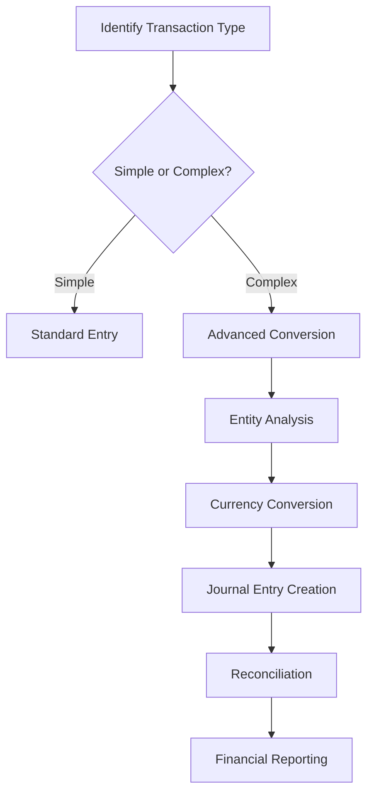

#### Advanced Conversion Scenarios

##### Scenario 1: Inter-Company Loan Processing
1. **Setup Requirements**
   - Create separate company files for each entity
   - Establish inter-company accounts in each entity's chart of accounts
   - Configure consolidation settings

2. **Transaction Flow**
   - Record loan origination in lending entity
   - Create corresponding receivable in borrowing entity
   - Process periodic interest accruals
   - Handle principal and interest payments
   - Record foreign exchange gains/losses if applicable

3. **Accounting Entries**
   ```
   Lending Entity:
   Debit: Inter-Company Receivable $10,000
   Credit: Cash $10,000

   Borrowing Entity:
   Debit: Cash $10,000
   Credit: Inter-Company Payable $10,000
   ```

##### Scenario 2: Foreign Currency Transaction Conversion
1. **Currency Setup**
   - Enable multi-currency in company settings
   - Define exchange rates (manual or automatic)
   - Set up currency-specific accounts

2. **Transaction Processing**
   - Enter transaction in foreign currency
   - System calculates functional currency equivalent
   - Record exchange rate fluctuations
   - Generate currency translation adjustments

3. **Revaluation Process**
   - Identify foreign currency balances
   - Calculate current exchange rate differences
   - Create revaluation journal entries
   - Update financial statements

##### Scenario 3: Complex Revenue Recognition
1. **Contract Analysis**
   - Identify performance obligations
   - Determine transaction price allocation
   - Establish revenue recognition timing

2. **Journal Entry Creation**
   ```
   Initial Recognition:
   Debit: Contract Asset $5,000
   Credit: Deferred Revenue $5,000

   Revenue Recognition:
   Debit: Deferred Revenue $1,000
   Credit: Revenue $1,000
   ```

3. **Progress Tracking**
   - Monitor completion percentage
   - Adjust revenue recognition
   - Handle contract modifications

#### Advanced Conversion Best Practices

##### Documentation Requirements
- Maintain detailed conversion logs
- Document business rationale for complex entries
- Preserve audit trails for all adjustments
- Create conversion procedure manuals

##### Quality Control Measures
- Implement dual approval for complex conversions
- Regular review of conversion accuracy
- Automated validation rules
- Exception reporting for unusual transactions

##### Performance Optimization
- Batch processing for bulk conversions
- Automated rules for recurring transactions
- Real-time validation during entry
- Efficient reconciliation processes

---

## Complete Accounting Cycle Workflow

### End-to-End Accounting Process

#### Phase 1: Transaction Recording
**Daily Operations:**
1. **Source Document Collection**
   - Invoices, receipts, purchase orders
   - Bank statements, credit card statements
   - Time sheets, expense reports
   - Contracts and agreements

2. **Data Entry Process**
   - Verify document completeness
   - Enter transactions in chronological order
   - Apply appropriate account classifications
   - Attach supporting documentation

3. **Validation Checks**
   - Mathematical accuracy verification
   - Account balance validation
   - Tax calculation confirmation
   - Approval workflow processing

#### Phase 2: Transaction Processing
**Weekly/Monthly Activities:**
1. **Bank Reconciliation**
   ```
   Bank Statement Balance + Outstanding Deposits - Outstanding Checks = Adjusted Bank Balance
   Adjusted Bank Balance should equal Haypbooks Cash Account Balance
   ```

2. **Accounts Receivable Management**
   - Invoice aging analysis
   - Payment application
   - Bad debt provisioning
   - Collection activity tracking

3. **Accounts Payable Processing**
   - Bill approval workflows
   - Payment scheduling
   - Vendor statement reconciliation
   - 1099 processing

#### Phase 3: Month-End Close Process
**Systematic Approach:**
1. **Pre-Close Checklist**
   - All transactions entered and approved
   - Bank reconciliations completed
   - Inventory counts performed
   - Time sheets approved

2. **Adjusting Entries**
   ```
   Accrued Expenses:
   Debit: Expense $X
   Credit: Accrued Liabilities $X

   Prepaid Expenses:
   Debit: Prepaid Expense $X
   Credit: Cash/Expense $X

   Depreciation:
   Debit: Depreciation Expense $X
   Credit: Accumulated Depreciation $X
   ```

3. **Financial Statement Preparation**
   - Generate trial balance
   - Prepare income statement
   - Create balance sheet
   - Generate cash flow statement

#### Phase 4: Financial Reporting & Analysis
**Management Reporting:**
1. **Key Financial Statements**
   - Profit & Loss statement
   - Balance Sheet
   - Cash Flow statement
   - Statement of Retained Earnings

2. **Management Reports**
   - Budget vs. Actual analysis
   - Trend analysis
   - Ratio analysis
   - Custom departmental reports

3. **Regulatory Reporting**
   - Tax return preparation
   - Government filings
   - Industry-specific reports
   - Audit workpaper preparation

#### Phase 5: Year-End Close Process
**Annual Activities:**
1. **Year-End Adjustments**
   - Inventory valuation review
   - Fixed asset reconciliation
   - Deferred tax adjustments
   - Revenue recognition finalization

2. **Audit Preparation**
   - Document retention verification
   - Supporting schedule preparation
   - Management representation letters
   - External auditor coordination

3. **Archive & Roll Forward**
   - Historical data archiving
   - Budget roll-forward
   - Opening balance setup for new year
   - System backup and testing

### Accounting Cycle Automation

#### Automated Workflows
1. **Recurring Transactions**
   - Monthly rent payments
   - Annual insurance premiums
   - Depreciation entries
   - Loan payments

2. **Approval Workflows**
   - Expense report approvals
   - Purchase order authorizations
   - Journal entry reviews
   - Budget variance notifications

3. **Integration Automations**
   - Bank feed processing
   - Credit card reconciliation
   - Payroll integration
   - E-commerce synchronization

#### Quality Control Automation
1. **Validation Rules**
   - Duplicate transaction detection
   - Account balance limits
   - Tax calculation verification
   - Required field enforcement

2. **Exception Reporting**
   - Unusual transaction identification
   - Budget variance alerts
   - Reconciliation discrepancies
   - Compliance violations

---

## Integration Diagrams & Architecture

### System Integration Architecture

#### Core Integration Framework
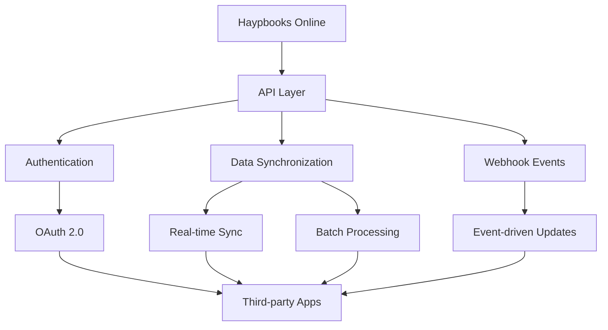

#### Data Flow Architecture


### Industry-Specific Integration Patterns

#### E-commerce Integration Architecture
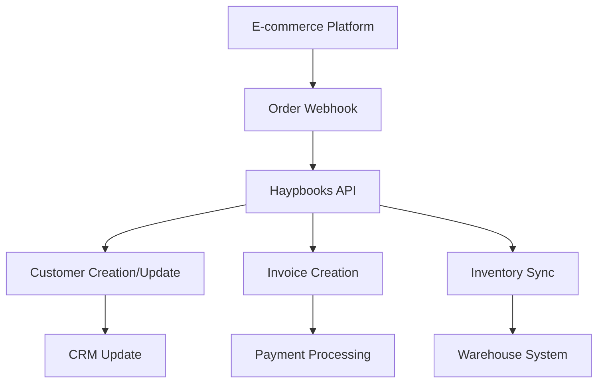

#### ERP Integration Framework
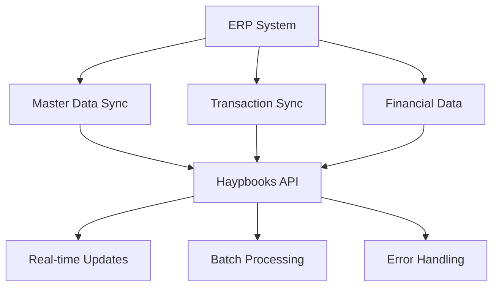

### Integration Workflow Diagrams

#### Automated Invoice Processing
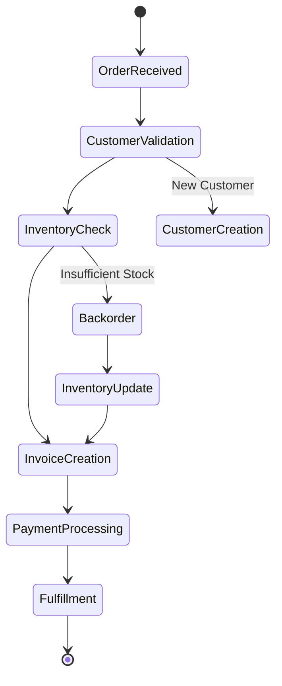

#### Bank Reconciliation Automation
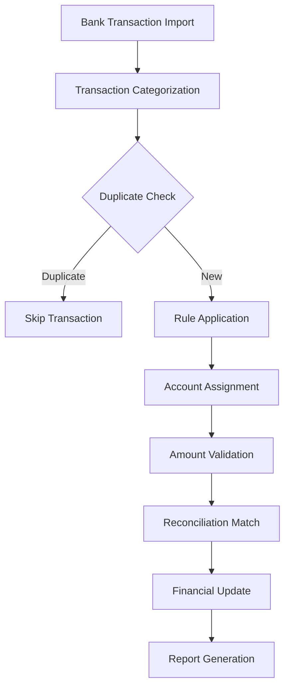

### Advanced Integration Scenarios

#### Multi-Channel Sales Integration
1. **Architecture Overview**
   - Centralized customer database
   - Unified inventory management
   - Consolidated order processing
   - Integrated payment processing

2. **Data Synchronization Flow**
   ```
   Channel Order → Central Hub → Haypbooks → Fulfillment System
   Inventory Update ← Haypbooks ← Central Hub ← Channel Update
   ```

3. **Business Benefits**
   - Single view of customer across channels
   - Real-time inventory accuracy
   - Automated order processing
   - Consolidated financial reporting

#### Supply Chain Integration
1. **Integration Components**
   - Purchase order automation
   - Vendor performance tracking
   - Inventory optimization
   - Demand forecasting

2. **Workflow Automation**
   ```
   Demand Signal → Purchase Order → Vendor Fulfillment → Goods Receipt → Invoice Processing → Payment
   ```

3. **Performance Metrics**
   - Order fulfillment time
   - Inventory turnover ratio
   - Supplier on-time delivery
   - Purchase order accuracy

---

## Industry-Specific Process Flows

### Retail & E-commerce Processes

#### Point of Sale Integration
**Process Flow:**
1. **Customer Interaction**
   - Customer identification
   - Product selection
   - Payment processing
   - Receipt generation

2. **Backend Processing**
   - Transaction recording in Haypbooks
   - Inventory reduction
   - Sales tax calculation
   - Payment reconciliation

3. **Reporting & Analysis**
   - Daily sales summary
   - Inventory turnover analysis
   - Customer purchase patterns
   - Profit margin analysis

#### Multi-Channel Sales Management
**Key Processes:**
1. **Order Consolidation**
   - Online orders from website
   - In-store purchases
   - Marketplace sales (Amazon, eBay)
   - Mobile app transactions

2. **Inventory Synchronization**
   - Real-time stock updates
   - Low stock alerts
   - Automatic reorder triggers
   - Cross-channel availability

3. **Customer Data Integration**
   - Unified customer profiles
   - Purchase history tracking
   - Loyalty program integration
   - Marketing automation

### Professional Services Processes

#### Time & Billing Management
**Core Workflow:**
1. **Time Capture**
   - Project time tracking
   - Task categorization
   - Client approval process
   - Billing rate application

2. **Invoice Generation**
   - Time-to-invoice conversion
   - Expense inclusion
   - Retainer management
   - Progress billing

3. **Project Profitability**
   - Budget vs. actual analysis
   - Resource utilization tracking
   - Client profitability analysis
   - Forecasting and planning

#### Client Relationship Management
**Process Integration:**
1. **Client Onboarding**
   - Contract setup
   - Service agreement configuration
   - Billing terms establishment
   - Communication preferences

2. **Ongoing Service Delivery**
   - Project milestone tracking
   - Deliverable management
   - Change order processing
   - Client communication

3. **Client Retention**
   - Satisfaction monitoring
   - Upsell opportunity identification
   - Contract renewal management
   - Referral program tracking

### Construction & Contracting Processes

#### Job Cost Accounting
**Project Lifecycle:**
1. **Pre-Construction**
   - Bid preparation
   - Contract signing
   - Project setup in Haypbooks
   - Budget establishment

2. **Construction Phase**
   - Material procurement
   - Labor tracking
   - Subcontractor management
   - Progress billing

3. **Project Closeout**
   - Final billing
   - Retainage release
   - Warranty tracking
   - Profit analysis

#### Subcontractor Management
**Management Process:**
1. **Subcontractor Setup**
   - Vendor profile creation
   - Insurance verification
   - Lien waiver tracking
   - Payment terms establishment

2. **Payment Processing**
   - Progress payment scheduling
   - Retainage management
   - Compliance verification
   - 1099 reporting

3. **Performance Tracking**
   - On-time delivery monitoring
   - Quality assessment
   - Cost variance analysis
   - Relationship management

### Manufacturing Processes

#### Production Cost Tracking
**Manufacturing Workflow:**
1. **Production Planning**
   - Bill of materials setup
   - Production order creation
   - Resource allocation
   - Cost estimation

2. **Production Execution**
   - Material issuance
   - Labor tracking
   - Overhead allocation
   - Quality control

3. **Cost Analysis**
   - Standard vs. actual cost comparison
   - Variance analysis
   - Efficiency reporting
   - Cost reduction initiatives

#### Inventory Management
**Advanced Inventory:**
1. **Multi-Location Tracking**
   - Warehouse management
   - Location-specific costing
   - Transfer processing
   - Stock level monitoring

2. **Quality Control**
   - Inspection tracking
   - Defect recording
   - Quarantine management
   - Disposition processing

3. **Supply Chain Integration**
   - Vendor managed inventory
   - Just-in-time ordering
   - Demand forecasting
   - Supplier performance

### Healthcare Processes

#### Patient Billing Integration
**Revenue Cycle Management:**
1. **Charge Capture**
   - Service documentation
   - Charge entry
   - Coding verification
   - Insurance eligibility check

2. **Claims Processing**
   - Claim submission
   - Payment posting
   - Denial management
   - Patient billing

3. **Payment Reconciliation**
   - Insurance payment processing
   - Patient payment handling
   - Contractual adjustment posting
   - Bad debt management

#### Compliance Tracking
**Regulatory Processes:**
1. **HIPAA Compliance**
   - Patient data protection
   - Access logging
   - Breach notification
   - Audit trail maintenance

2. **Insurance Compliance**
   - Coverage verification
   - Authorization tracking
   - Medical necessity documentation
   - Appeal processing

3. **Quality Reporting**
   - Outcome measurement
   - Patient satisfaction tracking
   - Regulatory reporting
   - Performance improvement

---

## Compliance Workflows & Controls

### Regulatory Compliance Framework

#### SOX Compliance Implementation
**Control Objectives:**
1. **Access Controls**
   - User role segregation
   - Access logging and monitoring
   - Password policies and MFA
   - Regular access reviews

2. **Transaction Controls**
   - Dual authorization requirements
   - Transaction approval workflows
   - Change management procedures
   - Audit trail preservation

3. **Financial Reporting Controls**
   - Period-end close procedures
   - Journal entry reviews
   - Reconciliation requirements
   - Documentation standards

#### GDPR Compliance Processes
**Data Protection Measures:**
1. **Data Mapping**
   - Personal data identification
   - Data flow documentation
   - Processing purpose definition
   - Retention schedule establishment

2. **Privacy Controls**
   - Consent management
   - Data minimization practices
   - Subject access request procedures
   - Data breach response protocols

3. **Audit & Monitoring**
   - Privacy impact assessments
   - Data processing logs
   - Compliance monitoring
   - Regular audit reviews

### Industry-Specific Compliance

#### Healthcare Compliance (HIPAA)
**Privacy & Security:**
1. **Technical Safeguards**
   - Data encryption
   - Access controls
   - Audit logging
   - Secure transmission

2. **Administrative Safeguards**
   - Security training
   - Incident response planning
   - Business associate agreements
   - Risk assessments

3. **Physical Safeguards**
   - Facility access controls
   - Device security
   - Media disposal procedures
   - Workstation security

#### Financial Services Compliance
**Regulatory Requirements:**
1. **Anti-Money Laundering (AML)**
   - Customer due diligence
   - Transaction monitoring
   - Suspicious activity reporting
   - Record retention

2. **Know Your Customer (KYC)**
   - Customer identification
   - Risk assessment
   - Enhanced due diligence
   - Ongoing monitoring

3. **Data Security Standards**
   - PCI DSS compliance
   - Encryption requirements
   - Access controls
   - Security testing

### Compliance Automation

#### Automated Monitoring
**System Controls:**
1. **Real-time Alerts**
   - Compliance violation detection
   - Unusual transaction identification
   - Access anomaly monitoring
   - System security alerts

2. **Scheduled Reviews**
   - Regular compliance assessments
   - Policy update reminders
   - Training completion tracking
   - Audit preparation automation

3. **Reporting Automation**
   - Compliance status reports
   - Regulatory filing preparation
   - Audit trail generation
   - Management dashboards

#### Workflow Controls
**Process Automation:**
1. **Approval Workflows**
   - Multi-level authorization
   - Segregation of duties enforcement
   - Exception handling procedures
   - Documentation requirements

2. **Audit Trails**
   - Complete transaction history
   - User action logging
   - Change tracking
   - Access monitoring

3. **Quality Assurance**
   - Automated validation rules
   - Error detection and correction
   - Process compliance monitoring
   - Performance metric tracking

---

## Mobile Workflow Processes

### Mobile-First Business Operations

#### Field Service Management
**Mobile Workflow:**
1. **Job Dispatch**
   - Receive work orders on mobile device
   - Access customer information and job history
   - GPS navigation to job site
   - Real-time status updates

2. **On-Site Service**
   - Time tracking with GPS verification
   - Photo documentation of work performed
   - Parts and material usage recording
   - Customer signature capture

3. **Post-Service Processing**
   - Invoice generation and sending
   - Payment collection via mobile payment
   - Follow-up appointment scheduling
   - Customer feedback collection

#### Sales Force Automation
**Mobile Sales Process:**
1. **Lead Management**
   - Access to customer database
   - Lead qualification and scoring
   - Appointment scheduling
   - Proposal generation

2. **Customer Visits**
   - Customer profile access
   - Product catalog browsing
   - Quote creation and sending
   - Order processing

3. **Post-Sale Activities**
   - Delivery confirmation
   - Installation coordination
   - Customer onboarding
   - Follow-up communication

### Mobile Data Capture & Processing

#### Receipt & Document Management
**Mobile Capture Process:**
1. **Document Scanning**
   - Camera-based receipt capture
   - Automatic data extraction
   - Categorization suggestions
   - Batch processing

2. **Data Validation**
   - OCR accuracy verification
   - Manual data correction
   - Duplicate detection
   - Approval workflows

3. **Integration Processing**
   - Automatic expense creation
   - Tax calculation
   - Reimbursement processing
   - Financial reporting

#### Inventory Management
**Mobile Inventory:**
1. **Stock Counting**
   - Barcode scanning
   - Quantity verification
   - Location tracking
   - Photo documentation

2. **Real-Time Updates**
   - Instant inventory adjustments
   - Low stock alerts
   - Reorder point monitoring
   - Cross-location transfers

3. **Analytics & Reporting**
   - Inventory turnover analysis
   - Stock movement tracking
   - Valuation reporting
   - Trend analysis

### Mobile Collaboration & Communication

#### Team Coordination
**Mobile Collaboration:**
1. **Task Management**
   - Real-time task assignment
   - Progress tracking
   - Deadline monitoring
   - Resource allocation

2. **Communication Tools**
   - Instant messaging
   - File sharing
   - Video conferencing
   - Screen sharing

3. **Knowledge Sharing**
   - Document access
   - Training materials
   - Best practice sharing
   - Issue resolution

#### Customer Interaction
**Mobile Customer Service:**
1. **Customer Communication**
   - Real-time messaging
   - Appointment scheduling
   - Service request handling
   - Feedback collection

2. **Self-Service Options**
   - Customer portal access
   - Invoice viewing and payment
   - Order tracking
   - Support ticket submission

3. **Relationship Building**
   - Customer profile updates
   - Purchase history access
   - Loyalty program management
   - Personalized recommendations

### Mobile Security & Compliance

#### Device Security
**Security Measures:**
1. **Authentication**
   - Biometric login
   - Multi-factor authentication
   - Device encryption
   - Remote wipe capabilities

2. **Data Protection**
   - Secure data transmission
   - Local data encryption
   - Automatic session timeout
   - Secure file storage

3. **Compliance Monitoring**
   - Access logging
   - Usage monitoring
   - Security incident reporting
   - Compliance auditing

#### Mobile Policy Management
**Policy Implementation:**
1. **Device Management**
   - Company device provisioning
   - BYOD policy enforcement
   - Application whitelisting
   - Security patch management

2. **Usage Policies**
   - Acceptable use guidelines
   - Data handling procedures
   - Privacy protection
   - Incident reporting

3. **Training & Awareness**
   - Security training programs
   - Policy acknowledgment
   - Regular security reminders
   - Best practice sharing

---

## Performance Optimization Flows

### System Performance Enhancement

#### Database Optimization
**Performance Strategies:**
1. **Data Archiving**
   - Historical data identification
   - Archive policy establishment
   - Automated archiving processes
   - Archive retrieval procedures

2. **Index Optimization**
   - Database index analysis
   - Index creation and maintenance
   - Query performance monitoring
   - Index fragmentation management

3. **Query Optimization**
   - Slow query identification
   - Query execution plan analysis
   - Query rewriting for efficiency
   - Result caching implementation

#### Application Performance
**Optimization Techniques:**
1. **Caching Strategies**
   - Data caching implementation
   - Session management optimization
   - Static content caching
   - Database query caching

2. **Code Optimization**
   - Performance bottleneck identification
   - Code profiling and analysis
   - Memory usage optimization
   - Algorithm efficiency improvement

3. **Resource Management**
   - Memory allocation optimization
   - CPU usage monitoring
   - Network bandwidth optimization
   - Storage utilization management

### Workflow Performance Optimization

#### Process Streamlining
**Efficiency Improvements:**
1. **Workflow Analysis**
   - Process bottleneck identification
   - Workflow complexity assessment
   - Redundancy elimination
   - Process automation opportunities

2. **Automation Implementation**
   - Repetitive task automation
   - Approval workflow optimization
   - Notification system enhancement
   - Integration point optimization

3. **Resource Optimization**
   - Task prioritization
   - Workload balancing
   - Skill-based task assignment
   - Time management tools

#### User Experience Optimization
**Interface Improvements:**
1. **Navigation Optimization**
   - Menu structure simplification
   - Keyboard shortcut implementation
   - Quick action access
   - Personalized dashboards

2. **Form Optimization**
   - Field layout improvement
   - Auto-fill functionality
   - Validation rule enhancement
   - Progressive disclosure

3. **Mobile Optimization**
   - Responsive design implementation
   - Touch-friendly interfaces
   - Offline capability enhancement
   - Performance monitoring

### Scalability & Growth Management

#### System Scalability
**Growth Preparation:**
1. **Infrastructure Scaling**
   - Server capacity planning
   - Database scaling strategies
   - Network bandwidth assessment
   - Storage expansion planning

2. **Application Scaling**
   - User load management
   - Concurrent user handling
   - Transaction volume scaling
   - Integration capacity planning

3. **Data Scaling**
   - Data volume management
   - Archive strategy development
   - Backup system enhancement
   - Disaster recovery planning

#### Business Process Scaling
**Operational Growth:**
1. **Process Standardization**
   - Workflow documentation
   - Standard operating procedures
   - Quality control processes
   - Training program development

2. **Team Scaling**
   - Role definition and documentation
   - Training program expansion
   - Knowledge management systems
   - Performance monitoring

3. **Technology Scaling**
   - Integration expansion
   - Automation enhancement
   - Reporting system development
   - Analytics capability growth

### Monitoring & Continuous Improvement

#### Performance Monitoring
**Monitoring Systems:**
1. **System Metrics**
   - Response time monitoring
   - Error rate tracking
   - Resource utilization
   - User activity analysis

2. **Business Metrics**
   - Process efficiency measurement
   - User productivity tracking
   - Customer satisfaction monitoring
   - Financial performance analysis

3. **Quality Metrics**
   - Error rate monitoring
   - Compliance tracking
   - Audit finding analysis
   - Improvement opportunity identification

#### Continuous Optimization
**Improvement Processes:**
1. **Feedback Collection**
   - User feedback gathering
   - Performance data analysis
   - Stakeholder input collection
   - Benchmarking against standards

2. **Optimization Implementation**
   - Change management processes
   - Testing and validation
   - Rollout planning
   - Training and communication

3. **Measurement & Reporting**
   - KPI tracking and reporting
   - Performance trend analysis
   - ROI measurement
   - Continuous improvement planning

This comprehensive update adds the missing advanced sections to the Flow.md file, providing complete coverage of advanced transaction conversions, accounting cycles, integration diagrams, industry-specific processes, compliance workflows, mobile processes, and performance optimization. These additions ensure the documentation serves as a complete master reference for Haypbooks Online implementation and operation.

